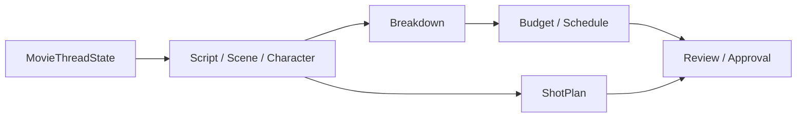
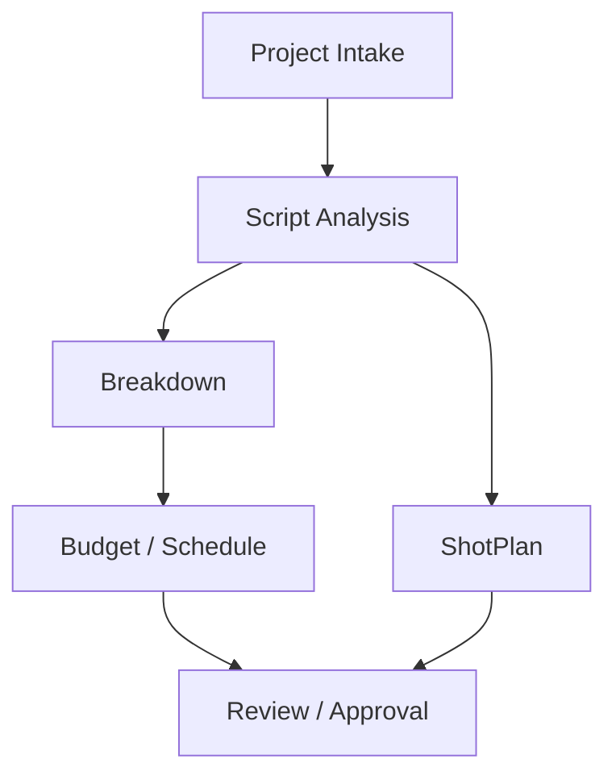
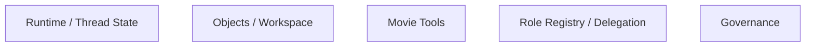
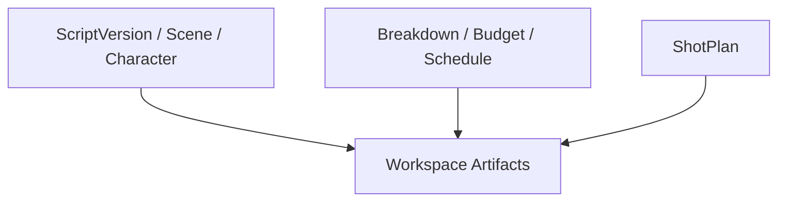
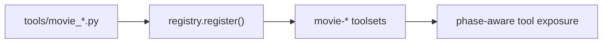
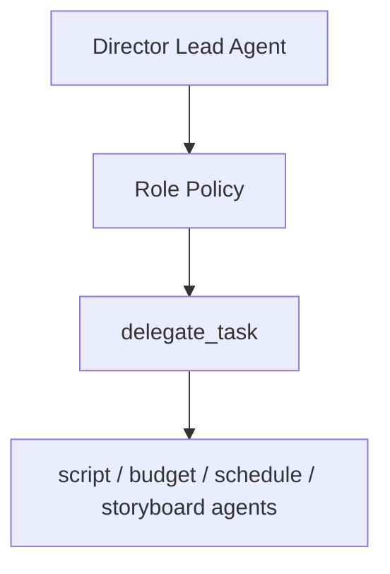
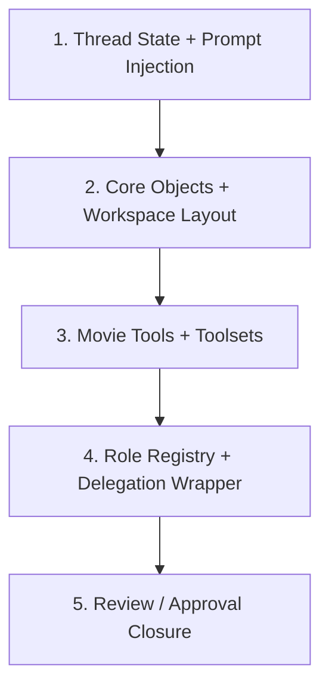
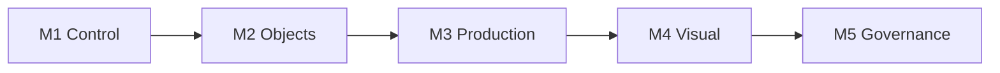
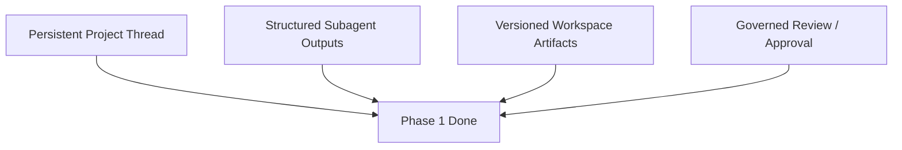
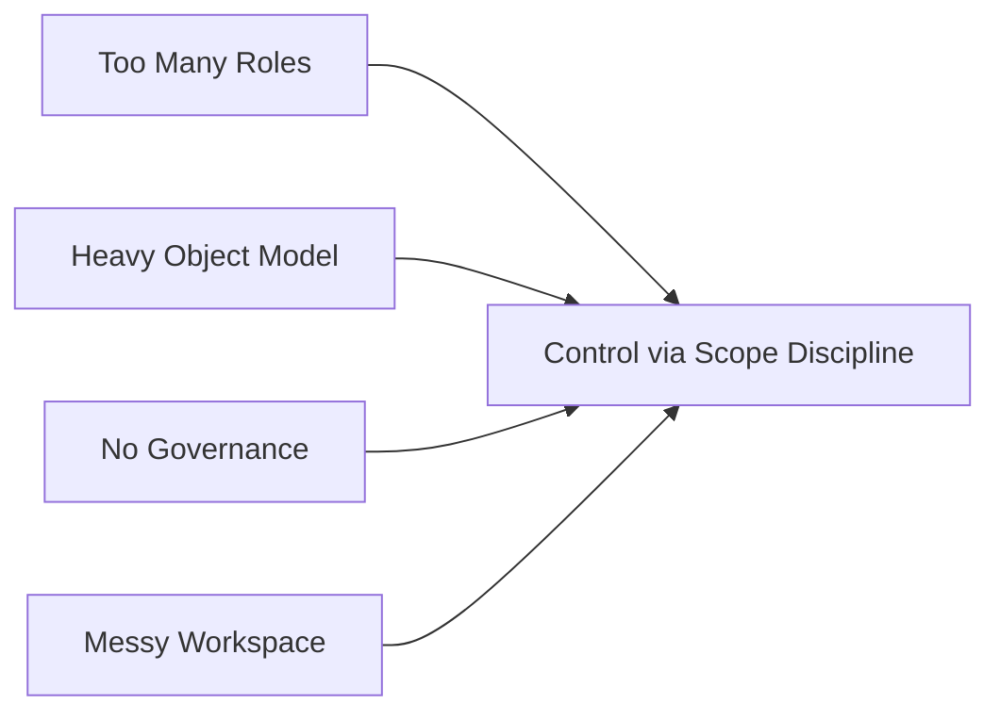

# 82. Phase 1 开发计划

## 这篇文档回答什么问题

MVP 范围确定后，下一步要回答的是：

- 第一阶段到底先做什么
- 哪些代码模块先动
- 哪些交付件必须在这一阶段完成

本篇将 `Phase 1` 明确定义为：

**前期制作 MVP 的工程落地阶段。**

---

## 一、Phase 1 的目标

Phase 1 的目标不是“电影平台初具雏形”这种模糊表述，而是明确跑通这条链：

也就是说，Phase 1 要交付的是“前期制作闭环”。

---

## 二、Phase 1 的工作流范围

建议这一阶段只覆盖：

- project intake
- script analysis
- scene / character extraction
- breakdown generation
- budget draft
- schedule draft
- shot plan draft
- review / approval closure

---

## 三、Phase 1 的主要工程工作流

建议拆成五个 workstreams：

- runtime 与 thread state
- 对象系统与 workspace
- movie tools
- role registry 与 delegation
- governance 闭环

---

## 四、Workstream 1：Runtime 与 Thread State

### 目标

- 让 `AIAgent` 带有电影项目上下文
- 让 `MovieThreadState` 成为 turn 级控制面

### 主要触点

- `run_agent.py`
- `gateway/session.py`
- `hermes_state.py`

### 交付物

- `MovieThreadState` schema
- load / save 接口
- turn summary 注入逻辑

---

## 五、Workstream 2：对象系统与 Workspace

### 目标

- 把第一批创作和生产对象正式落盘
- 建立 movie workspace 目录骨架

### 主要触点

- `tools/file_tools.py` 使用方式
- workspace 目录设计
- artifact / version 关联辅助层

### 交付物

- 对象 schema
- canonical path 规则
- 最小 artifact / version 关联

---

## 六、Workstream 3：Movie Tools

### 目标

- 让主智能体有正式 movie 操作面

### 主要触点

- `tools/`
- `tools/registry.py`
- `toolsets.py`
- `model_tools.py`

### 建议第一批 tools

- `movie_project_state`
- `movie_object_resolve`
- `movie_script_breakdown`
- `movie_budget_estimate`
- `movie_schedule_plan`
- `movie_shotplan_generate`
- `movie_review_package`

---

## 七、Workstream 4：Role Registry 与 Delegation

### 目标

- 从通用 delegation 升级到角色化协作

### 主要触点

- `tools/delegate_tool.py`
- role registry / policy 辅助模块

### Phase 1 建议的角色

- `script_analyst`
- `budget_planner`
- `schedule_planner`
- `storyboard_planner`
- `producer_planner`（可选）

---

## 八、Workstream 5：Governance 闭环

### 目标

- 让结果进入正式 review / approval

### 主要触点

- review / approval 对象
- `MovieThreadState.pending_approvals`
- artifact version 状态

### 交付物

- 最小 review 模型
- approval 状态枚举
- decision 回写逻辑

---

## 九、Phase 1 的代码改动优先顺序

这个顺序的目的，是先建立控制面和对象基线，再接复杂协作。

---

## 十、Phase 1 的里程碑

### M1：Lead Agent 看见项目

- 能加载 `MovieThreadState`
- 能显示 phase / working set / risks

### M2：对象链成立

- 能从剧本生成 `Scene` / `Character` / `BreakdownSheet`

### M3：生产链成立

- 能生成 `BudgetDraft` / `ScheduleDraft`

### M4：视觉链成立

- 能生成 `ShotPlan`

### M5：治理链成立

- 能完成 review / approval 闭环

---

## 十一、Phase 1 的验收标准

建议至少满足以下标准：

1. 单个项目可以连续运行多轮，不丢 phase / working set。
2. 至少 4 个子智能体能稳定产生结构化结果。
3. 关键 artifacts 能落入正式 workspace 目录。
4. review / approval 可以绑定对象版本。

---

## 十二、Phase 1 的主要风险与对策

### 风险 1：角色太多

对策：控制在 4 到 6 个。

### 风险 2：对象过重

对策：先做 schema + artifact，而不是先重数据库化。

### 风险 3：治理缺席

对策：最晚在 Phase 1 末接入最小 approval。

### 风险 4：文件流失控

对策：尽早定义 canonical path。

---

## 十三、结论

Phase 1 的意义，是把电影平台从“设计正确”推进到“前期制作主链可运行”。

它最重要的不是功能数，而是闭环：

- 有控制面
- 有对象链
- 有角色协作
- 有正式治理

只有这四层都成立，Hermes 的电影化扩展才算真正跨过第一道门槛。

---

## 相关文档

- [81-mvp-scope-definition.md](./81-mvp-scope-definition.md)
- [83-phase-2-development-plan.md](./83-phase-2-development-plan.md)
- [85-pilot-project-implementation-manual.md](./85-pilot-project-implementation-manual.md)
- [112-ai-coding-and-multi-agent-delivery-plan.md](./112-ai-coding-and-multi-agent-delivery-plan.md)
- [118-program-governance-roadmap-and-operating-metrics.md](./118-program-governance-roadmap-and-operating-metrics.md)
