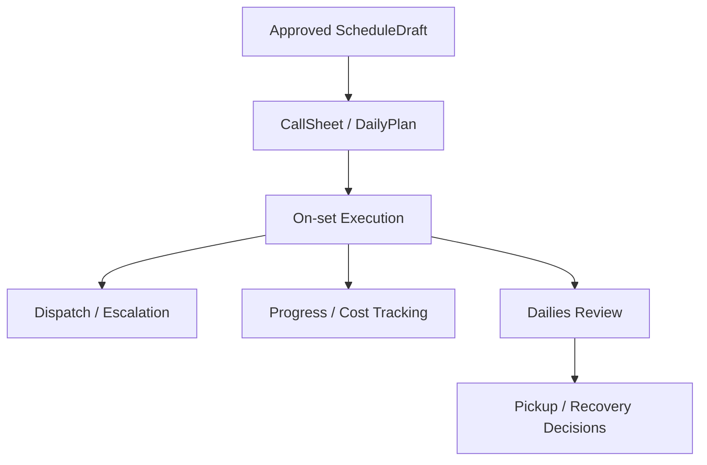
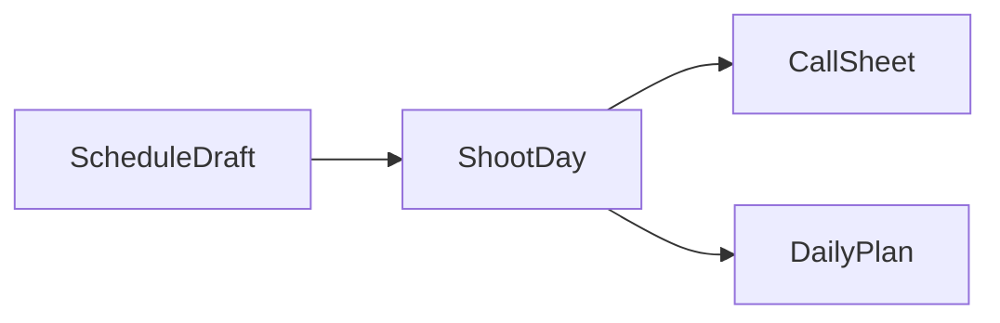
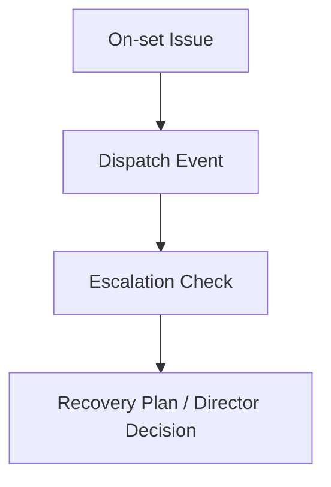
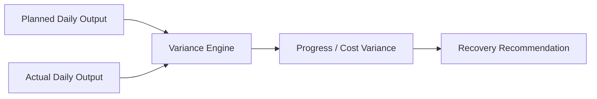
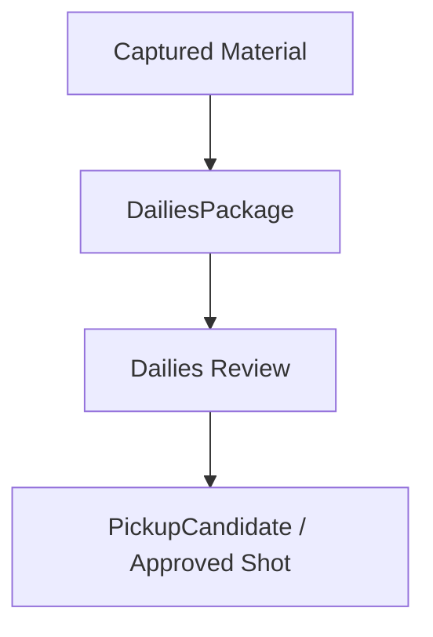
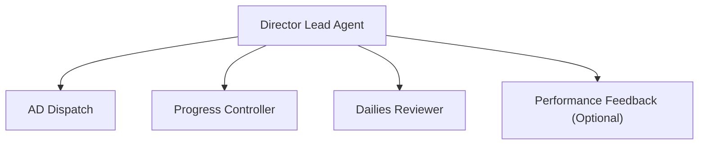
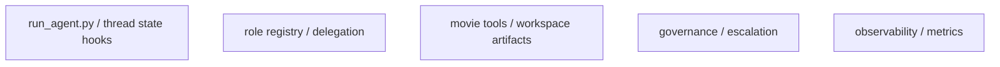
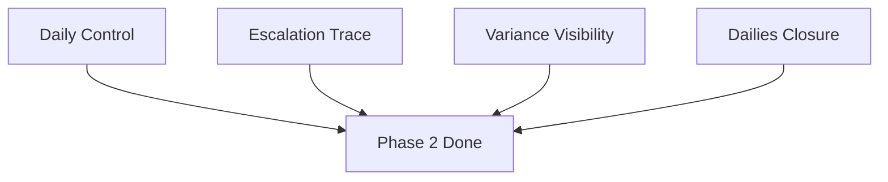
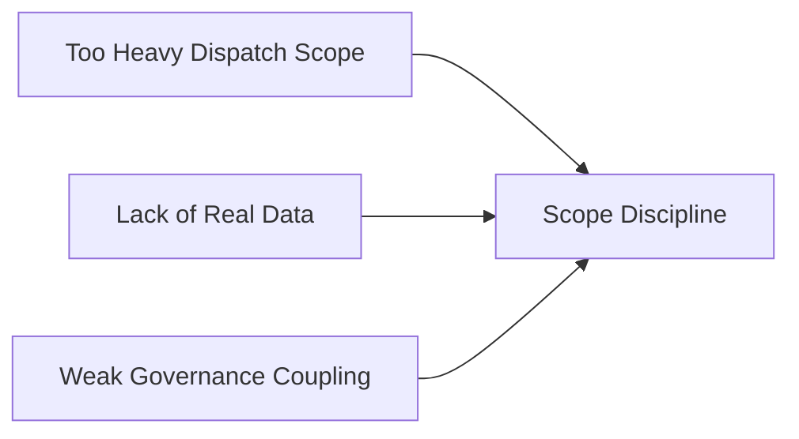

# 83. Phase 2 开发计划

## 这篇文档回答什么问题

Phase 1 跑通之后，平台会从“前期制作系统”进入“拍摄执行系统”。

这时重点不再是多做几个对象，而是把项目从静态规划推进到动态控制：

- 每天拍什么
- 现场风险如何升级
- 成本和进度偏差如何被看见
- dailies 如何进入日结 review

本篇重点回答：

1. Phase 2 要补哪些能力。
2. 这些能力应如何接在 Phase 1 的基线上。
3. 这一阶段的验收标准和风险是什么。

---

## 一、Phase 2 的目标

Phase 2 的目标可以概括成一句话：

**把前期方案转成可观测、可调度、可升级的现场执行控制面。**

---

## 二、Phase 2 的主要能力范围

建议这一阶段主要覆盖：

- `ShootDay`
- `CallSheet`
- `DailyPlan`
- `DispatchEvent`
- `ProgressVariance`
- `CostVariance`
- `DailiesPackage`
- `PickupCandidate`

---

## 三、Phase 2 的核心工作流

这说明 Phase 2 的关键不是新增孤立对象，而是把日级控制链打通。

---

## 四、Workstream 1：日计划与 Call Sheet

### 目标

- 将 `ScheduleDraft` 细化为日级控制对象

### 主要交付

- `ShootDay`
- `CallSheet`
- `DailyPlan`

### 代码触点

- movie objects / schema
- workspace artifacts
- movie tools for daily packaging

---

## 五、Workstream 2：现场 Dispatch 与升级

### 目标

- 让现场变化不再只是临时聊天，而是正式事件流

### 主要交付

- `DispatchBoard`
- `DispatchEvent`
- `EscalationRecord`
- `RecoveryPlan`

### 代码触点

- role registry 扩展
- governance hooks
- thread state update policy

---

## 六、Workstream 3：进度与成本偏差控制

### 目标

- 让平台不只知道“计划是什么”，还知道“偏差有多大”

### 主要交付

- `ProgressVariance`
- `CostVariance`
- `VarianceSummary`
- `RecoveryRecommendation`

### 代码触点

- movie governance tools
- observability / event hooks
- state risk board

---

## 七、Workstream 4：Dailies 与 Pickup 闭环

### 目标

- 让拍摄素材进入日结 review，而不是仅仅“拍完了”

### 主要交付

- `DailiesPackage`
- `DailiesReview`
- `PickupCandidate`

---

## 八、Phase 2 的角色扩展建议

在 Phase 1 角色基础上，建议增加：

- `assistant_director_dispatch`
- `progress_controller`
- `dailies_reviewer`
- `performance_feedback`（可选）

---

## 九、Phase 2 的主要代码触点

### 重点区域

- `run_agent.py`
- `tools/delegate_tool.py`
- `tools/`
- `hermes_state.py`
- `agent/trajectory.py`

---

## 十、Phase 2 的里程碑

### M1：Daily Control Objects 成立

- call sheet / daily plan 可生成

### M2：Dispatch / Escalation 成立

- 现场问题可留痕、可升级

### M3：Variance Tracking 成立

- 进度 / 成本偏差可见

### M4：Dailies Review 成立

- 能形成 pickup 候选与恢复建议

---

## 十一、Phase 2 的验收标准

建议至少满足：

1. 平台能基于 schedule 生成日级控制对象。
2. 现场问题能进入 escalation chain。
3. 系统能看见 progress / cost variance。
4. dailies review 能输出 pickup candidate 或明确通过。

---

## 十二、Phase 2 的主要风险

### 风险 1：把现场系统做得过重

对策：先做日级控制，不做分钟级全自动调度。

### 风险 2：缺乏真实日常数据

对策：先围绕模拟 shoot day 或 pilot 项目运行。

### 风险 3：治理流和现场流脱节

对策： escalation / approval 必须回写 thread state。

---

## 十三、结论

Phase 2 的真正目标，不是“多支持一些拍摄词汇”，而是让电影平台第一次具备现场控制能力。

它建立的是：

- 日计划控制面
- 现场事件流
- 偏差观测层
- dailies 闭环

只有过了这一阶段，平台才开始从“前期制作协作系统”迈向“拍摄执行系统”。

---

## 相关文档

- [82-phase-1-development-plan.md](./82-phase-1-development-plan.md)
- [84-phase-3-development-plan.md](./84-phase-3-development-plan.md)
- [37-principal-photography-operations.md](./37-principal-photography-operations.md)
- [39-assistant-director-dispatch-system.md](./39-assistant-director-dispatch-system.md)
- [44-dailies-output-and-review.md](./44-dailies-output-and-review.md)
