# 84. Phase 3 开发计划

## 这篇文档回答什么问题

当平台已经具备：

- 前期制作闭环
- 拍摄执行控制面

下一步就进入后期制作与正式交付阶段。

Phase 3 的关键，不再是“怎么把计划执行起来”，而是：

- 哪个版本成立
- 哪个版本可以进入正式交付
- 哪些对象该归档
- 哪些经验要沉淀成长期能力

本篇重点回答：

1. Phase 3 该补哪些后期与交付能力。
2. 这些能力应如何接在前两阶段基础上。
3. 这一阶段的验收标准和风险是什么。

---

## 一、Phase 3 的目标

Phase 3 的目标可以概括成一句话：

**把电影平台从执行系统推进成完整的版本治理、交付与复盘系统。**

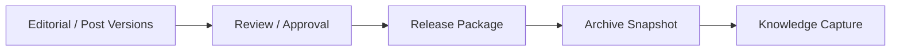

---

## 二、Phase 3 的主要能力范围

建议这一阶段主要覆盖：

- `CutVersion`
- `Sound / ADR / Music Package`
- `ColorGradeVersion`
- `VFXShot / VFXDelivery`
- `ReleaseCandidate`
- `ReleasePackage`
- `ArchiveSnapshot`
- `RetrospectiveReport / LessonLearned`

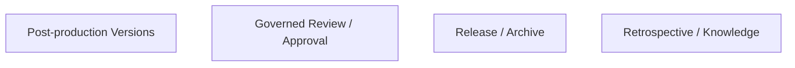

---

## 三、Phase 3 的主工作流

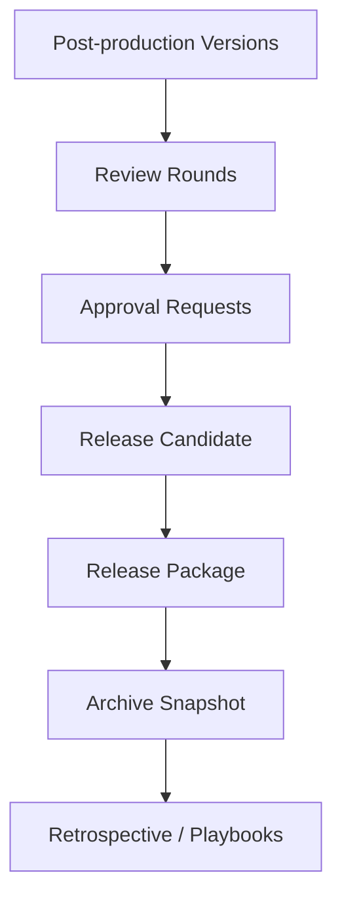

这条链意味着平台第一次真正闭合了整个电影项目生命周期。

---

## 四、Workstream 1：后期版本对象链

### 目标

- 建立可 review、可比较、可收敛的后期版本体系

### 主要交付

- `CutVersion`
- `MixVersion`
- `ColorGradeVersion`
- `VFXDelivery`

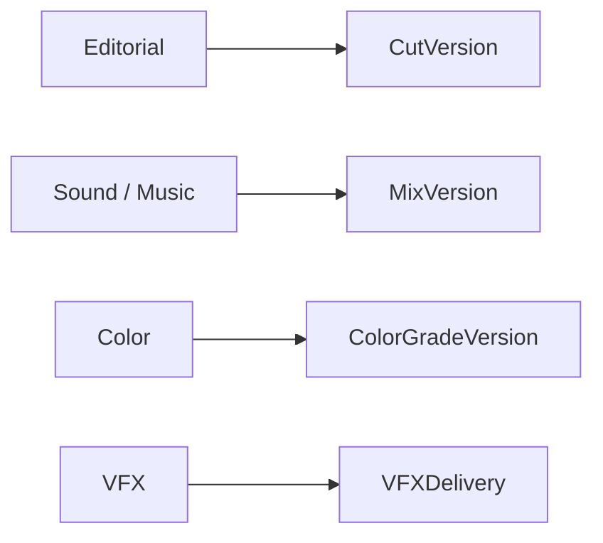

### 重点

- 所有后期对象都必须 version-aware
- review 必须绑定具体版本

---

## 五、Workstream 2：Release Candidate 与 Release Package

### 目标

- 让“可交付状态”成为正式治理状态，而不是模糊口头判断

### 主要交付

- `ReleaseCandidate`
- `ReleasePackage`
- `DeliveryChecklist`

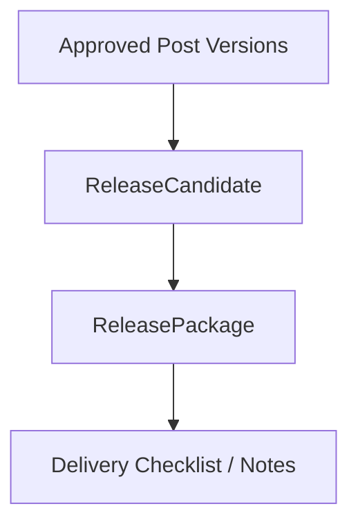

---

## 六、Workstream 3：归档系统

### 目标

- 把项目里程碑结果冻结成可恢复快照

### 主要交付

- `ArchiveSnapshot`
- `ArchiveIndex`
- milestone snapshot policy

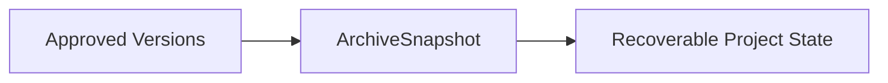

---

## 七、Workstream 4：复盘与知识沉淀

### 目标

- 让项目结束后的有效经验进入长期能力层

### 主要交付

- `RetrospectiveReport`
- `LessonLearned`
- `ReusablePlaybook`
- `TemplateAsset`

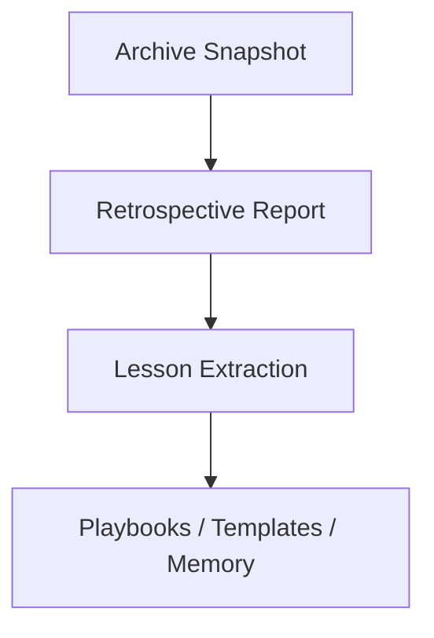

---

## 八、Phase 3 的角色扩展建议

在前两阶段角色基础上，建议增加：

- `editorial_reviewer`
- `post_supervisor`
- `release_packager`
- `retrospective_analyst`

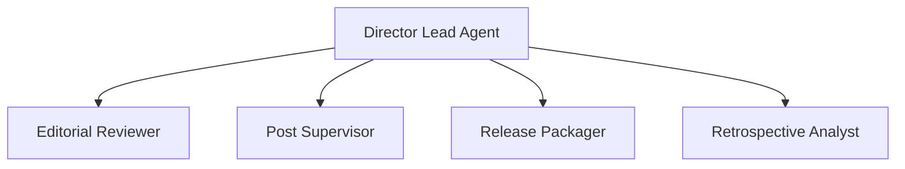

---

## 九、Phase 3 的主要代码触点

### 重点区域

- `tools/`
- `toolsets.py`
- `run_agent.py`
- `agent/trajectory.py`
- memory / state / artifact 辅助层

---

## 十、Phase 3 的里程碑

### M1：后期版本链成立

- cut / mix / color / vfx 版本可追踪

### M2：release candidate 成立

- review / approval 能明确指向可交付候选

### M3：archive snapshot 成立

- 项目里程碑状态可恢复

### M4：knowledge capture 成立

- retrospective 能生成 lessons / playbooks

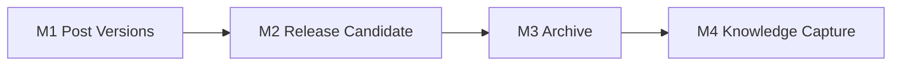

---

## 十一、Phase 3 的验收标准

建议至少满足：

1. 后期版本对象能进入正式 review / approval。
2. 平台能明确生成 `ReleasePackage`。
3. 项目结束时能产出 `ArchiveSnapshot`。
4. retrospective 能产出至少一组 `LessonLearned / Playbook`。

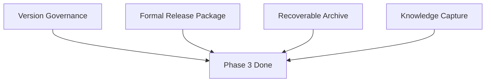

---

## 十二、Phase 3 的主要风险

### 风险 1：后期对象过多、过细

对策：先抓版本链，不追求一开始覆盖所有 post 子工种细节。

### 风险 2：release package 只是文件打包，没有治理意义

对策：必须绑定 approval history 与 approved object refs。

### 风险 3：复盘流流于总结，没有进入长期能力层

对策：必须把 lessons 结构化并绑定 evidence refs。

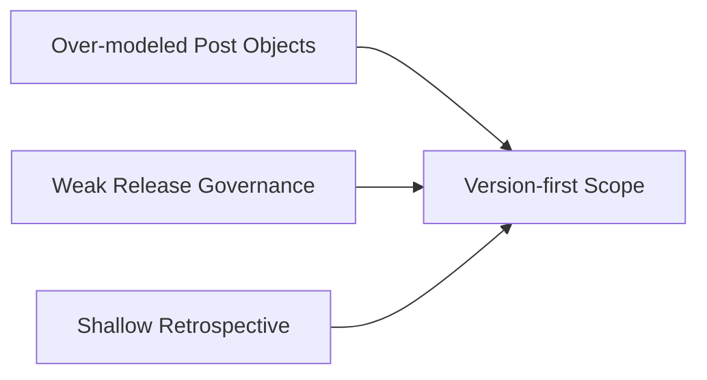

---

## 十三、结论

Phase 3 的意义，是让电影平台具备“正式收尾”的能力。

它不只是后期生产工具集合，而是把：

- 后期版本链
- 交付治理链
- 归档链
- 知识沉淀链

真正连成一个完整生命周期闭环。只有过了这一阶段，Hermes 的电影化扩展才开始接近完整生产系统。

---

## 相关文档

- [83-phase-2-development-plan.md](./83-phase-2-development-plan.md)
- [45-editing-workflow-and-versioning.md](./45-editing-workflow-and-versioning.md)
- [49-review-flow-versioning-and-release-package.md](./49-review-flow-versioning-and-release-package.md)
- [51-project-retrospective-and-knowledge-capture.md](./51-project-retrospective-and-knowledge-capture.md)
- [118-program-governance-roadmap-and-operating-metrics.md](./118-program-governance-roadmap-and-operating-metrics.md)
