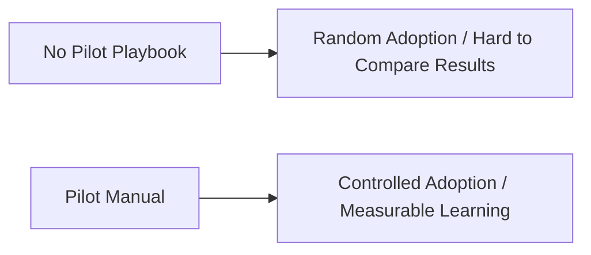
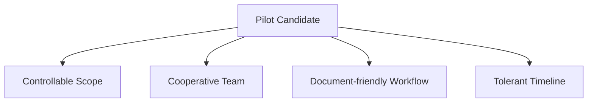
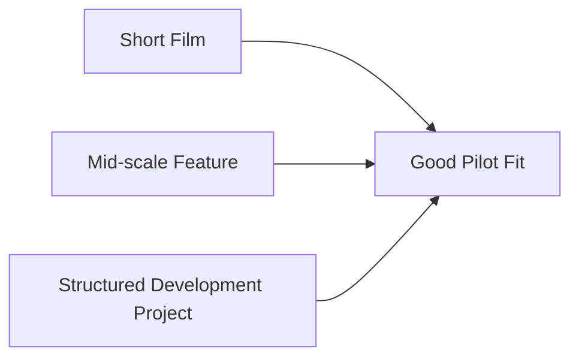
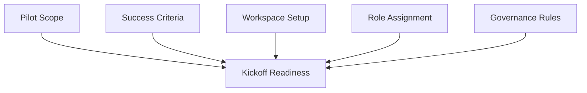
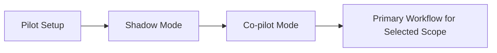
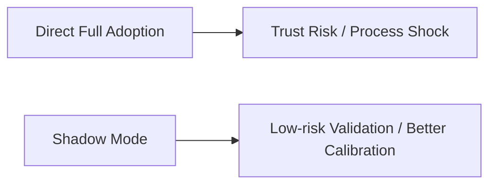
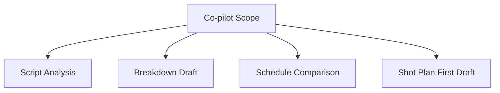
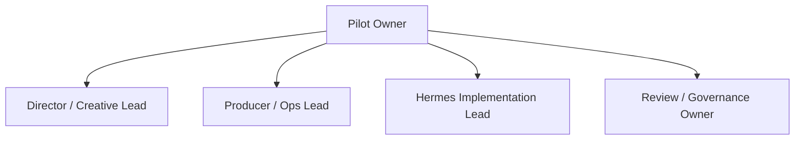
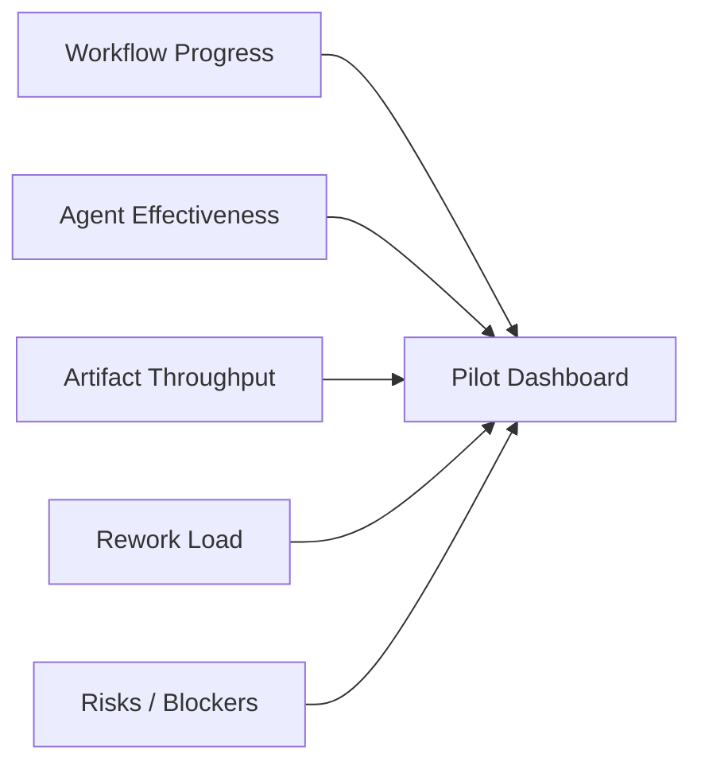
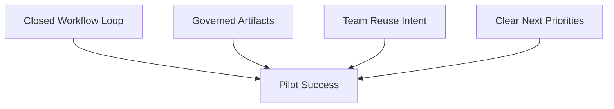

# 85. 试点项目实施手册

## 这篇文档回答什么问题

当电影导演智能体平台从设计阶段进入试点阶段，真正困难的地方往往不是技术，而是：

- 第一批试点项目怎么选
- 试点怎么启动
- 谁负责什么
- 什么时候算试点成功

本篇重点回答：

1. 第一批 pilot project 应该如何选择。
2. 试点项目应如何从启动、运行到验收。
3. Hermes movie mode 在试点中应如何被克制地使用，而不是一上来替代全部工作。

---

## 一、为什么试点项目必须单独设计实施手册

试点不是“小规模上线”，而是验证路线、暴露问题、沉淀组织经验的特殊阶段。

如果没有实施手册，团队很容易把试点做成：

- 临时 demo
- 个人试用
- 难以复盘的实验

---

## 二、第一批试点项目应该怎么选

建议优先选择满足以下条件的项目：

- 规模中小，复杂度可控
- 前期制作文档化意愿较高
- 团队愿意配合 review / approval 流
- 项目负责人对新工作法有试验空间

不建议第一批就选：

- 极度高压的大制作
- 几乎没有文档基础的项目
- 不接受流程改变的团队

---

## 三、建议的试点项目画像

第一批最适合的往往是：

- 一部短片
- 一部低到中预算长片
- 一个具有完整前期制作窗口的开发中项目

关键不是题材，而是它是否能给系统提供完整但可控的前期制作链路。

---

## 四、试点启动前必须完成的准备

建议在 pilot kickoff 前完成以下准备：

1. 明确试点边界。
2. 明确试点成功标准。
3. 建立 movie workspace。
4. 建立最小角色责任表。
5. 约定 review / approval 节点。

---

## 五、试点的推荐运行阶段

建议把试点拆成四个小阶段，而不是一把梭。

### 含义

- `Pilot Setup`：搭环境、对象、角色和规则
- `Shadow Mode`：系统给建议，但不进入正式流程
- `Co-pilot Mode`：系统和人工共同推进正式对象
- `Primary Workflow`：在选定范围内，以 movie mode 为主流程

---

## 六、Shadow Mode 为什么很关键

很多试点失败，不是因为系统没能力，而是因为一开始就直接接管正式流程。

在 Shadow Mode 中，系统主要做：

- 平行生成 breakdown / budget / schedule 草稿
- 给出 review package
- 让团队对比人工结果与系统结果

---

## 七、Co-pilot Mode 的推荐范围

当 Shadow Mode 表现稳定后，可进入 Co-pilot Mode。

建议优先让系统主导这些工作：

- script analysis
- scene / character extraction
- breakdown draft
- schedule option compare
- shot plan first draft

这些环节最容易体现 movie mode 的价值，又不会一下子触碰最高风险的现场执行。

---

## 八、试点中的角色分工建议

### 关键角色

- `Pilot Owner`：对试点成败负责
- `Creative Lead`：确认创作可用性
- `Ops Lead`：确认生产可执行性
- `Implementation Lead`：维护 workspace、配置和运行
- `Governance Owner`：维护 review / approval 节点

---

## 九、试点期间必须跟踪什么

建议每周至少跟踪五类信息：

- 当前 phase 和已推进对象数
- 主智能体 / 子智能体调用效果
- artifact 产出数量和通过率
- 人工返工量
- 风险与阻塞项

---

## 十、试点验收标准建议

建议试点验收不要只看主观满意度，而应满足：

1. 至少一个项目完成前期制作主链闭环。
2. 至少 3 类正式对象进入 review / approval。
3. 团队愿意在下个项目继续使用部分 movie workflow。
4. 能清晰列出下一阶段扩展优先级。

---

## 十一、试点结束后的输出物

试点结束后应至少输出：

- `PilotRetrospectiveReport`
- `LessonsLearned`
- `PilotPlaybook`
- 下一阶段范围建议

---

## 十二、结论

试点项目实施手册的意义，是把 movie mode 的第一次落地从“自由尝试”收束成“可衡量的组织实验”。

它最重要的价值是：

- 控制范围
- 降低风险
- 形成比较基线
- 为后续 rollout 积累真实证据

只有试点做得像试点，而不是像一次 demo，电影平台后面的企业化推进才有基础。

---

## 相关文档

- [81-mvp-scope-definition.md](./81-mvp-scope-definition.md)
- [86-team-organization-and-role-allocation.md](./86-team-organization-and-role-allocation.md)
- [89-metrics-and-roi.md](./89-metrics-and-roi.md)
- [90-enterprise-rollout-roadmap.md](./90-enterprise-rollout-roadmap.md)
- [102-hermes-agent-roi-governance-and-adoption-roadmap-2026.md](./102-hermes-agent-roi-governance-and-adoption-roadmap-2026.md)
- [118-program-governance-roadmap-and-operating-metrics.md](./118-program-governance-roadmap-and-operating-metrics.md)
