# 86. 团队组织与角色分工

## 这篇文档回答什么问题

电影导演智能体平台要真正落地，最终要面对的不只是技术组织，还包括人类团队与 AI 团队如何共同工作。

如果不提前设计组织结构，最容易出现两种问题：

- 人类团队不知道系统在替谁做什么
- AI 团队边界不清，导致责任归属混乱

本篇重点回答：

1. 电影平台落地需要怎样的人类团队结构。
2. AI 角色和人类岗位应如何映射与配合。
3. 试点与规模化阶段的组织设计应如何不同。

---

## 一、为什么组织设计是平台落地的关键变量

即使技术系统已经可用，如果组织结构没有准备好，平台也很容易停留在少数人的实验工具。

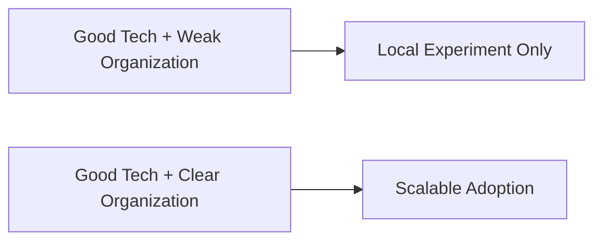

所以组织设计不是 rollout 之后才考虑的问题，而是 rollout 的前提。

---

## 二、建议的人类团队最小结构

在试点阶段，建议至少有以下人类角色：

- `Executive Sponsor`
- `Pilot Owner`
- `Creative Lead`
- `Production Lead`
- `Hermes Implementation Lead`
- `Governance Owner`

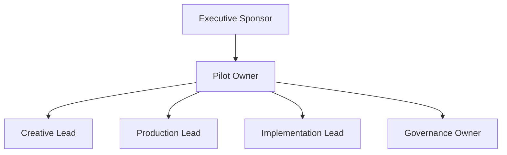

---

## 三、AI 角色与人类岗位的关系

AI 角色不应该被理解成“替代岗位”，更准确的理解是“扩展岗位能力的操作层”。

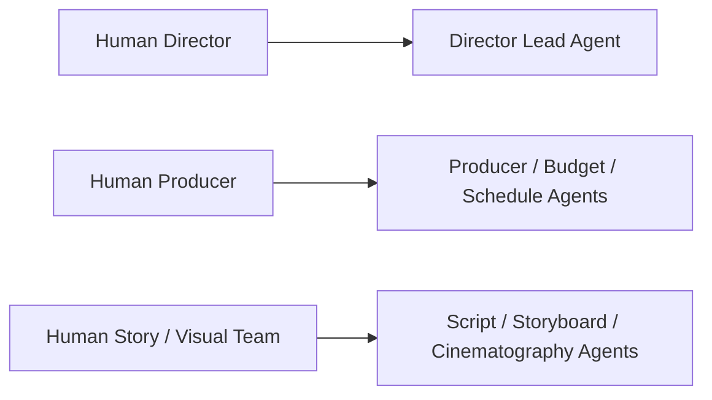

原则上：

- 人类岗位保留最终责任
- AI 角色承担分析、草案、版本组织和回写

---

## 四、建议的人机责任边界

### 人类负责

- 最终创作判断
- 最终生产取舍
- 最终审批和风险承担

### AI 负责

- 结构化分析
- 多版本草案生成
- 状态与 artifact 组织
- review package 和比较摘要

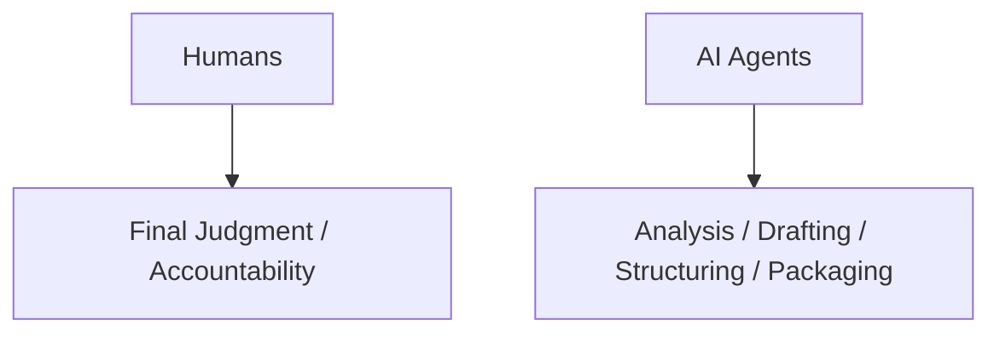

只有边界明确，团队才不会把 AI 误用成“自动拍板器”。

---

## 五、试点阶段的组织模式

试点阶段推荐小队制，而不是大矩阵。

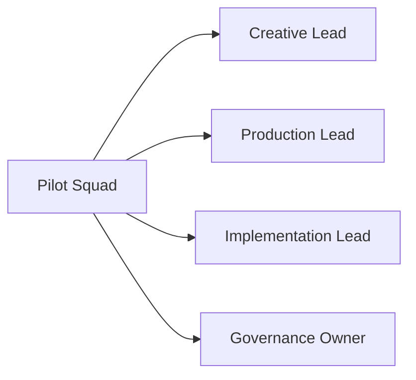

这支小队的目标不是覆盖全部岗位，而是先把一条工作链稳定下来。

---

## 六、规模化阶段的组织模式

当平台开始走向多项目和企业化时，组织结构应逐步分层。

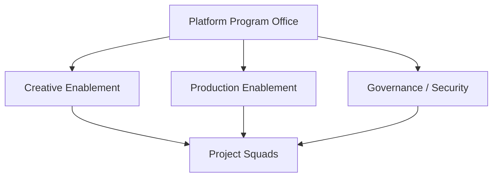

### 含义

- 中央平台团队维护能力底座
- 项目 squad 面向具体片子落地

---

## 七、人与 AI 的协作模式建议

建议至少区分三种模式：

- `Shadow`
- `Co-pilot`
- `Primary Workflow`

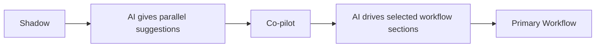

这三种模式不只是技术状态，也是组织成熟度状态。

---

## 八、谁来拥有 MovieThreadState 和治理链

在组织层面，必须明确：

- 谁负责项目控制面的真实性
- 谁负责 review / approval 的正式性

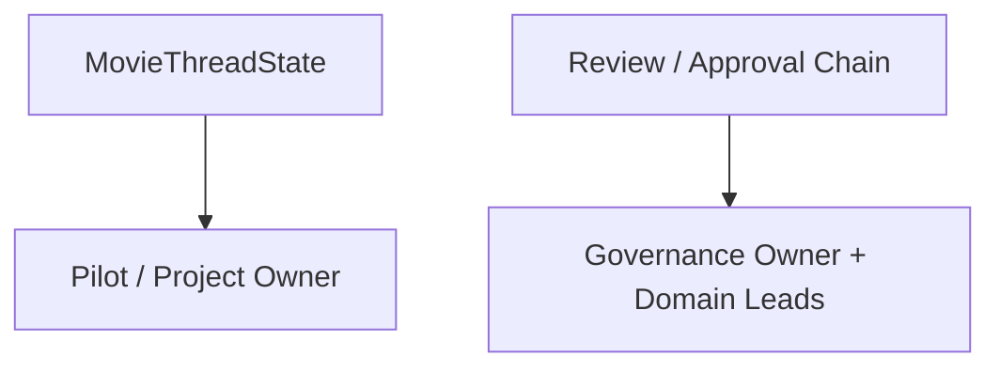

如果 thread state 没有 owner，它很快会变成“看起来很完整，但没人维护”的状态板。

---

## 九、Implementation Lead 为什么单独重要

在很多试点里，技术不是坏在模型，而是坏在没人维护：

- workspace
- config
- role registry
- toolsets
- logs / eval

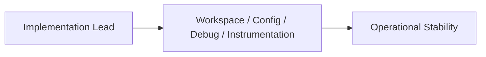

因此 Implementation Lead 在试点阶段几乎是必须角色。

---

## 十、团队能力成长路径建议

建议把团队成长分成三段：

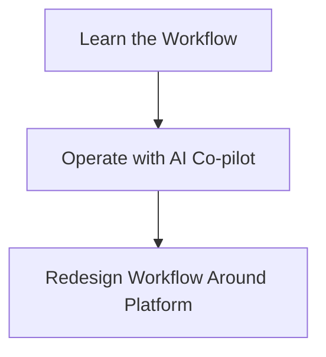

### 解释

- 第一步：先理解 movie mode 的正式工作法
- 第二步：在现有流程里引入 AI 协作
- 第三步：反向重构组织流程

---

## 十一、试点阶段的人力投入建议

第一批试点不建议大面积铺开，建议每个 pilot 至少确保：

- 1 名项目 owner
- 1 名 creative reviewer
- 1 名 production reviewer
- 1 名 implementation lead

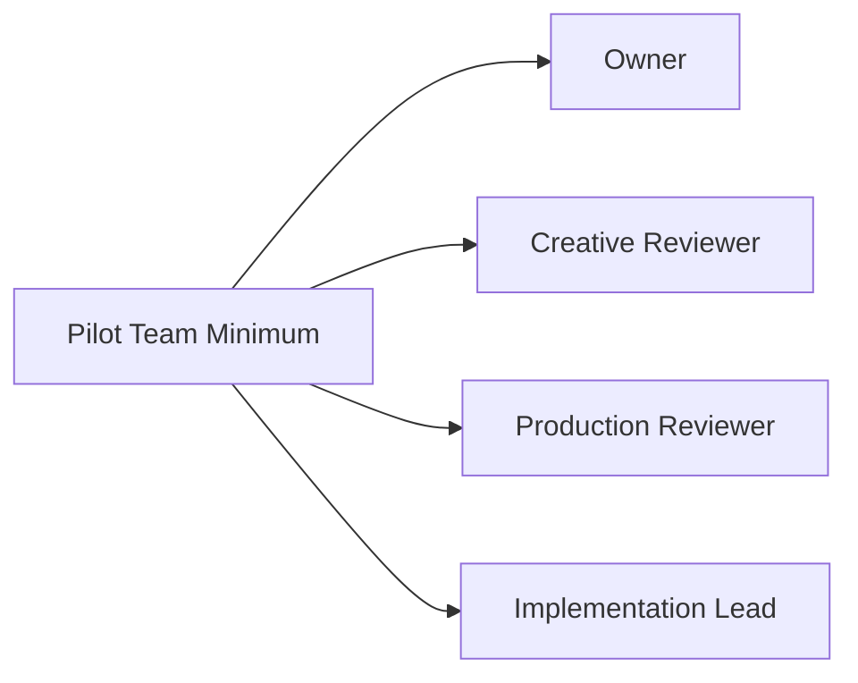

---

## 十二、结论

团队组织与角色分工的核心，不是复制现实剧组层级，而是让：

- 人类责任边界清晰
- AI 角色职责清晰
- 平台 owner 清晰

只有组织结构和平台结构一起设计，movie mode 才能从技术方案变成真实工作体系。

---

## 相关文档

- [85-pilot-project-implementation-manual.md](./85-pilot-project-implementation-manual.md)
- [87-data-and-asset-governance.md](./87-data-and-asset-governance.md)
- [88-security-permissions-and-audit.md](./88-security-permissions-and-audit.md)
- [113-human-team-and-ai-team-organization-design.md](./113-human-team-and-ai-team-organization-design.md)
- [118-program-governance-roadmap-and-operating-metrics.md](./118-program-governance-roadmap-and-operating-metrics.md)
