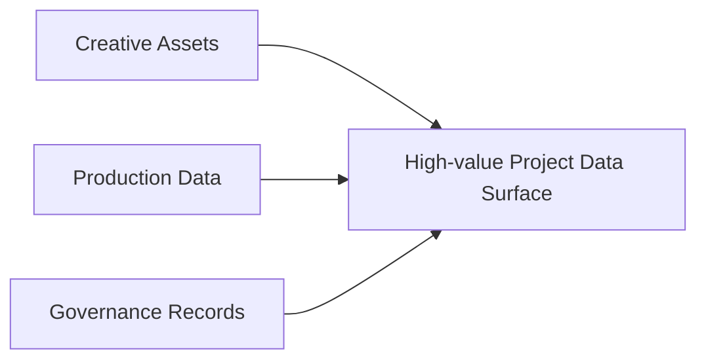
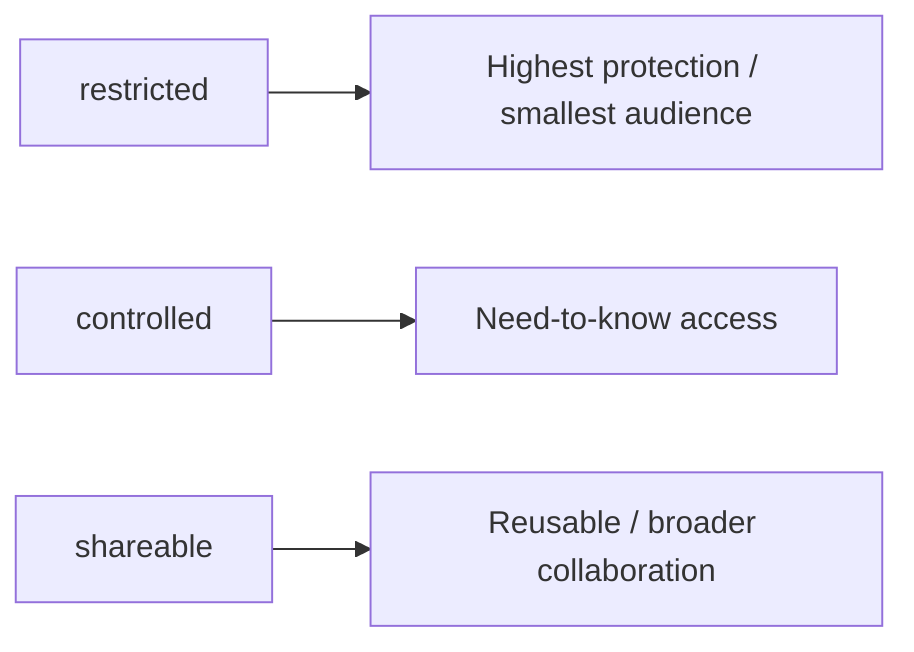
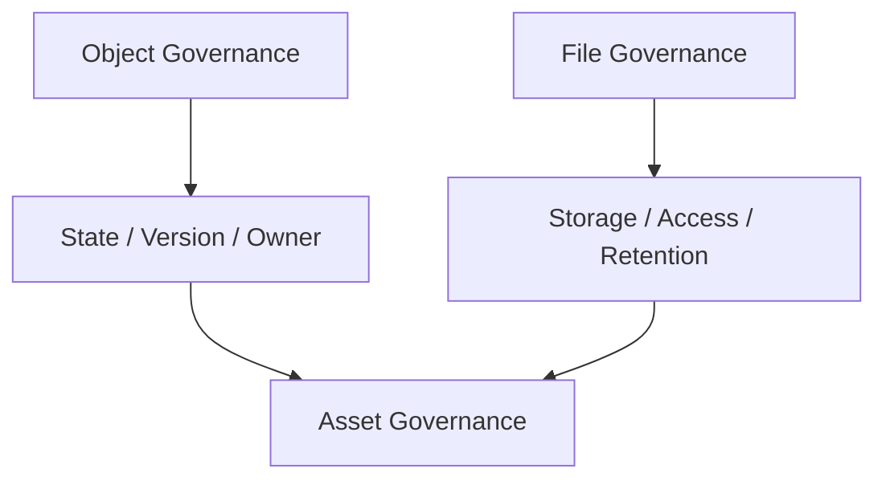
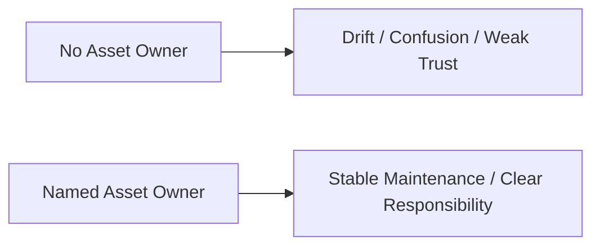
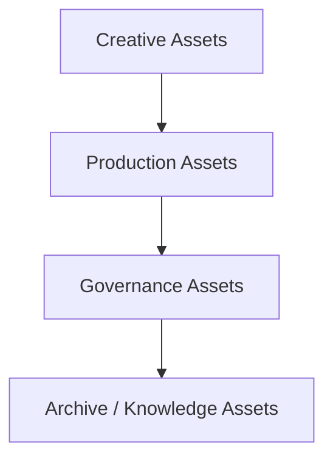
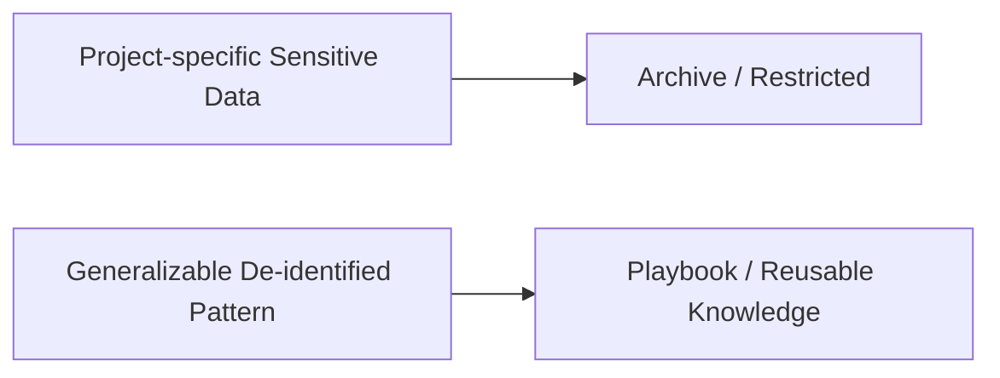
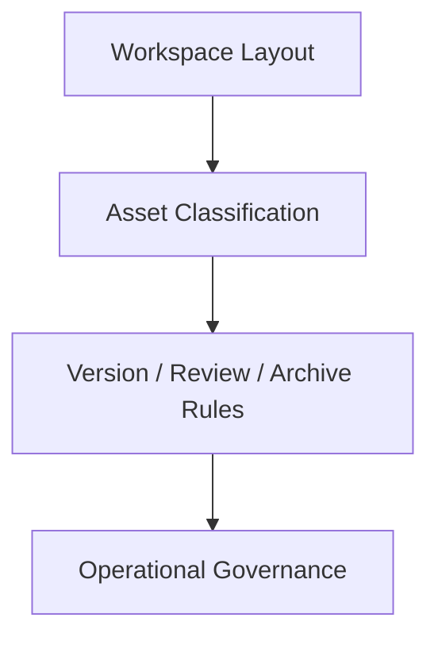
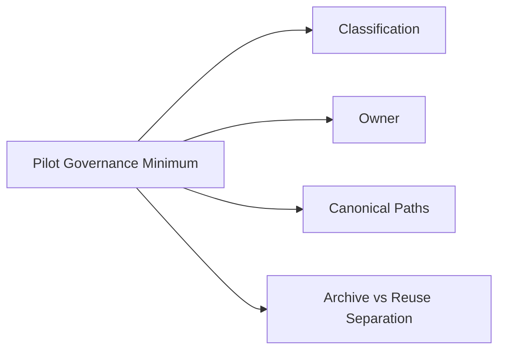

# 87. 数据与资产治理

## 这篇文档回答什么问题

电影项目平台一旦开始真正运行，就会快速积累大量敏感数据和高价值资产：

- 剧本
- 预算
- 排期
- 场地信息
- 分镜和视觉参考
- 审片意见
- 发行与交付文件

如果没有数据与资产治理，平台会很快面临：

- 文件混乱
- 版本失控
- 敏感信息泄露
- 后续无法审计和复盘

本篇重点回答：

1. 电影平台应如何看待数据与资产治理。
2. 应如何对不同类型的资产分级和分流。
3. Hermes movie mode 里最值得优先建立哪些治理规则。

---

## 一、为什么数据治理对电影平台特别关键

电影项目的数据价值通常不是均匀的。

同一个项目里，剧本、预算和 release package 的敏感性、价值和访问方式都可能完全不同。

---

## 二、建议的数据与资产分层

建议至少分成四层：

- 创作资产
- 生产资产
- 治理资产
- 知识资产

### 例子

- 创作资产：script、scene、character、storyboard、prompt pack
- 生产资产：breakdown、budget、schedule、resource plan
- 治理资产：review、approval、release、audit trail
- 知识资产：retrospective、lesson、playbook

---

## 三、资产分级建议

建议在治理上至少给资产打三个等级：

- `restricted`
- `controlled`
- `shareable`

### 例子

- `restricted`：预算、未公开剧本、合同相关数据
- `controlled`：排期、选角短名单、内部审片记录
- `shareable`：通用模板、脱敏 playbooks、公共风格指南

---

## 四、为什么对象层和文件层都要治理

如果只治理文件，不治理对象，系统会出现“文件权限有了，但不知道它代表哪个正式状态”的问题。

所以治理必须同时覆盖：

- 对象身份
- 文件路径
- 版本关系
- 访问边界

---

## 五、建议的治理规则主链

每个关键资产进入系统时，都至少应经过这条链。

---

## 六、资产 owner 为什么必须明确

很多系统失败，不是因为没人能看，而是因为没人负责维护真实性。

### 建议

- 剧本对象 owner：creative lead
- 预算 / 排期 owner：production lead
- review / approval owner：governance owner
- archive / retrospective owner：platform or project owner

---

## 七、数据流转边界建议

电影平台里最容易出问题的是跨层数据流转。

### 原则

- 上游对象可派生下游对象
- 下游对象不能无约束回写上游正式版本
- 每次关键跨层变更都应留 decision trace

---

## 八、脱敏与知识复用的关系

不是所有资产都能直接进入跨项目知识层。

这就是为什么：

- archive 和 knowledge 必须分层
- ROI / enterprise rollout 只能依赖脱敏后的复用结果

---

## 九、workspace 与治理的关系

工作区不是治理之外的文件堆，而应是治理规则的执行面。

### 建议

- 用目录结构强化资产边界
- 用 canonical path 强化正式版本边界
- 用 archive snapshot 强化里程碑边界

---

## 十、在 Hermes Agent 中的映射建议

最值得优先补的治理能力包括：

- asset classification metadata
- object owner metadata
- archive retention rules
- de-identification / reusable knowledge policy

---

## 十一、MVP / Pilot 阶段应先做什么

第一批试点不需要全量 enterprise-grade data governance，但至少应先做到：

1. 关键资产分类。
2. 关键对象 owner 明确。
3. canonical artifact paths 明确。
4. archive 与 reusable knowledge 分离。

---

## 十二、结论

数据与资产治理的意义，不是把电影平台做得更官僚，而是让高价值创作与生产资产真正具备：

- 可识别
- 可追踪
- 可保护
- 可复用

只有这层建立起来，movie mode 才能从“协作工具”升级成“正式生产资产系统”。

---

## 相关文档

- [70-artifact-version-and-archive-system.md](./70-artifact-version-and-archive-system.md)
- [79-workspace-artifacts-and-file-flow.md](./79-workspace-artifacts-and-file-flow.md)
- [88-security-permissions-and-audit.md](./88-security-permissions-and-audit.md)
- [116-output-management-and-agent-artifacts-system.md](./116-output-management-and-agent-artifacts-system.md)
- [118-program-governance-roadmap-and-operating-metrics.md](./118-program-governance-roadmap-and-operating-metrics.md)
