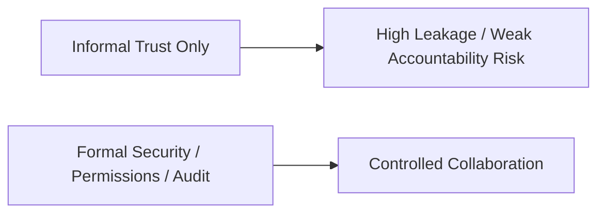
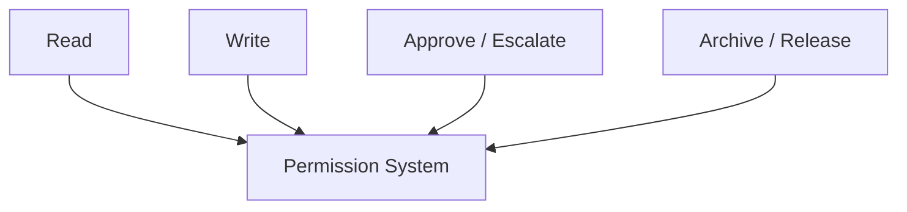
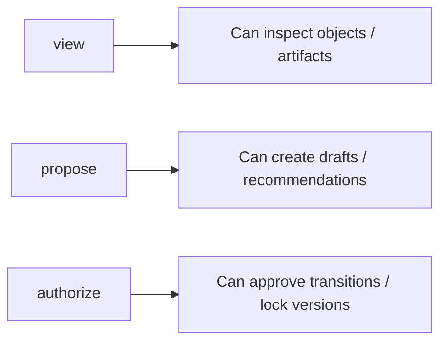
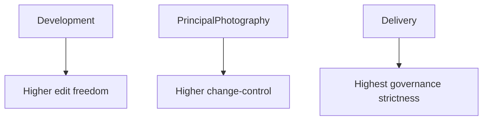
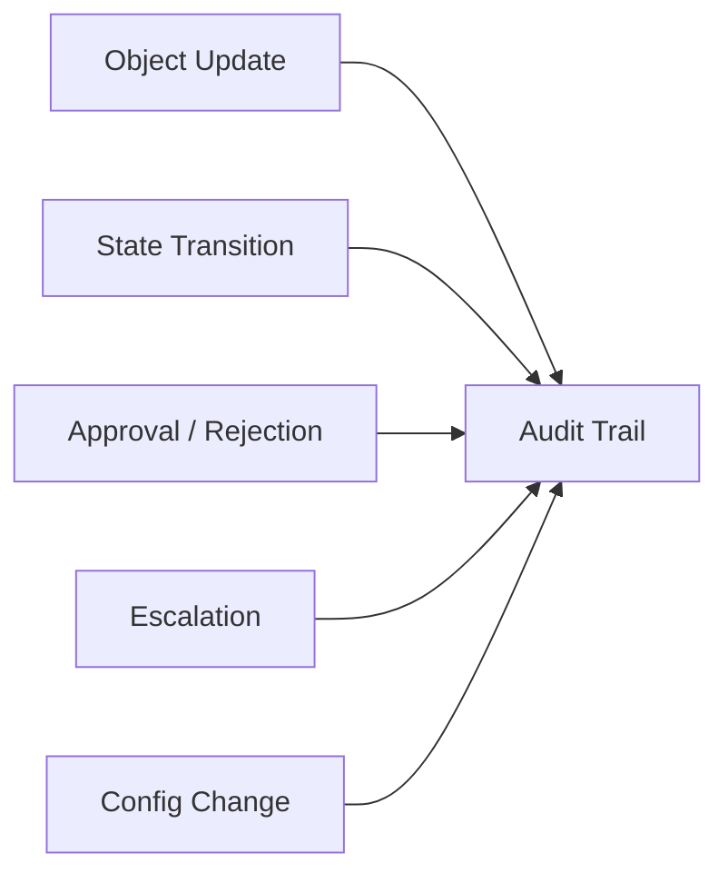
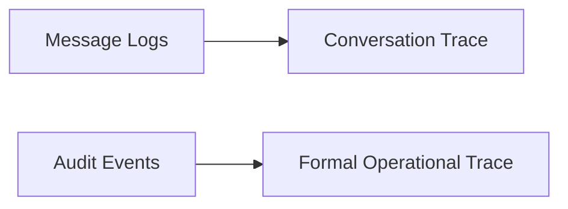
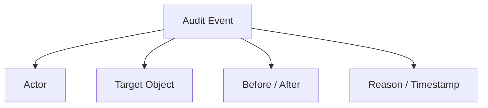
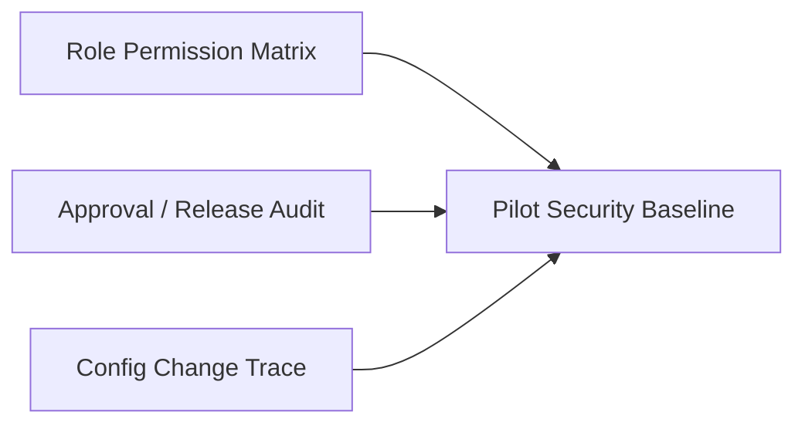
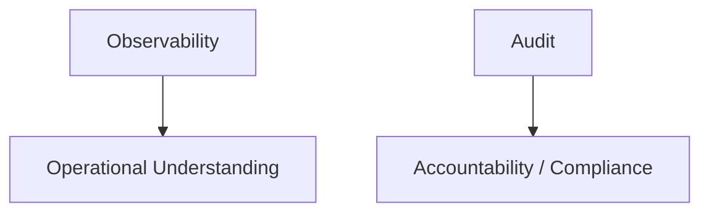

# 88. 安全、权限与审计

## 这篇文档回答什么问题

电影导演智能体平台一旦进入真实项目，就不再只是“创意工具”，而是一个会读写敏感资产、会触发正式治理动作的系统。

这意味着三个问题必须被明确设计：

- 谁能看什么
- 谁能改什么
- 出了问题以后如何追溯

本篇重点回答：

1. 为什么安全、权限与审计必须在企业落地前进入正式设计。
2. 电影平台最需要保护的边界是什么。
3. Hermes movie mode 里最值得优先实现的权限和审计机制是什么。

---

## 一、为什么电影平台不能只靠“团队自觉”

当系统开始承载：

- 剧本
- 预算
- 排期
- review / approval 记录
- release package

仅靠口头约定已经不够。

平台真正进入组织级使用之前，这一层必须被明确下来。

---

## 二、最需要保护的边界是什么

建议至少明确四种高敏边界：

- 创作机密
- 生产机密
- 治理机密
- 平台操作机密

### 例子

- 创作机密：未公开剧本、角色弧线、分镜
- 生产机密：预算、排期、资源约束
- 治理机密：审批意见、问题归因、送审结论
- 平台操作机密：配置、密钥、审计日志

---

## 三、权限系统最该控制什么

权限系统的重点不应只是“能不能打开文件”，还应包括：

- 对象读权限
- 对象写权限
- 状态跃迁权限
- 审批 / 升级权限

这就是为什么权限层必须和对象系统、治理系统一起设计。

---

## 四、角色权限建议

建议至少分三类权限：

- `view`
- `propose`
- `authorize`

### 典型边界

- 子智能体通常应停留在 `view + propose`
- 导演主智能体和治理层才拥有部分 `authorize`
- 最终高风险授权仍应保留给人类 owner

---

## 五、为什么 phase 也应影响权限

同一个对象在不同 phase 下的权限边界可能不同。

例如：

- development 中允许频繁改写 `ScriptVersion`
- principal photography 中对 `ScheduleDraft` 的变更应更谨慎
- delivery 中 `ReleasePackage` 应近乎只读

---

## 六、审计要记录什么

建议至少审计以下事件：

- 对象创建与更新
- 状态跃迁
- approval / rejection
- escalation
- release / archive
- 关键配置变更

---

## 七、为什么审计不能只看消息日志

消息日志只能说明“说了什么”，但不能稳定说明：

- 哪个对象被正式改了
- 哪个状态被正式批准了
- 哪个 artifact 被正式出厂了

因此：

- 消息日志是背景
- audit event 才是正式治理证据

---

## 八、最小审计事件结构建议

建议至少包含：

- `event_id`
- `event_type`
- `actor_type`
- `actor_id`
- `target_object_ref`
- `before_state`
- `after_state`
- `timestamp`
- `reason`

---

## 九、在 Hermes Agent 中最适合先实现什么

不建议第一版就做复杂 RBAC 平台，但至少应优先实现：

- role-based object permission matrix
- approval action logging
- release / archive audit events
- config and key change trace

---

## 十、与 observability 的关系

安全与审计不是 observability 的替代，它们覆盖的是不同层面。

### 简化理解

- observability 回答“系统为什么这样表现”
- audit 回答“谁在什么时候正式做了什么”

---

## 十一、试点与企业阶段的差异

### 试点阶段

- 先做最小权限矩阵
- 先做关键治理事件审计

### 企业阶段

- 再细化到部门 / 项目 / phase 级授权
- 再补审计查询、保留和合规流程

---

## 十二、结论

安全、权限与审计的意义，不是让电影平台变慢，而是让它在真正进入正式生产后仍然可控、可追责、可扩展。

这一层最少要确保三件事：

- 敏感内容有边界
- 状态跃迁有授权
- 正式动作有审计

只有这样，movie mode 才能真正进入组织级使用，而不只是停留在实验状态。

---

## 相关文档

- [87-data-and-asset-governance.md](./87-data-and-asset-governance.md)
- [90-enterprise-rollout-roadmap.md](./90-enterprise-rollout-roadmap.md)
- [111-video-agents-risk-evals-and-governance.md](./111-video-agents-risk-evals-and-governance.md)
- [116-output-management-and-agent-artifacts-system.md](./116-output-management-and-agent-artifacts-system.md)
- [118-program-governance-roadmap-and-operating-metrics.md](./118-program-governance-roadmap-and-operating-metrics.md)
