# 89. 指标与 ROI

## 这篇文档回答什么问题

电影平台要进入企业级 rollout，最终一定会被问到一个问题：

**它到底值不值。**

如果没有指标体系和 ROI 口径，平台很容易陷入两种局面：

- 使用者觉得“感觉挺好”，但无法争取资源
- 管理层觉得“很有趣”，但无法决定是否扩大投入

本篇重点回答：

1. 电影平台最该看哪些指标。
2. ROI 应如何从时间、质量、治理和复用四个维度来衡量。
3. Hermes movie mode 在试点和企业阶段应如何建立统一口径。

---

## 一、为什么不能只看节省了多少时间

电影平台的价值不是纯自动化软件价值，它还涉及：

- 产出质量
- 治理稳定性
- 组织协同成本
- 跨项目复用能力

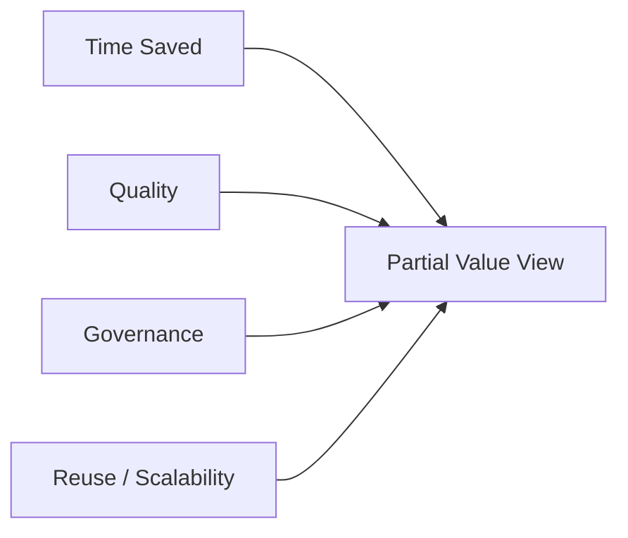

所以 ROI 必须是复合指标，不是单一工时指标。

---

## 二、建议的四类核心指标

建议至少把指标分成四组：

- 效率指标
- 质量指标
- 治理指标
- 复用指标

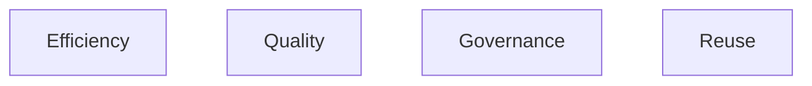

---

## 三、效率指标建议

效率层最适合回答：

- 任务是否更快完成
- 版本是否更快收敛
- 人工返工是否降低

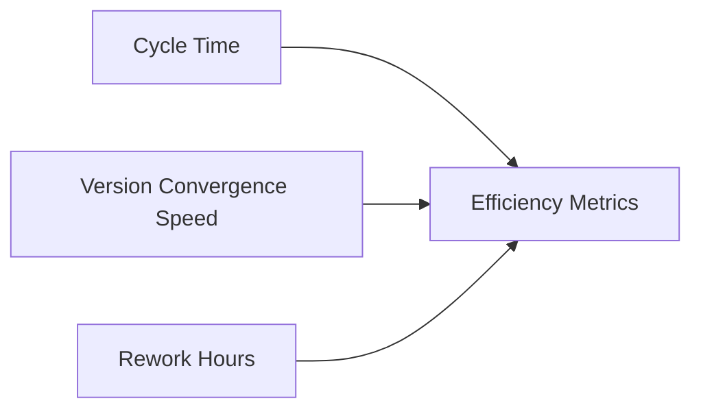

### 例子

- 剧本分析从输入到首版 artifact 的耗时
- budget / schedule 初稿产出的平均时间
- review 闭环周期
- 每个阶段的人工作业小时数

---

## 四、质量指标建议

质量层不应只靠主观“看起来更好”，而应寻找可比较 proxy。

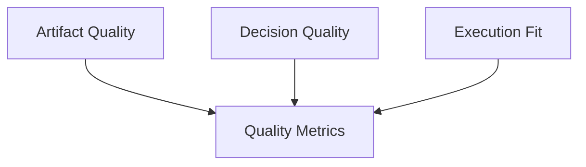

### 例子

- breakdown 完整率
- budget / schedule 后续修正幅度
- shot plan 在后续阶段保留比例
- review finding 重复出现率

---

## 五、治理指标建议

治理层最适合回答“平台有没有让流程更正式、更可控”。

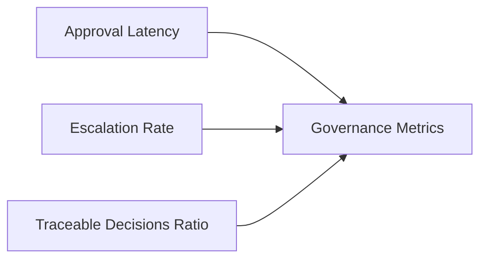

### 例子

- approval 平均等待时长
- escalation 触发率
- 有正式 decision record 的关键动作比例
- release package 可追溯率

---

## 六、复用指标建议

很多长期价值并不来自单个项目，而来自可复用能力增长。

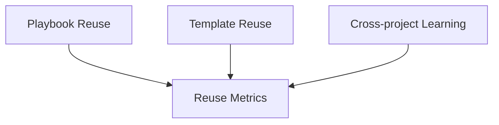

### 例子

- playbook 被复用次数
- 模板资产复用率
- 跨项目平均启动时间下降幅度

---

## 七、ROI 的推荐计算视角

建议至少从四个维度算 ROI：

- 时间 ROI
- 质量 ROI
- 治理 ROI
- 组织 ROI

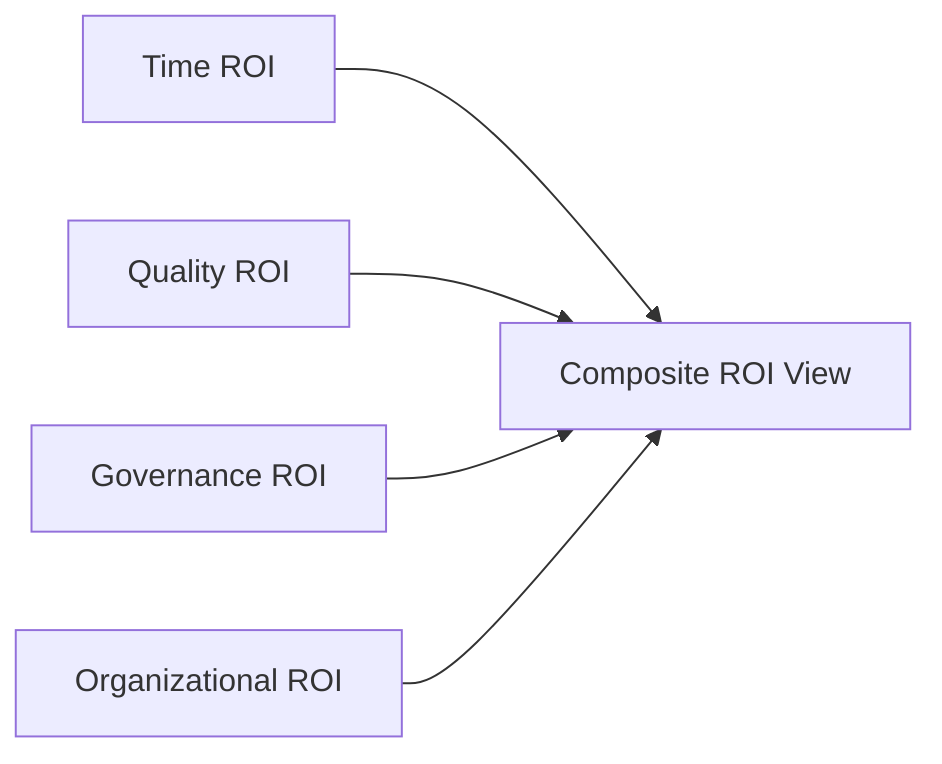

---

## 八、试点阶段如何算 ROI

试点阶段不适合追求严格财务模型，更适合做对比型 ROI。

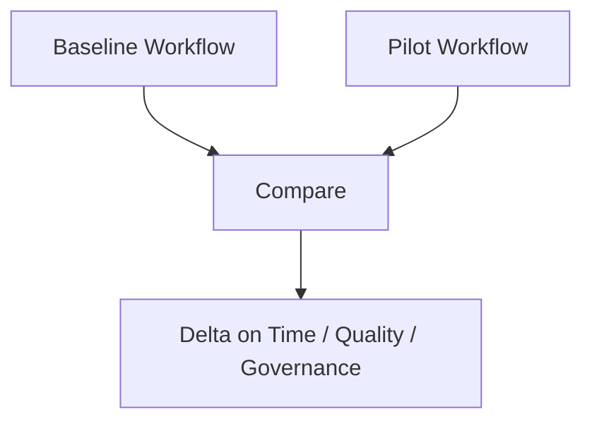

### 推荐比较方法

- 同类任务前后对比
- 平行 shadow mode 对比
- 单项目内 AI vs 非 AI 工作流对比

---

## 九、企业阶段如何算 ROI

企业阶段需要更正式的投入产出模型。

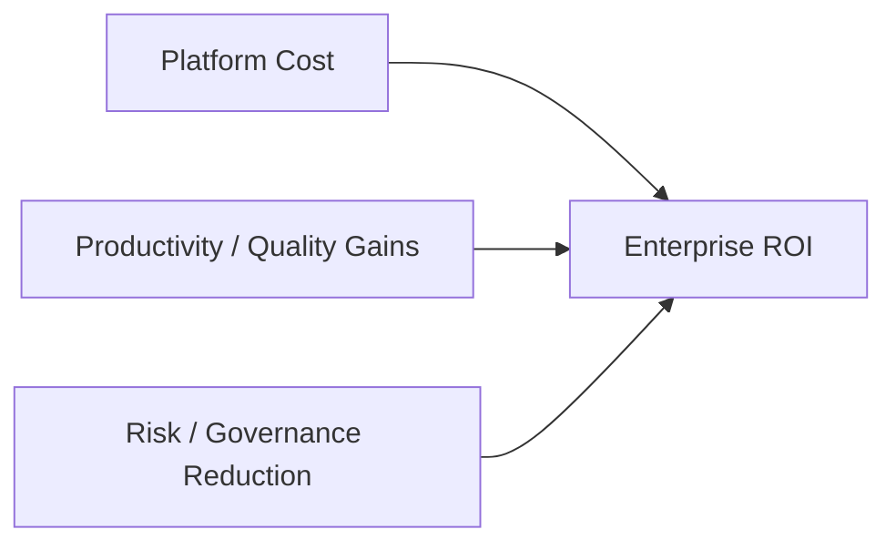

### 平台成本可包括

- 模型与基础设施成本
- 实施与维护成本
- 培训与治理成本

### 收益可包括

- 人工工时下降
- 返工减少
- 项目交付稳定性提升
- 知识复用带来的加速

---

## 十、为什么“风险下降”也应计入 ROI

在电影项目里，减少返工、减少版本混乱、减少治理失控，本身就是价值。

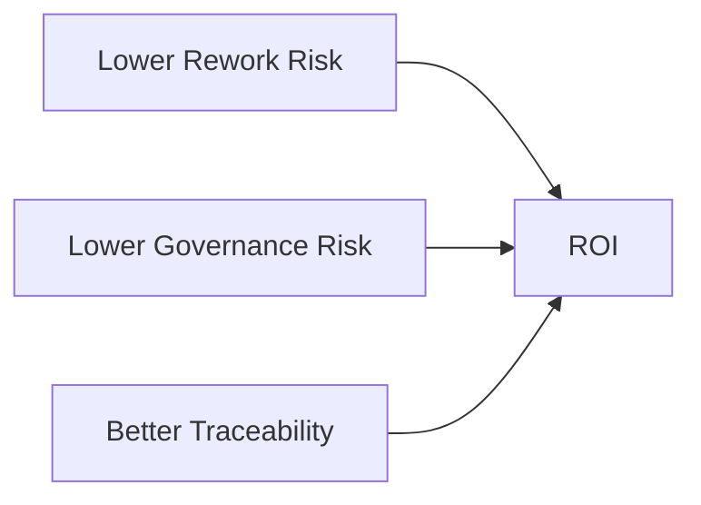

这部分往往比单次节省几小时更重要。

---

## 十一、推荐的指标仪表板结构

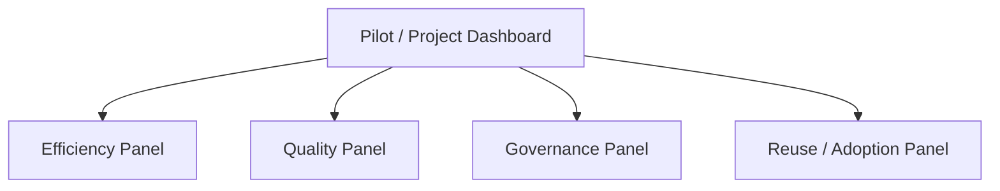

这也是后续 management review 最容易使用的结构。

---

## 十二、结论

指标与 ROI 的意义，不是把电影平台变成财务工具，而是让平台价值能被持续解释、比较和决策。

最推荐的做法是：

- 先从试点对比指标做起
- 再逐步形成统一 ROI 口径
- 把时间、质量、治理和复用一起纳入评价

只有这样，movie mode 才能从“有趣的新工具”变成“值得持续投资的平台能力”。

---

## 相关文档

- [85-pilot-project-implementation-manual.md](./85-pilot-project-implementation-manual.md)
- [90-enterprise-rollout-roadmap.md](./90-enterprise-rollout-roadmap.md)
- [102-hermes-agent-roi-governance-and-adoption-roadmap-2026.md](./102-hermes-agent-roi-governance-and-adoption-roadmap-2026.md)
- [118-program-governance-roadmap-and-operating-metrics.md](./118-program-governance-roadmap-and-operating-metrics.md)
