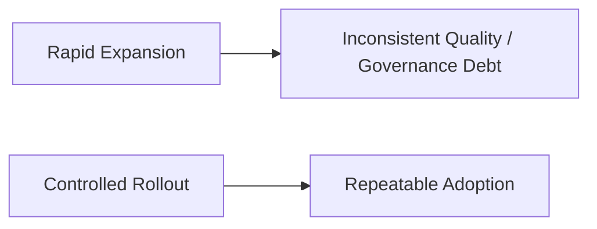
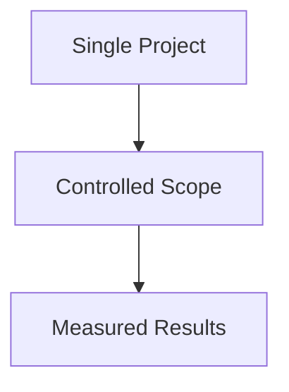
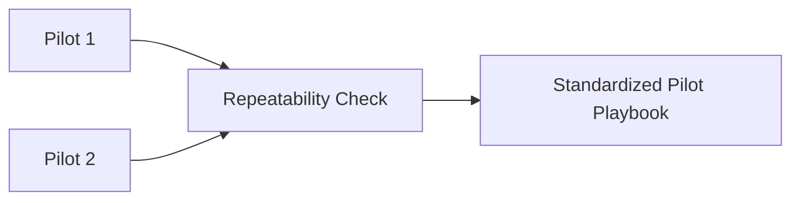
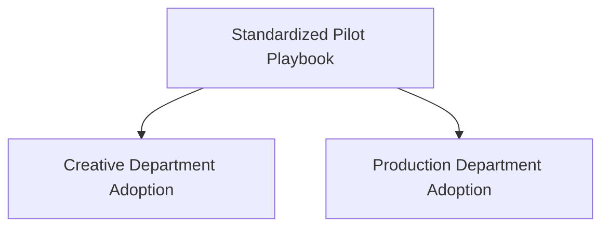
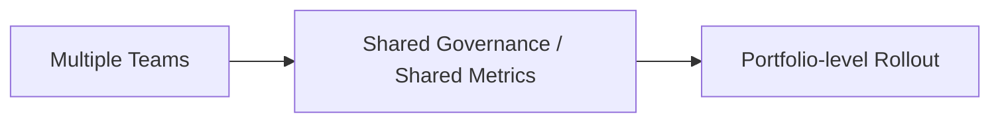
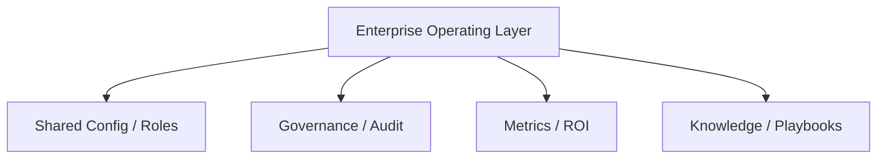
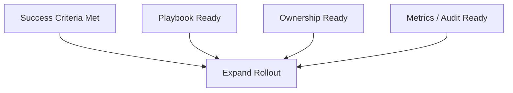
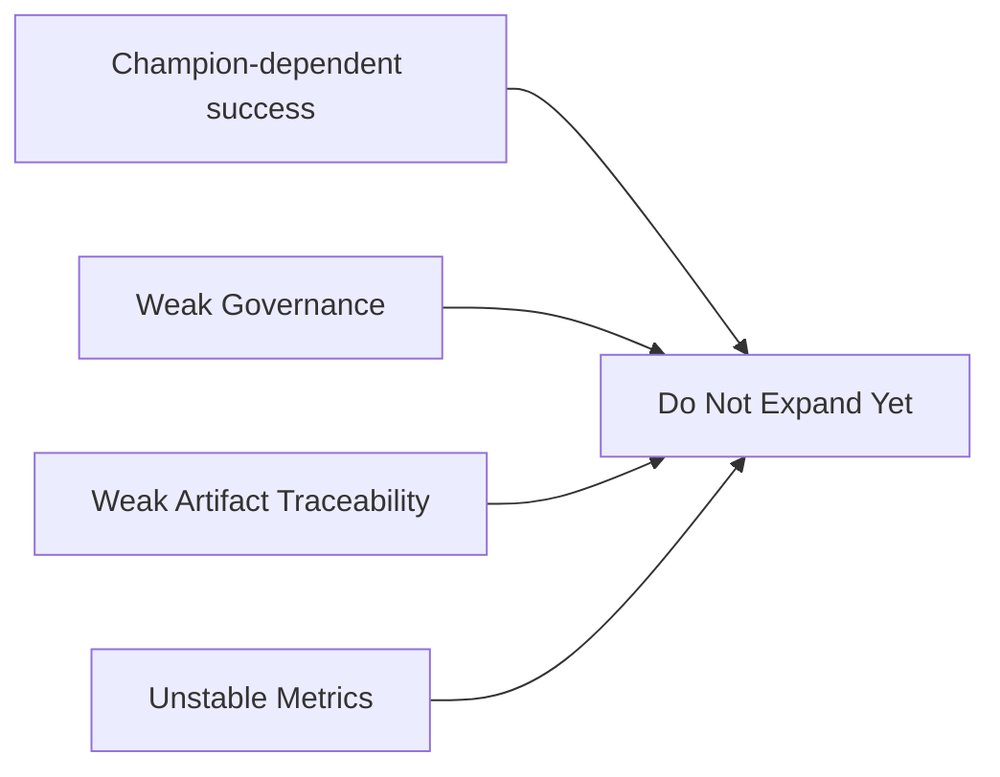
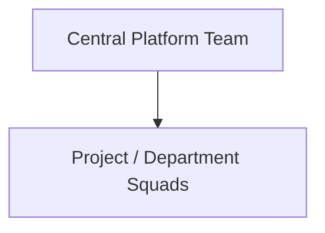
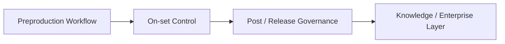

# 90. 企业级推广路线图

## 这篇文档回答什么问题

试点做完之后，真正困难的问题才开始出现：

- 是不是可以扩大到更多项目
- 先扩到哪些团队
- 平台团队和项目团队如何配合
- rollout 应该按什么顺序避免失控

本篇重点回答：

1. movie mode 从试点走向企业级应用的推荐路径。
2. 不同阶段的 rollout 重点应该是什么。
3. 什么情况下应该扩大推广，什么情况下应该继续局部收敛。

---

## 一、为什么 rollout 不能从“更多人用”开始

企业级 rollout 的第一原则不是扩张，而是稳定复制。

只有当平台在一个范围内稳定可复制，扩大才有意义。

---

## 二、推荐的 rollout 五阶段

建议把 rollout 拆成五个阶段：

- `Pilot`
- `Repeatable Pilot`
- `Department Adoption`
- `Portfolio Adoption`
- `Enterprise Operating Layer`

---

## 三、阶段 1：Pilot

目标：

- 证明前期制作闭环可跑通
- 证明团队愿意持续使用

只有 pilot 结束后，才讨论是否复制。

---

## 四、阶段 2：Repeatable Pilot

这一阶段的重点，不是再做一个更大的 pilot，而是验证：

- 不同项目类型下是否仍然成立
- 同一套 playbook 是否可复用

如果 repeatability 不成立，就不应直接进入部门级 rollout。

---

## 五、阶段 3：Department Adoption

当试点可复制后，可以开始在相近团队或业务单元内推广。

### 这一阶段重点

- 培训
- playbook 固化
- 默认配置与角色包收敛
- support 机制建立

---

## 六、阶段 4：Portfolio Adoption

当多个团队都能稳定使用时，平台才进入 portfolio 层。

这时重点不再是“能不能用”，而是：

- 不同项目之间是否能共享能力
- 是否有统一指标口径
- 是否有统一配置与治理基线

---

## 七、阶段 5：Enterprise Operating Layer

最终阶段，movie mode 不再只是项目工具，而开始成为企业操作层的一部分。

这时平台的价值主要体现在：

- 可复制
- 可治理
- 可评估
- 可持续积累

---

## 八、什么情况下应该扩大 rollout

建议至少满足以下条件才扩大：

1. 前一阶段有清晰成功标准并已满足。
2. 有标准 playbook 和最小培训材料。
3. 有 owner 和 support 机制。
4. 有最小 metrics / audit 能见度。

---

## 九、什么情况下不应该扩大 rollout

如果出现以下情况，应继续局部收敛而不是扩张：

- pilot 结果高度依赖个别 champion
- 关键治理节点仍然混乱
- 版本与文件流不可追溯
- 指标口径不稳定

---

## 十、企业级 rollout 的组织建议

建议形成“双层组织”：

- 中央平台团队
- 项目落地 squad

### 中央平台团队负责

- config / tools / skills / governance baseline
- training / support
- metrics / ROI

### 项目 squad 负责

- 具体项目落地
- 本地流程适配
- 反馈回流

---

## 十一、rollout 的能力演进顺序建议

建议 rollout 的能力顺序和平台能力顺序保持一致。

不要一开始就在所有项目上同时打开全部能力。

---

## 十二、结论

企业级推广路线图的关键，不是追求“最快覆盖”，而是建立：

- 可复制的 pilot 结果
- 可标准化的 playbook
- 可治理的组织边界
- 可衡量的 ROI 口径

只有按阶段稳步扩大，movie mode 才能真正从单点试验成长为企业级电影生产能力层。

---

## 相关文档

- [85-pilot-project-implementation-manual.md](./85-pilot-project-implementation-manual.md)
- [89-metrics-and-roi.md](./89-metrics-and-roi.md)
- [102-hermes-agent-roi-governance-and-adoption-roadmap-2026.md](./102-hermes-agent-roi-governance-and-adoption-roadmap-2026.md)
- [113-human-team-and-ai-team-organization-design.md](./113-human-team-and-ai-team-organization-design.md)
- [118-program-governance-roadmap-and-operating-metrics.md](./118-program-governance-roadmap-and-operating-metrics.md)
