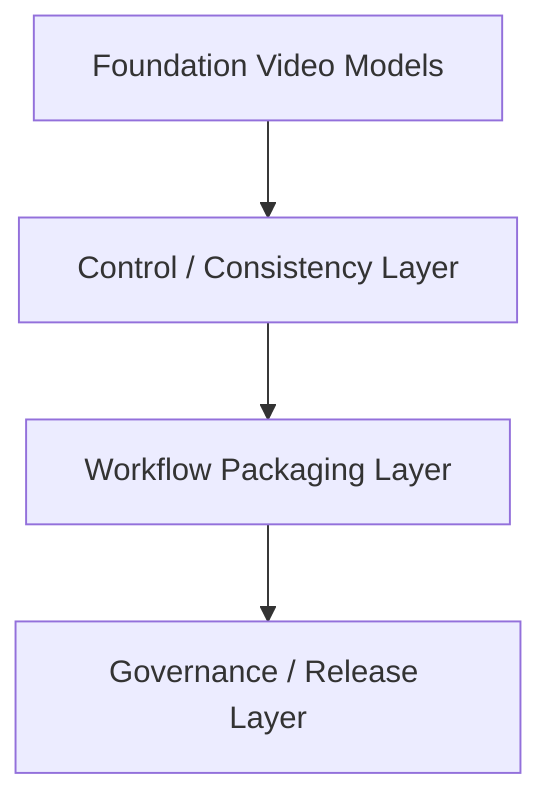
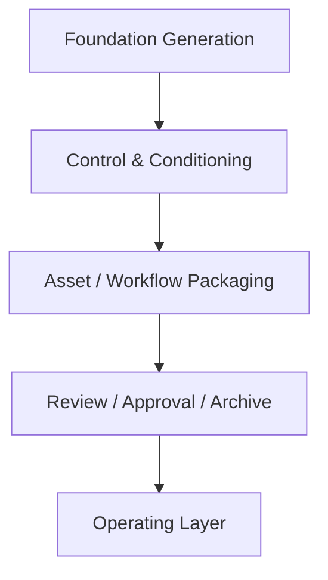
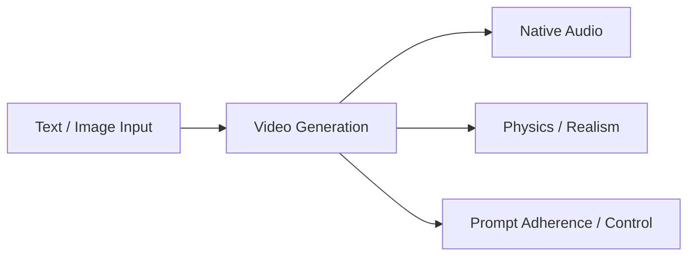
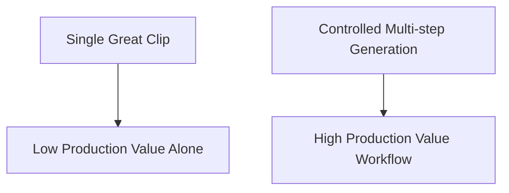
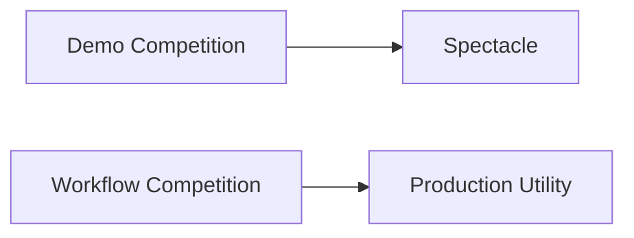
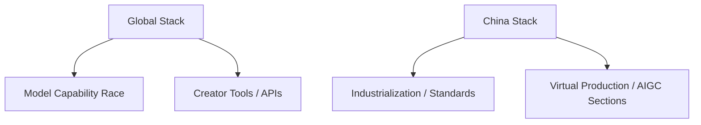
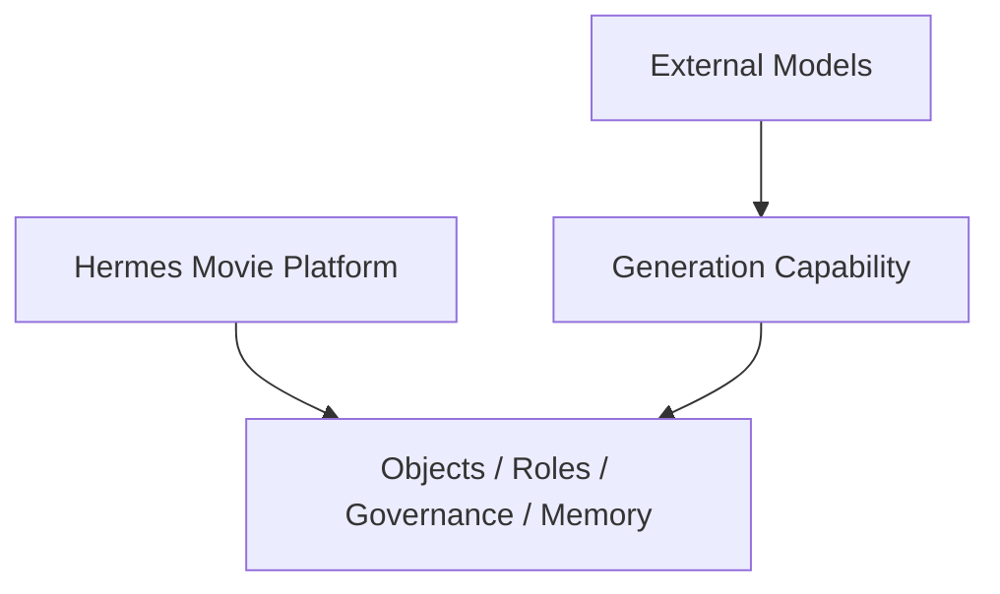
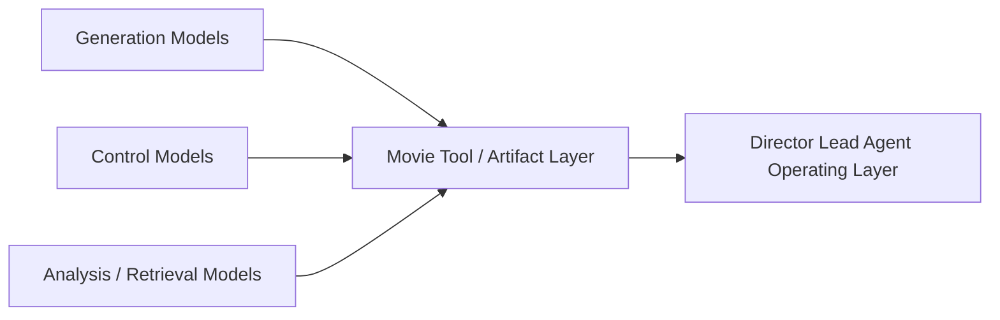
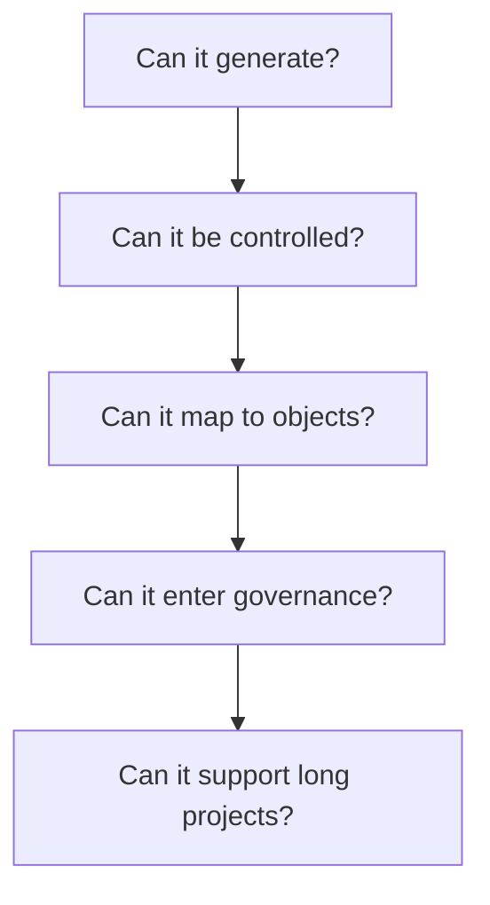

# 91. 2026 模型版图与电影 AI 技术栈

## 这篇文档回答什么问题

如果说前面 1 到 90 篇是在定义“电影导演智能体平台应该长成什么样”，那么从 91 开始，我们要回答另一个现实问题：

**截至 2026 年 4 月，外部模型世界已经发展到了哪里，电影平台该怎么接。**

本篇重点回答：

1. 2026 年视频生成与电影 AI 模型版图大致是什么结构。
2. 电影平台最该关注的不是“最强单模型”，而是哪条技术栈组合。
3. Hermes Agent 为什么更适合站在“组织这些模型”的位置，而不是变成某一个模型的壳。

---

## 一、2026 的核心变化不是“又多了几个模型”，而是技术栈开始分层

截至 2026 年 4 月，视频生成与电影 AI 生态已经不再只是“谁能出更惊艳的单段视频”。更关键的变化是：模型能力开始沿着完整工作流分层，从底层视频生成，走向控制、包装、协同和治理。OpenAI 的 Sora 2 已公开强调更强的物理准确性、可控性以及同步音频能力；Google DeepMind 的 Veo 页面则已展示带原生音频、扩展创作控制和更强 prompt adherence 的 Veo 3 / 3.1；Runway 也在持续把视频生成和世界模型方向结合到自己的产品层与开发者层。 citeturn1search1turn1search2turn1search4turn1search6turn0search10

这说明电影平台的竞争点，已经从“谁能出一支炫视频”，转向“谁能把模型组织成可靠工作流”。

---

## 二、截至 2026 年 4 月，电影 AI 技术栈大致可分五层

建议把 2026 的电影 AI 栈理解为五层：

- foundation generation
- control and conditioning
- asset / workflow packaging
- review / approval / archive
- organizational operating layer

这里真正决定平台价值的，往往不是第一层，而是后四层。

---

## 三、Foundation Generation 层正在发生什么

截至 2026 年 4 月，foundation generation 层的明显趋势是：

- 视频模型开始强调物理一致性
- 音频正成为一等能力
- 更长、更可控的视频片段正在成为默认诉求

OpenAI 的 Sora 2 官方资料强调同步音频、更高物理准确性和更强 steerability；Google DeepMind 官方 Veo 页面也明确把 native audio、creative controls、real world physics 和 prompt following 放在核心能力上。 citeturn1search1turn1search2turn1search4

这意味着“能不能出视频”已经不再是门槛，“能不能稳定控制”才是门槛。

---

## 四、为什么控制层会比单模型能力更重要

对电影工作流来说，最难的从来不是生成一条看起来不错的片段，而是让多轮生成围绕同一创作意图、同一场景和同一角色持续收敛。

这也是为什么 `ShotPlan`、`StoryboardDraft`、`PromptPack` 这些对象在平台里必须被正式化。Foundation model 负责“能生成”，控制层负责“能稳定生产”。

---

## 五、2026 的一个关键信号：视频模型正在走向世界模型和代理化

Runway 在 2026 年 3 月推出 Builders 计划时，同时强调了 `Runway Characters` 和由 `GWM-1` 驱动的实时视频 agent API；同一时期的官方材料也把 Gen-4.5 定义为更成熟的视频生成底座。这个信号很重要，因为它说明头部厂商不再把视频能力只当做单次生成，而是在把“视频世界状态”和“交互式创作”往 agent 方向推进。 citeturn0search10turn1search6turn1search10

对于电影平台来说，这意味着未来会越来越需要一个 orchestration 层去组织这些更强的媒体模型。

---

## 六、电影 AI 的真正竞争，正在从生成竞赛转成工作流竞赛

如果我们只看 demo，容易以为 2026 的重点还是“谁的视频更像电影”。但从工业化角度看，更关键的是：

- 谁更能接进 preproduction
- 谁更能接进 review / approval
- 谁更能接进 archive / release

这也是为什么一个导演智能体平台不能只盯模型排行榜，而必须盯“模型 + control + governance”的组合。

---

## 七、2026 年中国与全球技术栈的差异

截至 2026 年 4 月，中国 AI 产业的整体规模和产业化速度仍在快速扩大。中国官方在 2026 年 3 月披露，2025 年中国核心 AI 产业规模已超过 1.2 万亿元人民币，企业数量超过 6200 家；更早的官方政策也明确提出到 2026 年制定 50 项以上 AI 国家和行业标准。与此同时，中国电影与 AIGC 生态中，围绕电影节单元、虚拟制作和全链路应用的公开信号也明显增多。 citeturn0search2turn0search5turn4search1turn4search6turn2search1

这意味着中国市场未必先在“最强单模型品牌心智”上领先，但在行业接入、应用组织和基础设施方面可能出现非常快的落地速度。

---

## 八、导演智能体平台应该如何看待外部模型

外部模型不应被理解成“平台的替代物”，而应被理解成“平台要编排的外部能力层”。

这一点非常关键。因为：

- 外部模型擅长生成和识别
- 平台擅长项目控制、角色协作和状态治理

两者不是同一类产品。

---

## 九、对 Hermes Agent 的直接启发

截至 2026 年 4 月，最值得 Hermes movie mode 优先对接的，不是某个单一模型品牌，而是三种能力类型：

- 高质量视频 / 音频生成能力
- 图像与视觉一致性控制能力
- 面向角色和工作流的包装与治理能力

这会让 Hermes 更像“电影 AI 操作系统”，而不是“某个模型的前端 UI”。

---

## 十、推荐的 2026 电影 AI 栈认知框架

建议用下面这个判断顺序看待所有新模型：

1. 它能生成什么。
2. 它能否稳定控制。
3. 它能否进入对象系统。
4. 它能否进入 review / approval。
5. 它能否服务长期项目，而不是只服务一次性 demo。

---

## 十一、结论

截至 2026 年 4 月，电影 AI 的真正变化，不只是 foundation model 更强了，而是整个技术栈开始朝“可控、可包装、可治理、可代理化”方向走。

对 Hermes Agent 来说，这意味着最有价值的位置不是去和单模型竞争，而是：

- 组织外部模型
- 将它们接进角色系统
- 将它们接进对象系统
- 将它们接进治理和长期项目运行

这也是电影导演智能体平台在 2026 年最值得占据的技术位置。

---

## 相关文档

- [92-hollywood-ai-film-production-trends-2026.md](./92-hollywood-ai-film-production-trends-2026.md)
- [93-china-film-ai-production-trends-2026.md](./93-china-film-ai-production-trends-2026.md)
- [99-hermes-agent-ai-film-operating-system-overview.md](./99-hermes-agent-ai-film-operating-system-overview.md)
- [104-hermes-agent-future-capability-blueprint.md](./104-hermes-agent-future-capability-blueprint.md)
- [106-video-foundation-models-future-evolution.md](./106-video-foundation-models-future-evolution.md)
- [108-video-models-and-agents-convergence.md](./108-video-models-and-agents-convergence.md)
