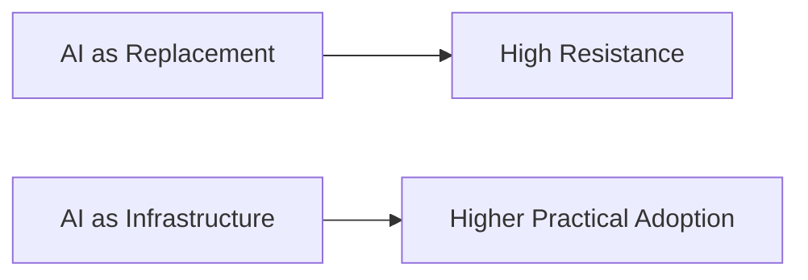
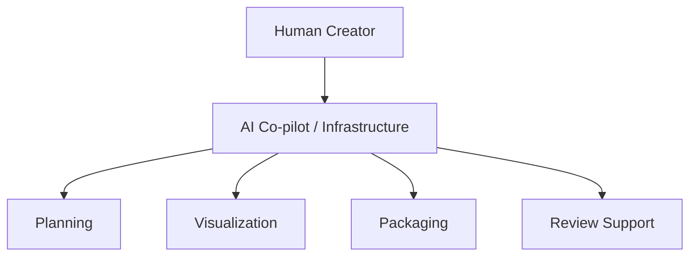
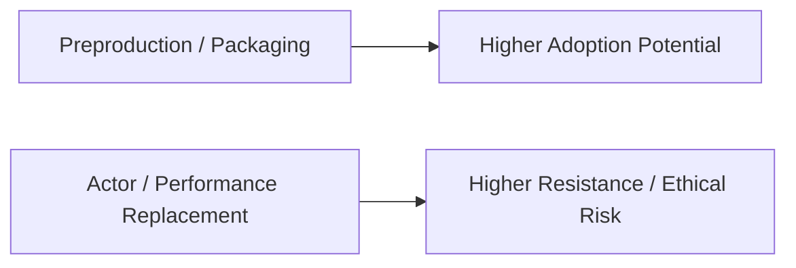
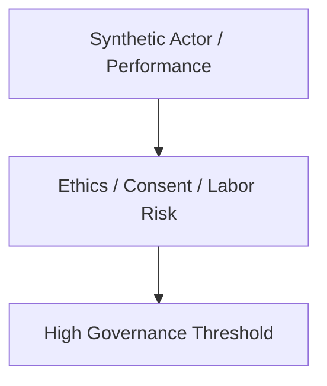
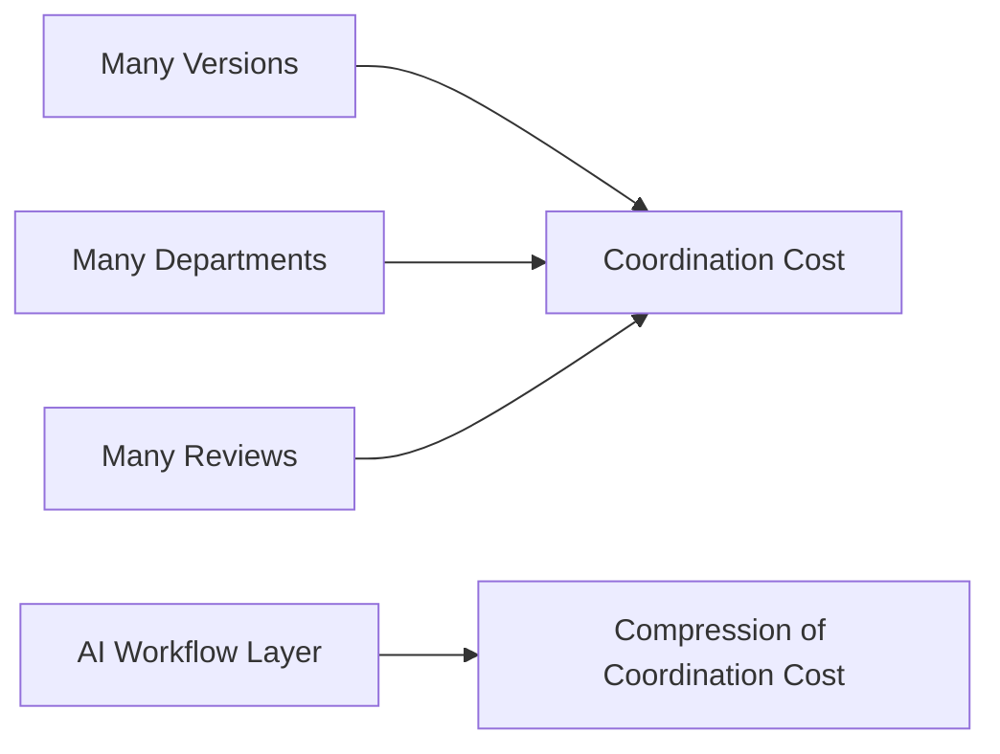
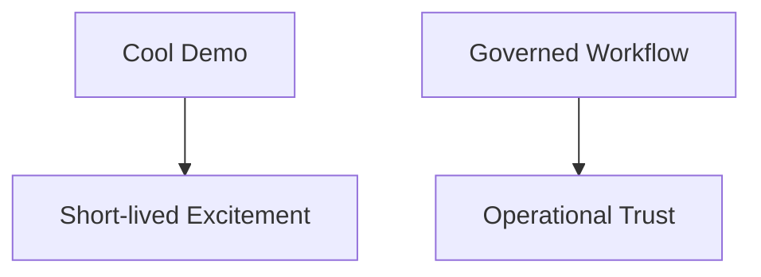
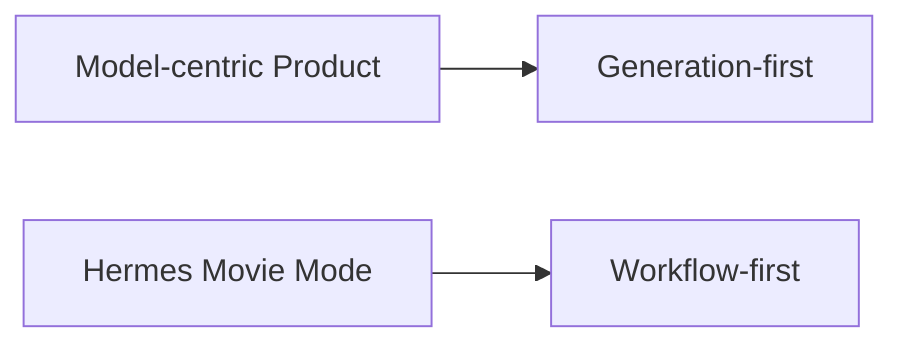
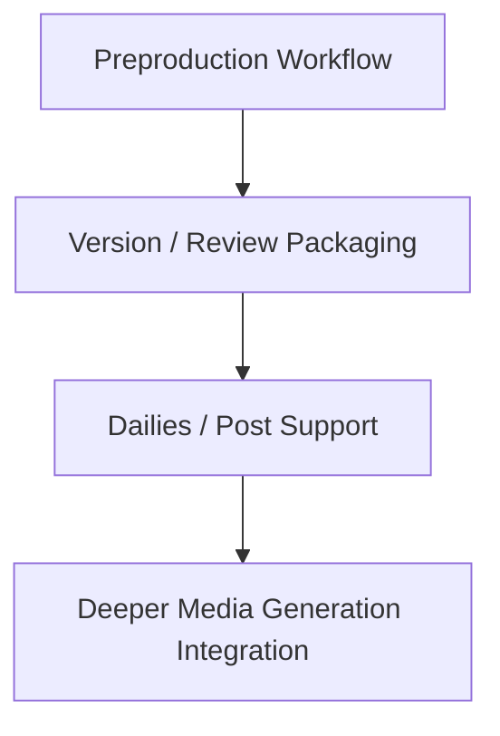
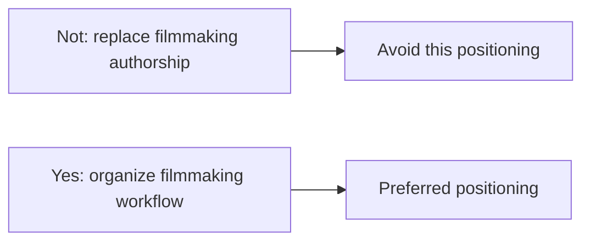

# 92. 2026 好莱坞 AI 电影生产趋势

## 这篇文档回答什么问题

到了 2026 年，好莱坞对 AI 的态度已经明显不只是“好不好用”的问题，而是：

- AI 会进入哪一段工作流
- 人类创作者保留什么位置
- 哪些使用方式会引发产业反弹
- 哪些使用方式会被当成基础设施默默普及

本篇重点回答：

1. 截至 2026 年 4 月，好莱坞 AI 电影生产最明显的趋势是什么。
2. 哪些趋势更适合导演智能体平台吸收，哪些趋势应谨慎对待。
3. Hermes movie mode 在好莱坞式流程中最有价值的切入点是什么。

---

## 一、2026 的核心变化：AI 正被重新定义为基础设施，而不是直接替代作者

截至 2026 年 3 月，围绕好莱坞 AI 的公开讨论已经出现一个明显转向：一些大型内容方更倾向把 AI 定义为“creator in the loop”的基础设施，用来服务生产效率、流程控制和成本优化，而不是直接把它定位为替代导演、演员或编剧的最终创作者。Axios 在 2026 年 3 月的报道中就把这一变化概括为“Hollywood reframes AI as infrastructure, not replacement”。 citeturn4news12

这对导演智能体平台是个利好信号，因为平台天然更接近“组织生产基础设施”，而不是“宣称替代作者”。

---

## 二、趋势 1：Creator-in-the-loop 正成为主流叙事

好莱坞对 AI 最容易接受的路径，是把 AI 放在：

- 资料分析
- previs / visualization
- 版本比较
- 生产协同
- 资产打包

而不是直接让它对最终作者身份构成挑战。

这意味着 Hermes movie mode 在好莱坞工作流里，最该优先占的是 orchestration 与 governance 位置。

---

## 三、趋势 2：AI 更容易先进入前期和包装层，而不是最终表演层

截至 2026 年，好莱坞对 AI 的高敏领域主要仍集中在“可替代演员、声音和作者身份”的部分，而相对更可接受的使用，则更偏向于：

- 概念开发
- visual exploration
- second-unit / previs 类用途
- pipeline acceleration

这也是为什么前期制作闭环是最适合先被平台化的领域。

---

## 四、趋势 3：AI actor / synthetic performance 依然是最容易引发反弹的边界

2026 年最敏感的公开讨论之一，仍然是 AI 演员与 AI 表演边界。James Cameron 在 2025 年末公开表示，让生成式 AI“凭空造演员、造表演”在他看来是“horrifying”，这是一个很典型的行业信号：即便技术进步很快，主流创作者和工业体系仍然对 synthetic performer 的全面进入保持高度警惕。 citeturn0search4turn2search0

对平台来说，这意味着：

- 可以研究 likeness governance
- 但不应把“替代表演主体”当成第一阶段卖点

---

## 五、趋势 4：AI 的价值越来越表现为“压缩版本与协调成本”

好莱坞不是缺一个会生成内容的模型，而是缺一个能稳定压缩：

- 开发成本
- 沟通成本
- 版本混乱
- review latency

这正是导演智能体平台的天然优势位。

---

## 六、趋势 5：工业化语境下，治理与可追溯性比单次惊艳更重要

在好莱坞语境里，单个炫目 demo 的意义有限。真正影响 adoption 的，是：

- 有没有权限边界
- 有没有 approval 链
- 有没有明确的 archive / audit

因此，一个强治理的平台，比一个只会生成视频的前端，更接近真正的工业需求。

---

## 七、为什么这对 Hermes 特别重要

Hermes 的优势不在于拥有某个独家的影像模型，而在于它已经具备：

- tool orchestration
- delegation
- state continuity
- artifacts
- review / approval 设计空间

在好莱坞这种强治理、强流程环境里，workflow-first 往往比 generation-first 更有可落地性。

---

## 八、好莱坞式 adoption 的推荐切入顺序

结合 2026 趋势，最稳妥的切入顺序应是：

1. 前期制作工作流
2. review / packaging / version control
3. dailies / post review support
4. 更深的 media generation integration

这样更符合好莱坞对风险和工种边界的现实态度。

---

## 九、对导演智能体平台的直接启发

在好莱坞趋势下，导演智能体平台最值得强调的价值不是：

- “替你拍电影”

而是：

- “让项目对象、角色、review 和版本更可控”

这会显著提升行业接受度。

---

## 十、结论

截至 2026 年 4 月，好莱坞的 AI 电影生产趋势可以概括成一句话：

**AI 更容易被接受为受控的生产基础设施，而不是不受约束的作者替代者。**

对 Hermes movie mode 来说，最有价值的路线因此非常清晰：

- 先做 workflow
- 再做 governance
- 最后再把更强的媒体模型接进来

这条顺序比直接押注“全自动电影生成”更贴近真实工业 adoption。

---

## 相关文档

- [91-2026-model-landscape-and-film-ai-stack.md](./91-2026-model-landscape-and-film-ai-stack.md)
- [93-china-film-ai-production-trends-2026.md](./93-china-film-ai-production-trends-2026.md)
- [94-director-case-christopher-nolan.md](./94-director-case-christopher-nolan.md)
- [95-director-case-james-cameron.md](./95-director-case-james-cameron.md)
- [100-hermes-agent-benefit-map-for-hollywood.md](./100-hermes-agent-benefit-map-for-hollywood.md)
