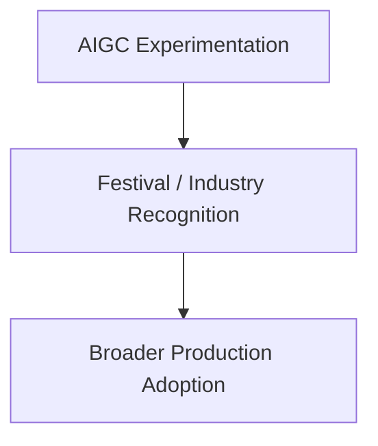
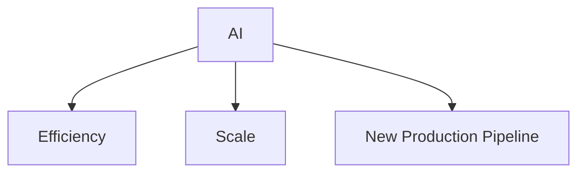
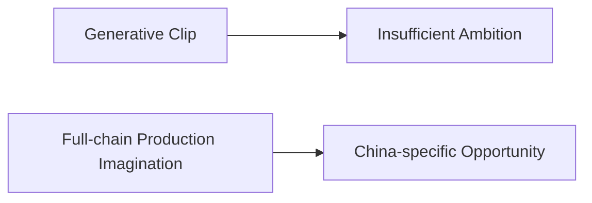
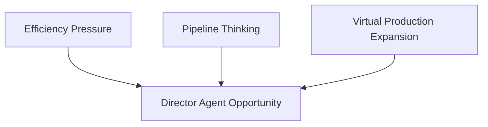
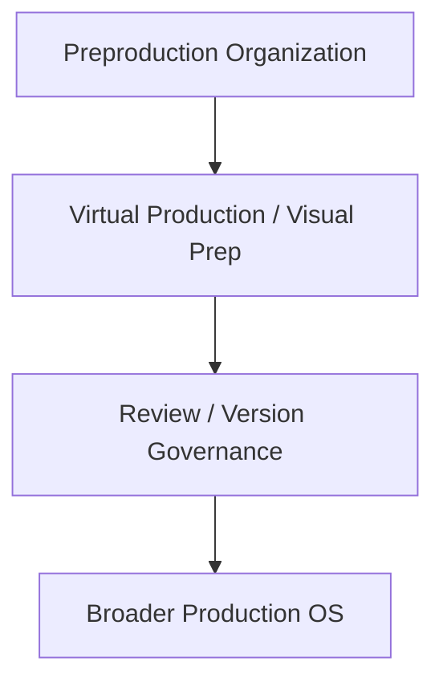
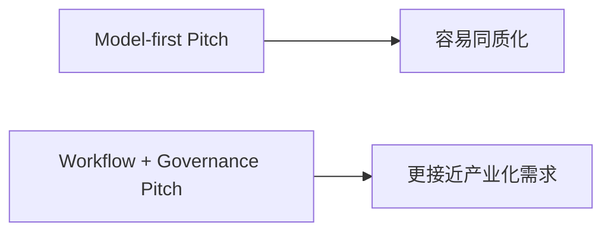

# 93. 2026 中国电影 AI 生产趋势

## 这篇文档回答什么问题

如果说好莱坞更强调工会、作者边界与治理约束，那么中国电影与泛影视领域在 2026 年呈现出的另一个特点是：

- 产业化推动更强
- 试验场景更丰富
- AIGC、虚拟制作与内容工业链结合更快

本篇重点回答：

1. 截至 2026 年 4 月，中国电影 AI 生产最明显的趋势是什么。
2. 这些趋势为什么特别适合导演智能体平台。
3. Hermes movie mode 在中国语境下应优先占据哪些位置。

---

## 一、宏观背景：AI 产业化速度本身就是电影 AI 的上游条件

中国官方在 2026 年 3 月披露，2025 年中国核心 AI 产业规模已超过 1.2 万亿元人民币，企业数量超过 6200 家；更早的官方政策还提出，到 2026 年将制定 50 项以上国家和行业 AI 标准。对电影产业来说，这意味着它并不是孤立地拥抱 AI，而是在一个快速制度化、快速产业化的上游环境中吸收 AI。 citeturn0search2turn0search5

这与更强调单点创作者采用的路径很不一样。

---

## 二、趋势 1：AIGC 正在从单点实验走向节展与行业制度化入口

截至 2026 年初，北京国际电影节 AIGC 单元继续扩展，并对全球作品开放征集；相关公开信息明确把它定位为面向 AI 驱动影像创新的重要平台。与此同时，北京电影节 AIGC 单元在 2025 年后的升级与持续存在，也说明 AIGC 不再只是边缘兴趣组，而正在获得更稳定的制度入口。 citeturn4search1turn4search6turn4search7

这意味着中国语境下，AI 影像正更快获得“被正式讨论”的场域。

---

## 三、趋势 2：虚拟制作与 AI 工具链的结合正在加速

2026 年中国公开讨论里，一个高频主题是：

- AI + 虚拟制作
- AI + 数字资产
- AI + 片场 / 片场前置准备

CGTN 在 2026 年初和 3 月的相关报道中，就持续把 AI-powered sets、virtual production、tech-driven creativity 和 film production efficiency 绑定在一起讨论。 citeturn2search1turn2search3turn2search9

这对导演智能体平台非常重要，因为它意味着中国市场更容易接受“AI 进入生产组织层”，而不只是创意工具层。

---

## 四、趋势 3：中国更容易把 AI 看作产业链效率工具

与好莱坞更强调劳工与作者边界不同，中国语境下一个更强的公开信号是：

- AI 被更频繁地放在效率、规模化和新型内容工业链里讨论

这并不意味着治理不重要，而是 adoption 的第一驱动力更常来自：

- 成本 / 效率
- 虚拟化 production
- 内容供给加速

---

## 五、趋势 4：从影像生成到全链路应用的想象更强

在中国语境下，很多关于 AI 与影视的公开讨论，并不只停在“生成一个镜头”，而更关注：

- 从创意开发到虚拟拍摄
- 从视觉资产到微短剧 / 影视工业链
- 从节展单元到产业园区和制作基地

这对 Hermes 是非常有利的，因为 Hermes 的优势本来就不在单点生成，而在全链路组织。

---

## 六、趋势 5：标准化和治理不会缺席，反而会更早制度化

虽然中国 adoption 速度可能更快，但这并不意味着治理会缺席。相反，国家和行业标准化推进本身说明，AI 应用会越来越被要求进入更正式的制度框架。 citeturn0search5turn0search2

这意味着“会治理的 AI 平台”在中国并不会失去价值，反而更容易成为正式项目的必要条件。

---

## 七、为什么这对导演智能体平台特别友好

中国趋势里有三点和导演智能体平台天然契合：

- 喜欢全链路效率提升
- 更容易接受平台化组织层
- 更适合把 AI 接进项目控制面

Hermes movie mode 的价值，在中国市场里会更容易被解释成：

- 生产组织层
- 项目控制层
- 资产与治理层

而不是单纯生成工具。

---

## 八、推荐的中国语境切入顺序

结合 2026 趋势，中国市场最自然的切入顺序可能是：

1. 前期制作组织化
2. 虚拟制作 / 分镜 / 视觉前置
3. 版本与 review 治理
4. 再向更完整的 production OS 扩展

这比先强调“全自动生成长片”更容易形成真实 adoption。

---

## 九、对 Hermes movie mode 的直接启发

在中国语境下，Hermes 最值得强调的不是：

- 某个单模型有多强

而是：

- 能否形成统一工作区
- 能否形成正式对象链
- 能否让多角色和多版本协作变得稳定

---

## 十、结论

截至 2026 年 4 月，中国电影 AI 生产趋势最值得注意的，不只是技术变强，而是：

- adoption 速度快
- 工业链想象更完整
- 节展、虚拟制作和产业化信号正在汇合

对导演智能体平台来说，这意味着中国是一个非常适合“从前期制作和项目组织层切入”的市场，而 Hermes 也天然适合站在这个位置上。

---

## 相关文档

- [91-2026-model-landscape-and-film-ai-stack.md](./91-2026-model-landscape-and-film-ai-stack.md)
- [92-hollywood-ai-film-production-trends-2026.md](./92-hollywood-ai-film-production-trends-2026.md)
- [97-director-case-zhang-yimou.md](./97-director-case-zhang-yimou.md)
- [98-director-case-guo-fan.md](./98-director-case-guo-fan.md)
- [101-hermes-agent-benefit-map-for-china-film.md](./101-hermes-agent-benefit-map-for-china-film.md)
