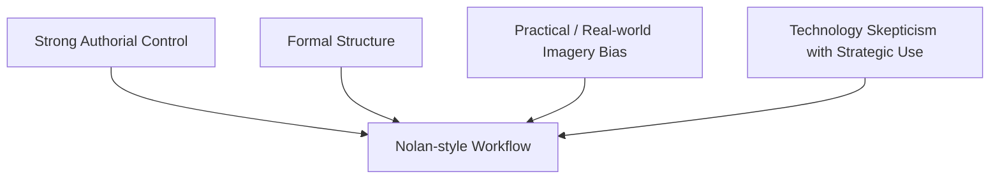
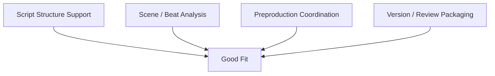
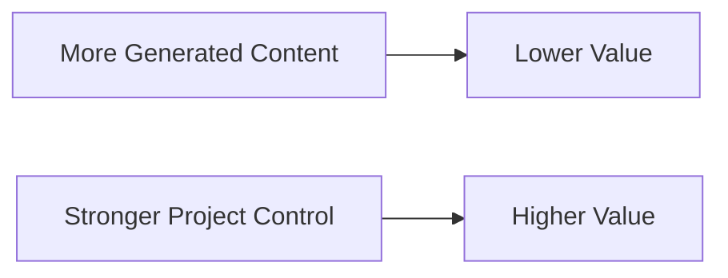
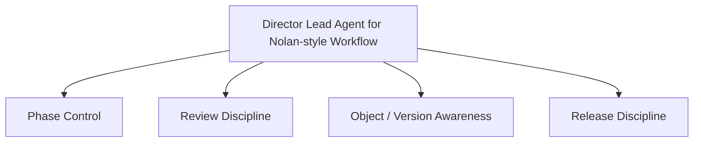
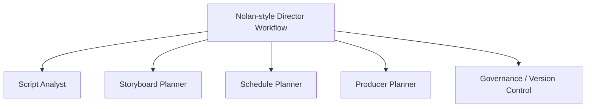
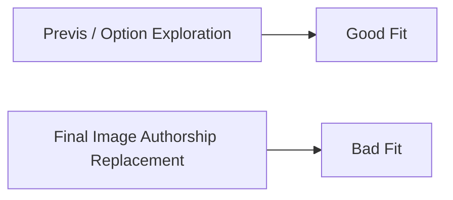
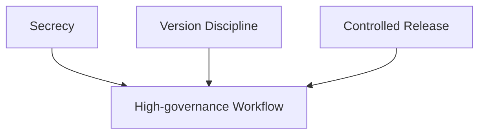
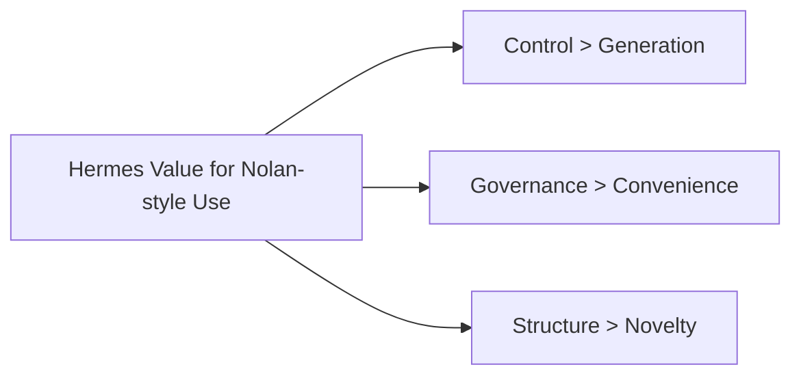

# 94. 导演案例：Christopher Nolan

## 这篇文档回答什么问题

从这一篇开始，我们不再只讨论行业趋势，而是讨论：

**如果把导演智能体平台放到具体导演工作法里，它最应该怎样适配。**

Christopher Nolan 是一个很适合先讨论的案例，因为他的工作法有几个非常鲜明的特点：

- 强控制
- 强结构
- 强摄影与放映介质意识
- 强实践主义和现场真实性追求

本篇重点回答：

1. Nolan 的创作方法对 AI 平台意味着什么。
2. 哪些 AI 工作方式与 Nolan 风格兼容，哪些明显不兼容。
3. Hermes movie mode 如果服务这类导演，正确定位应该是什么。

---

## 一、为什么 Nolan 是一个“高约束导演”案例

Nolan 的典型特征并不是“最大规模”，而是：

- 极强的作者控制
- 对结构和节奏的高度精密设计
- 对 IMAX、胶片、真实摄影和 practical execution 的长期偏好

他过去公开谈到 AI 风险时，也更容易把 AI 放在更大的技术风险语境中讨论，而不是把它当作现成的创作捷径。 citeturn4search9turn3search5turn3search15

---

## 二、这类导演最不需要什么样的 AI

如果一个平台一上来就主打：

- 自动生成完整镜头语言
- 自动替代表演和摄影判断
- 用便利性覆盖作者性

那么它和 Nolan 型导演几乎天然冲突。

Nolan 型导演最抗拒的，不是工具本身，而是作者判断被工具默认替代。

---

## 三、Nolan 型工作法最适合哪类 AI 支持

真正适合的支持点更像：

- 剧本结构分析
- 场景与叙事节拍拆解
- preproduction 协调与对象组织
- 大规模版本与 review packaging

也就是说，平台应更多服务“结构控制”和“生产组织”，而不是抢作者核心决定权。

---

## 四、为什么 Nolan 型导演会重视“控制面”而不是“生成面”

Nolan 长期的创作实践本身就在说明一件事：

- 对他这类导演而言，最稀缺的不是生成素材的能力
- 而是把复杂创作和复杂执行维持在同一作者意图之下的能力

这和 Hermes movie mode 的强项高度一致。

---

## 五、Nolan 型导演需要的 Director Agent 画像

如果要服务 Nolan 型导演，Director Lead Agent 应该表现得像：

- 强 phase control
- 强 review discipline
- 强 object lineage awareness
- 强 secrecy / release discipline

这类导演比起“灵感助理”，更需要“高精度创作控制台”。

---

## 六、哪些角色对 Nolan 型 workflow 最重要

优先级更高的角色往往是：

- `script_analyst`
- `storyboard_planner`
- `schedule_planner`
- `producer_planner`
- `governance / version controller`

比起“自动生成更多画面”，这类 workflow 更重视“让复杂项不失控”。

---

## 七、Nolan 型导演对影像模型的合理使用边界

对这类导演而言，影像模型更适合用在：

- previs 草案
- 风格比较
- 技术预演参考
- shot option exploration

而不是直接取代正式画面生产。

这也是为什么 `ShotPlan -> StoryboardDraft -> PromptPack` 这条链比“直接出成片”更适合做第一阶段落地。

---

## 八、为什么 secrecy 和 governance 对这类导演特别重要

Nolan 型项目通常天然重视：

- 信息泄露控制
- 版本收敛纪律
- 对外发布边界

这使得：

- audit trail
- approval gating
- archive discipline

在这类项目里比一般创意工具更重要。

---

## 九、对 Hermes movie mode 的直接启发

如果要服务 Nolan 型导演，最值得强调的价值是：

- complex preproduction control
- object / version governance
- director-centered role orchestration

这类导演案例说明，Hermes 不需要先在“最会生成视频”上赢，而要先在“最会组织复杂项目”上赢。

---

## 十、结论

Christopher Nolan 这个案例最有价值的地方，在于它提醒我们：

- 最顶级导演工作流的核心不是“更快出内容”
- 而是“更严格地控制结构、执行与作者意图”

因此，对这类导演，AI 平台最好的定位不是作者替代，而是：

- 高精度项目控制面
- 高结构化前期制作协作层
- 高治理强度的版本与 release 操作层

这正是导演智能体平台最值得占据的位置。

---

## 相关文档

- [92-hollywood-ai-film-production-trends-2026.md](./92-hollywood-ai-film-production-trends-2026.md)
- [95-director-case-james-cameron.md](./95-director-case-james-cameron.md)
- [96-director-case-denis-villeneuve.md](./96-director-case-denis-villeneuve.md)
- [99-hermes-agent-ai-film-operating-system-overview.md](./99-hermes-agent-ai-film-operating-system-overview.md)
- [100-hermes-agent-benefit-map-for-hollywood.md](./100-hermes-agent-benefit-map-for-hollywood.md)
