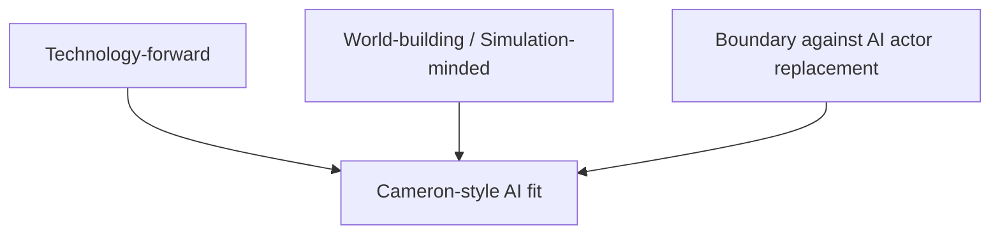
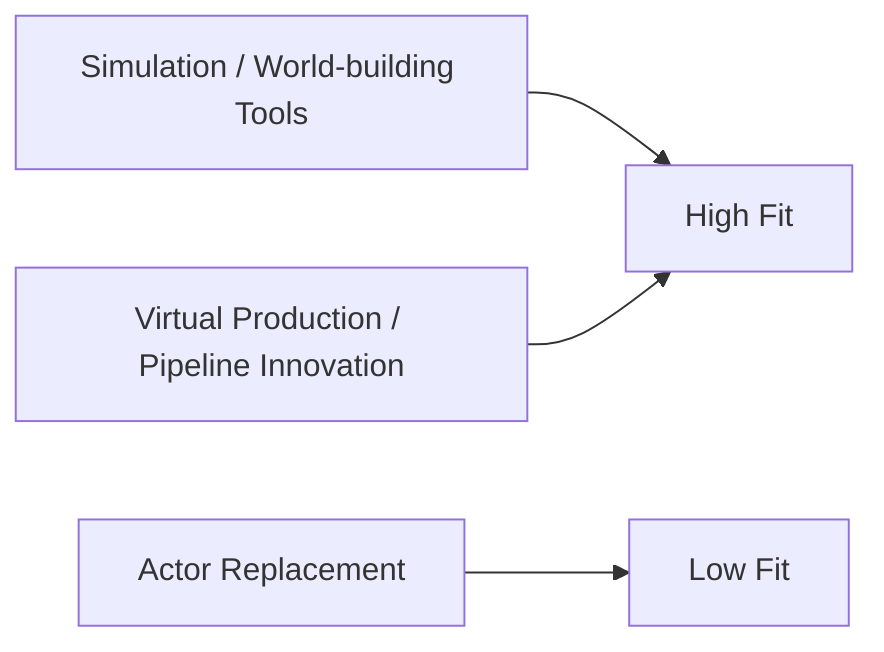
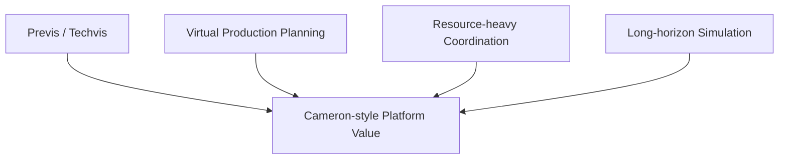
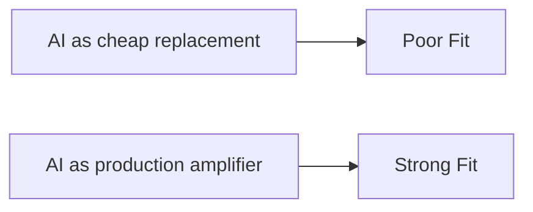
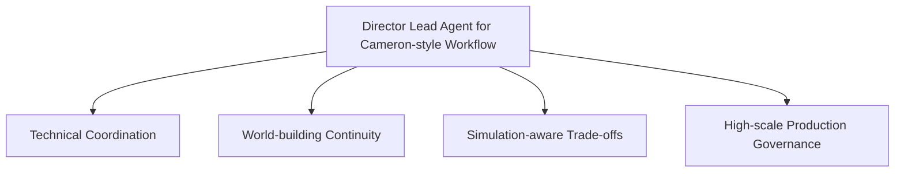
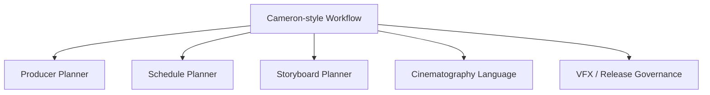
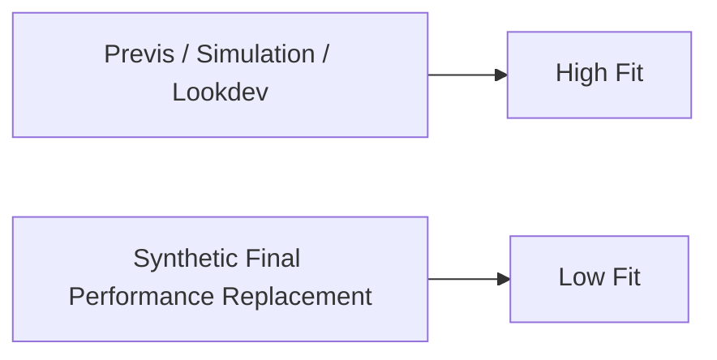
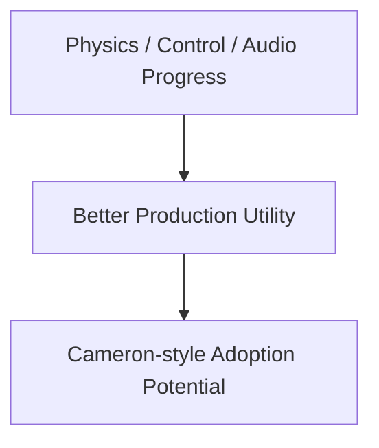
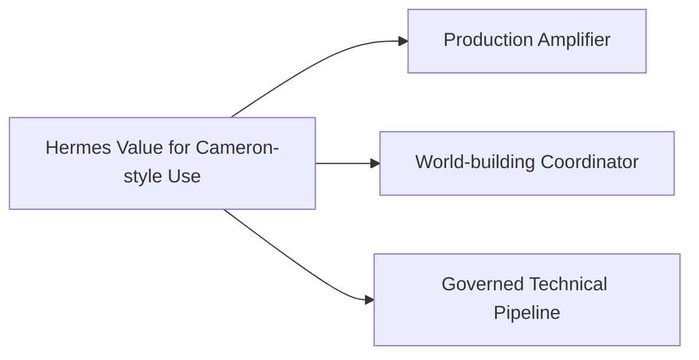

# 95. 导演案例：James Cameron

## 这篇文档回答什么问题

如果说 Nolan 代表“高控制、强结构、偏保守的作者型技术使用”，那么 James Cameron 代表的是另一种几乎相反但同样重要的导演画像：

- 对技术高度开放
- 愿意推动新生产范式
- 但对“替代人类表演与创作主体”的边界非常敏感

本篇重点回答：

1. Cameron 的技术观为什么对 AI 平台很重要。
2. 什么样的 AI 路线与 Cameron 风格兼容。
3. Hermes movie mode 如果服务这类导演，最该强调哪些能力。

---

## 一、为什么 Cameron 是一个“高技术接受度，但强边界意识”的案例

James Cameron 长期是把新技术真正推入电影语言的人物之一，但这并不等于他对所有 AI 路线都持欢迎态度。2025 年末，围绕 AI actor / synthetic performance 的公开采访中，Cameron 明确表示“make up an actor / make up a performance from scratch”这种方向让他感到“horrifying”。同时，相关报道也显示他并不是简单“反 AI”，而是更在意 AI 对创作主体和更大技术风险的影响。 citeturn0search4turn2search0turn2search2

---

## 二、这类导演最欢迎什么样的技术

Cameron 型导演通常欢迎的是：

- 扩展电影表达边界的技术
- 提高世界构建能力的技术
- 提高 simulation / virtual production 能力的技术

也就是说，他更可能接受“技术增强电影世界”，而不是“技术取代电影主体”。

---

## 三、为什么 Cameron 型 workflow 很适合更强的 movie tools

与 Nolan 型导演相比，Cameron 型 workflow 往往更容易接受：

- complex previsualization
- virtual production planning
- heavy technical coordination
- long-horizon production simulation

这和导演智能体平台的对象、角色和治理层天然契合。

---

## 四、Cameron 型导演最不需要的 AI 错误定位

错误定位通常是：

- 把 AI 定义成“少拍一些、直接生成更多”
- 把 AI 当作低成本替代演员与表演的工具

这类导演愿意为了更强表达去拥抱技术，但不会轻易接受作者和演员主体被工具抹平。

---

## 五、Cameron 型导演需要的 Director Agent 画像

这类导演需要的主智能体更像：

- 技术总协调器
- 世界构建与生产约束的统一控制面
- 跨部门 simulation 和 trade-off 枢纽

---

## 六、优先级更高的角色与对象

对 Cameron 型 workflow，更重要的角色往往是：

- `producer_planner`
- `schedule_planner`
- `storyboard_planner`
- `cinematography_language`
- 后续的 `vfx / release governance`

因为这类项目往往真正难的是：

- 复杂生产协同
- 大规模技术约束管理

---

## 七、影像模型在这类导演工作法中的最佳位置

这类导演更适合把影像模型放在：

- previs
- virtual set ideation
- action / scene simulation reference
- lookdev and scenario comparison

这意味着：

- movie visual tools 很有价值
- 但必须与治理和角色控制绑在一起

---

## 八、为什么 Cameron 型案例对 2026 模型世界特别重要

2026 的视频模型越来越强调 physics、audio、control 和 world-model 方向。对 Cameron 型导演来说，这类进展比“风格化短片炫技”更有意义，因为它们更接近真实 production needs。OpenAI 的 Sora 2 和 Google DeepMind 的 Veo 页面所强调的同步音频、物理准确性、控制能力，正好对应这类需求。 citeturn1search1turn1search2turn1search4

---

## 九、对 Hermes movie mode 的直接启发

如果要服务 Cameron 型导演，Hermes 最值得强调的是：

- orchestration across complex production domains
- simulation-aware planning
- high-governance visual and post pipeline

这类案例表明，Hermes 不应只把自己理解成前期制作文档引擎，而应逐步成长为高复杂度 production OS。

---

## 十、结论

James Cameron 这个案例提醒我们：

- 最先进的导演并不天然排斥技术
- 但他们非常在意技术服务于什么边界

对这类导演，AI 平台真正有价值的地方不是：

- 替代表演主体

而是：

- 扩展 simulation 能力
- 扩展 production coordination
- 扩展复杂世界构建与治理能力

这使 Cameron 型 workflow 成为导演智能体平台非常重要、也非常有代表性的目标场景。

---

## 相关文档

- [92-hollywood-ai-film-production-trends-2026.md](./92-hollywood-ai-film-production-trends-2026.md)
- [94-director-case-christopher-nolan.md](./94-director-case-christopher-nolan.md)
- [96-director-case-denis-villeneuve.md](./96-director-case-denis-villeneuve.md)
- [99-hermes-agent-ai-film-operating-system-overview.md](./99-hermes-agent-ai-film-operating-system-overview.md)
- [100-hermes-agent-benefit-map-for-hollywood.md](./100-hermes-agent-benefit-map-for-hollywood.md)
