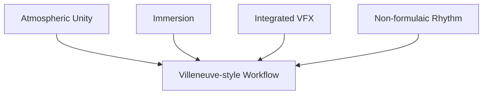
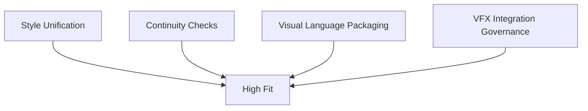
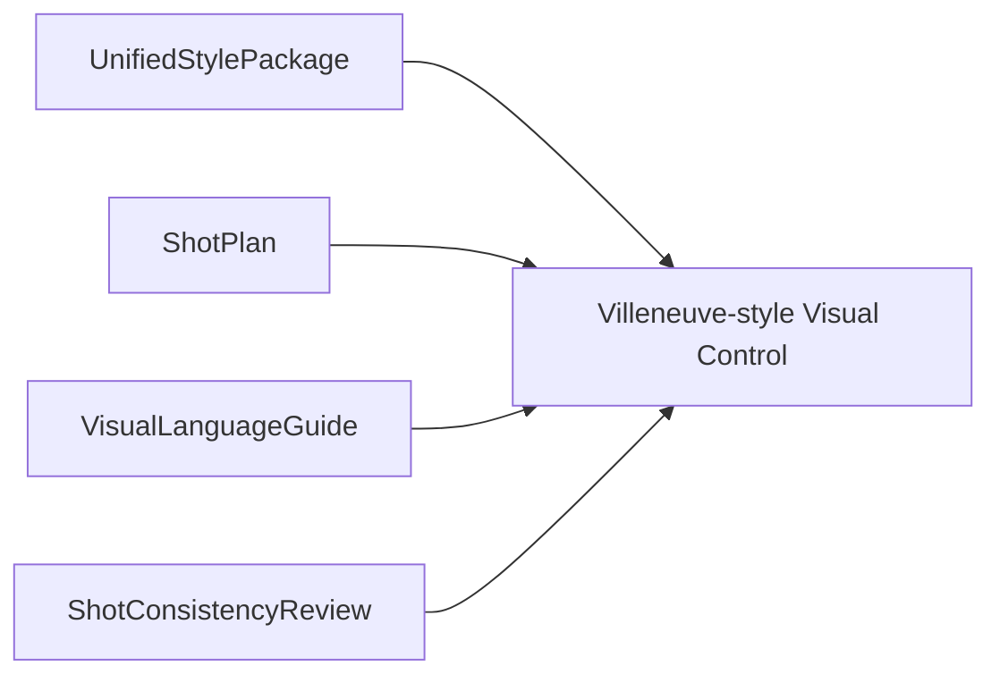
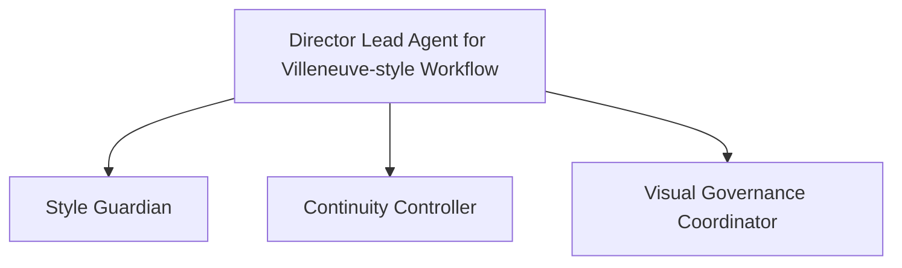
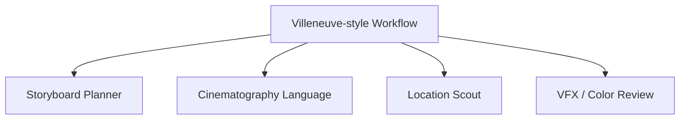
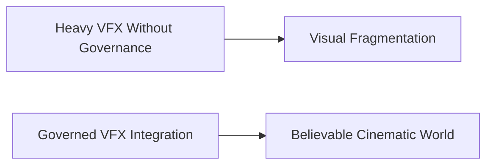
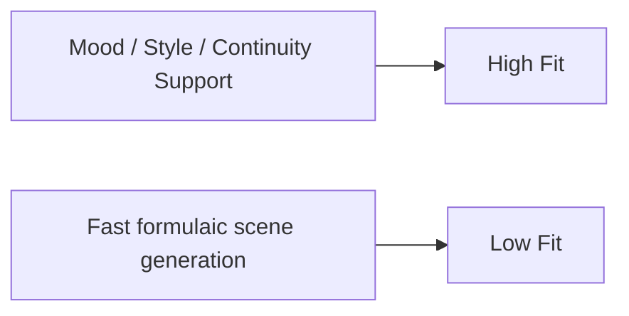
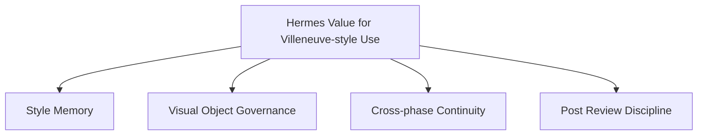

# 96. 导演案例：Denis Villeneuve

## 这篇文档回答什么问题

Denis Villeneuve 是另一类非常有代表性的导演案例。

他的电影工作法有几个鲜明特点：

- 极强的氛围与沉浸感控制
- 对影像统一性和世界观完整性的高度重视
- 对视觉特效的深度使用，但强调“无缝融入”而不是炫技

同时，在公开访谈中，他对 AI 也表现出一种很有代表性的态度：他担忧的并不只是技术本身，而是人类和行业开始“像算法一样”工作。 citeturn3search6

本篇重点回答：

1. Villeneuve 型导演工作法对 AI 平台意味着什么。
2. 哪些能力与他的电影方法兼容，哪些会破坏它。
3. Hermes movie mode 如果服务这类导演，应如何定位。

---

## 一、为什么 Villeneuve 是一个“氛围统一性导演”案例

Villeneuve 的作品通常不靠高速信息轰炸取胜，而靠：

- 统一而克制的视觉语言
- 稳定的世界观纹理
- 强氛围、强沉浸、强整体感

这意味着对他这类导演，AI 平台的最大价值不在“大量生成”，而在“持续统一”。

---

## 二、Villeneuve 型导演最担心哪类 AI 误用

如果 AI 把电影工作流推向：

- 套路化
- 快速但失去气质
- 看似效率更高、实则让创作语言被模板替代

那它就和 Villeneuve 型工作法天然冲突。

这和他公开表达中对“人像算法一样工作”的担心是相互印证的。 citeturn3search6

---

## 三、哪些 AI 能力更适合这类导演

更适合的能力通常是：

- 风格统一与 reference consolidation
- 镜头与场景之间的连续性检查
- 视觉语言包的长期维护
- VFX 与实拍之间的一致性治理

也就是说，这类导演比“多生成几种方案”更需要“方案别散掉”。

---

## 四、为什么 Villeneuve 型 workflow 适合强 visual object system

如果要服务这类导演，平台必须非常重视这些对象：

- `UnifiedStylePackage`
- `ShotPlan`
- `StoryboardDraft`
- `VisualLanguageGuide`
- `ShotConsistencyReview`

这说明 visual object system 在这类导演案例里不是附属，而是核心。

---

## 五、Villeneuve 型导演需要的 Director Agent 画像

这类导演更需要的主智能体，不是高频 brainstorm partner，而是：

- 风格守门人
- 视觉一致性协调器
- 跨前期、拍摄、后期的 continuity controller

---

## 六、优先级更高的角色与对象

对 Villeneuve 型 workflow，更关键的角色往往是：

- `storyboard_planner`
- `cinematography_language`
- `location_scout`
- `vfx / color / post review`

因为这类电影的价值，很大一部分来自：

- 空间质感
- 视觉克制
- 长程一致性

---

## 七、为什么 integrated VFX 反而让治理更重要

Villeneuve 型电影往往并不排斥高强度 VFX，但它强调：

- VFX 必须深埋在电影语言里
- 不能脱离整体气质

公开访谈中也能看到他对“让特效深度融入影片组织”的重视。 citeturn3search6

这和平台里的：

- version control
- review rounds
- style package
- post-production governance

高度契合。

---

## 八、影像模型在这类导演工作法中的最佳位置

对 Villeneuve 型导演来说，影像模型最适合放在：

- mood / style comparison
- environment / scale exploration
- previsual continuity checking
- VFX / post communication packaging

这里平台的价值不是“自动生成更多画面”，而是“让整体世界不破”。

---

## 九、对 Hermes movie mode 的直接启发

如果要服务 Villeneuve 型导演，Hermes 最值得强调的是：

- style memory
- visual object governance
- cross-phase continuity
- post-production review discipline

这类导演案例说明，导演智能体平台并不只是生产效率工具，它也可以是“电影气质的长期维护系统”。

---

## 十、结论

Denis Villeneuve 这个案例最有价值的地方，在于它提醒我们：

- AI 平台不只是帮导演做得更快
- 更重要的是帮导演在长周期、多工种协作中维持世界观和影像语言的一致性

对这类导演，Hermes movie mode 最好的定位不是“高速生成器”，而是：

- 风格统一层
- continuity 控制层
- visual governance 层

这让平台有机会进入更高价值的作者型工作流，而不是停留在浅层创意辅助。

---

## 相关文档

- [92-hollywood-ai-film-production-trends-2026.md](./92-hollywood-ai-film-production-trends-2026.md)
- [94-director-case-christopher-nolan.md](./94-director-case-christopher-nolan.md)
- [95-director-case-james-cameron.md](./95-director-case-james-cameron.md)
- [99-hermes-agent-ai-film-operating-system-overview.md](./99-hermes-agent-ai-film-operating-system-overview.md)
- [100-hermes-agent-benefit-map-for-hollywood.md](./100-hermes-agent-benefit-map-for-hollywood.md)
