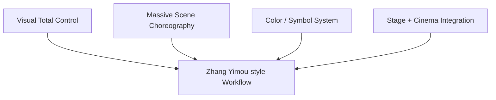
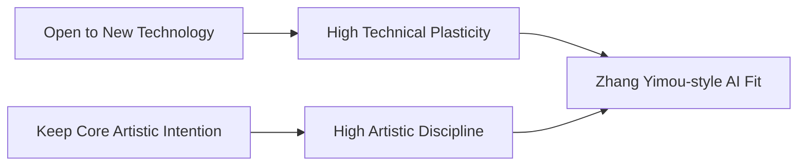
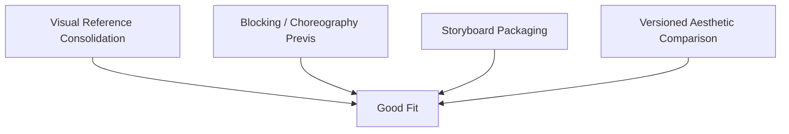
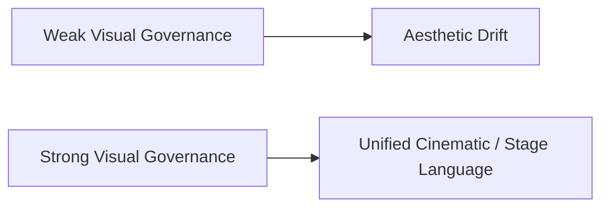
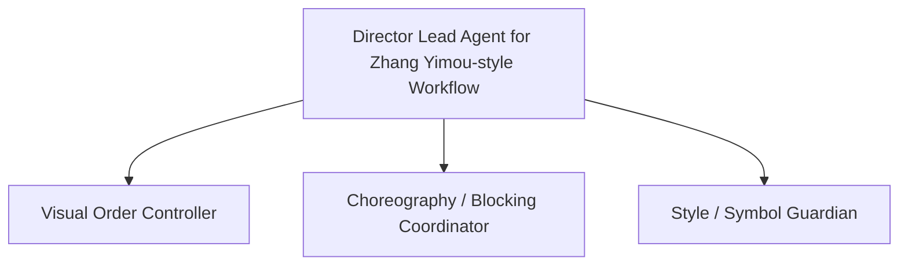
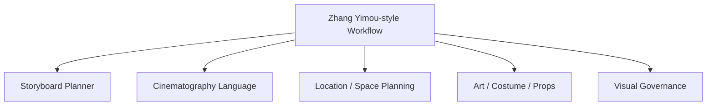
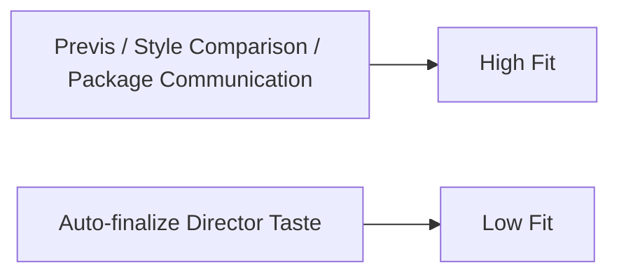
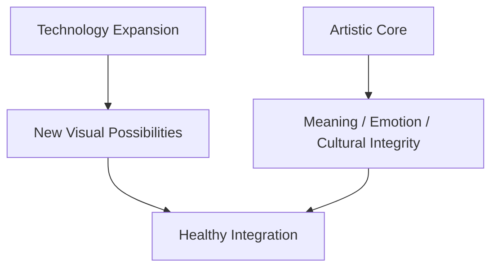
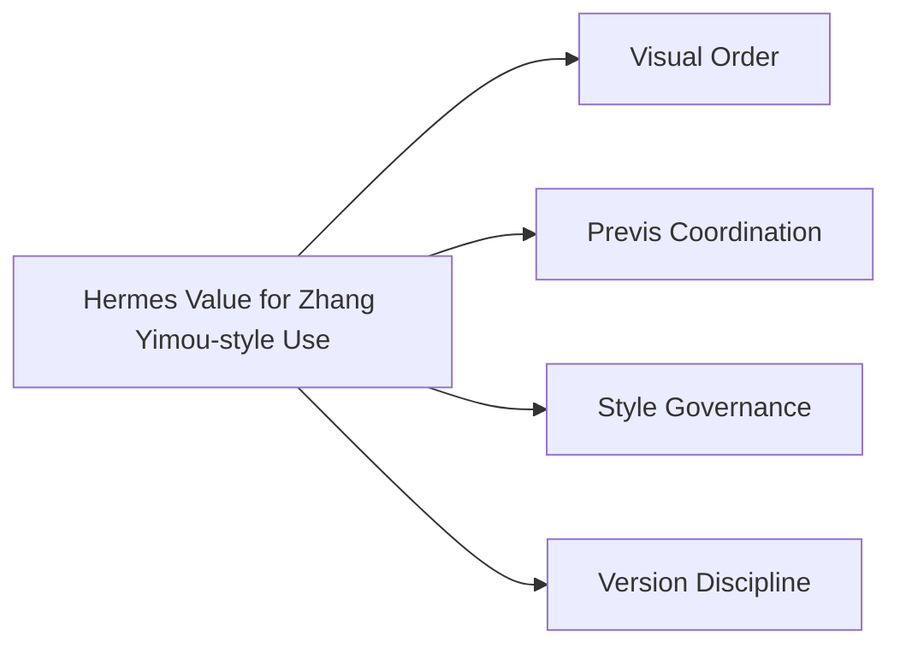

# 97. 导演案例：张艺谋

## 这篇文档回答什么问题

如果说 Nolan、Cameron、Villeneuve 代表的是三种国际作者型工作法，那么在中国导演案例里，张艺谋是一个非常关键的样本。

他的工作法往往有几个鲜明特征：

- 极强的视觉组织力
- 对大场面调度和整体美学控制的高度敏感
- 对传统文化、舞台化呈现和技术手段结合的长期兴趣
- 在面对新技术时，既愿意吸收，又强调“核心不能丢”

本篇重点回答：

1. 张艺谋型导演工作法对 AI 平台意味着什么。
2. 哪些 AI 能力与这类导演兼容，哪些会破坏其核心价值。
3. Hermes movie mode 如果服务这类导演，应如何定位。

---

## 一、为什么张艺谋是一个“强视觉总控导演”案例

张艺谋型导演的一个非常突出特点，是对整体视觉秩序的掌控能力。

这种掌控并不只是镜头层面的，而是：

- 场面调度
- 色彩组织
- 群体运动
- 文化意象包装
- 表演与空间的一体化

这意味着对这类导演，AI 平台最大的价值不是“帮他随机生成灵感”，而是“帮他维持整体视觉秩序”。

---

## 二、张艺谋型导演对技术的典型态度

张艺谋并不属于保守排斥技术的导演类型。相反，从大型舞台视觉、开闭幕式语言，到近年的机器人节目合作和更复杂的视效项目公开信号，都说明他愿意主动把新技术纳入表达体系。但与此同时，围绕 AI 时代电影行业变化的公开表态也显示，他强调变化越大，越需要守住电影的“初心”和真正的情感力量。 citeturn5view0turn5view3

这说明他适合的不是“技术替代创作”，而是“技术强化导演总控”。

---

## 三、这类导演最不需要什么样的 AI

如果 AI 平台把自己定位成：

- 自动替代导演的视觉判断
- 自动替代作者的文化判断
- 用大量风格模板快速复制“像张艺谋”的结果

那几乎天然是低配和误配。

这类导演最敏感的，不是技术本身，而是技术把原本高度统一的美学控制稀释掉。

---

## 四、这类导演最适合哪类 AI 支持

更适合的支持点通常是：

- 视觉 reference 组织
- 场面调度预演
- 分镜与群像结构拆解
- 大规模版本和视觉方案比较

这意味着，张艺谋型 workflow 特别适合强 `StoryboardDraft`、强 `PromptPack`、强 visual package 的平台。

---

## 五、为什么张艺谋型导演特别需要强 visual governance

张艺谋型电影或舞台化影像的一个共通点，是视觉统一性要求极高。

因此他这类工作法特别需要：

- `UnifiedStylePackage`
- `VisualLanguageGuide`
- `StoryboardDraft`
- `ShotConsistencyReview`

这些对象比“随机出更多图”更重要。

---

## 六、张艺谋型导演需要的 Director Agent 画像

如果要服务这类导演，Director Lead Agent 最好的样子更像：

- 视觉统筹控制台
- 场面调度与版本控制中枢
- 文化意象与风格包装守门层

---

## 七、优先级更高的角色

对这类导演工作法，更值得优先强化的角色往往是：

- `storyboard_planner`
- `cinematography_language`
- `location_scout`
- `art / costume / props collaboration`
- `review / visual governance`

这说明平台对这类导演最有价值的地方，是把“宏观美学组织”结构化。

---

## 八、影像模型在这类导演工作法中的最佳位置

影像模型对这类导演更适合放在：

- 大场面预演
- 视觉风格比较
- 文化意象方案探索
- scene package 打包与沟通

换句话说，模型更适合用来扩展导演的视觉试验空间，而不是代替其视觉判断。

---

## 九、为什么“初心”和治理在这类案例里并不冲突

公开表态里，张艺谋强调在 AI 时代越要守住电影初心，这并不意味着拒绝技术；更合理的理解是：

- 技术可以推动表达形式变化
- 但平台必须保障核心情感与美学目的不被工具逻辑吞没

这正是治理层和 visual object system 的价值所在。

---

## 十、对 Hermes movie mode 的直接启发

如果要服务张艺谋型导演，Hermes 最值得强调的是：

- visual package orchestration
- large-scene previsual coordination
- style governance
- director-centered version discipline

这类案例说明，导演智能体平台在中国语境下完全可以站在“高强度视觉总控”位置上，而不是只做轻量写作辅助。

---

## 十一、结论

张艺谋这个案例最有价值的地方，在于它把一个很中国、也很工业化的导演画像摆到我们面前：

- 愿意使用技术
- 但不愿意丢失作者的整体审美控制

因此，对这类导演，AI 平台最好的定位不是：

- 帮你自动生成一堆“像你”的东西

而是：

- 帮你更强地控制整体视觉秩序
- 帮你更快地比较方案
- 帮你更稳定地把大规模视觉工作流组织起来

这正是 Hermes movie mode 在中国导演场景里非常有机会占据的位置。

---

## 相关文档

- [93-china-film-ai-production-trends-2026.md](./93-china-film-ai-production-trends-2026.md)
- [98-director-case-guo-fan.md](./98-director-case-guo-fan.md)
- [99-hermes-agent-ai-film-operating-system-overview.md](./99-hermes-agent-ai-film-operating-system-overview.md)
- [101-hermes-agent-benefit-map-for-china-film.md](./101-hermes-agent-benefit-map-for-china-film.md)
