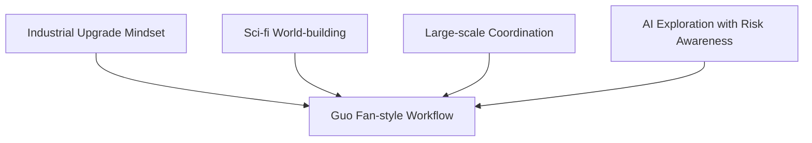
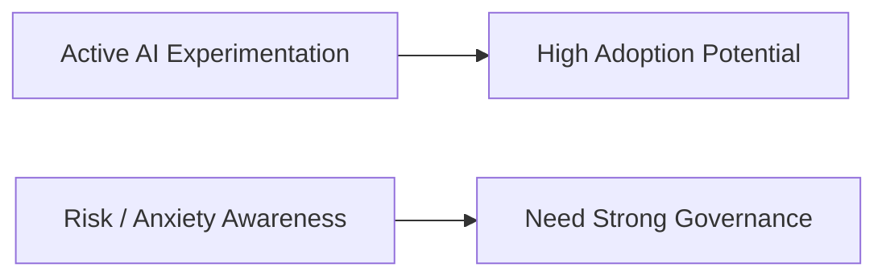
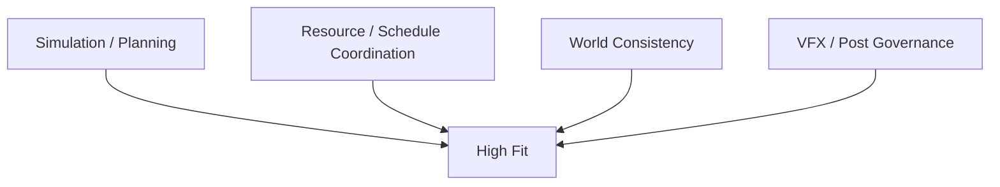
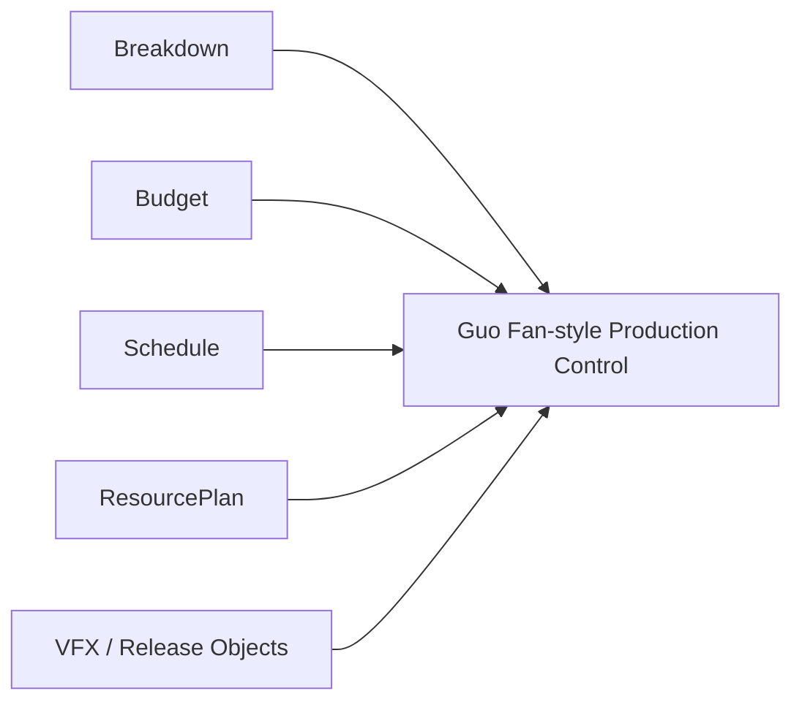
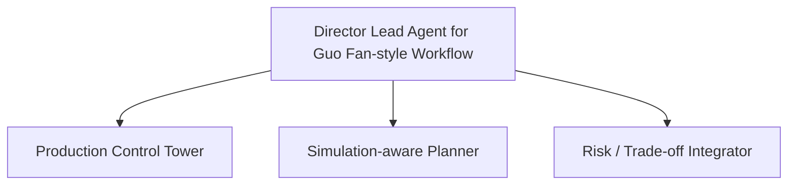
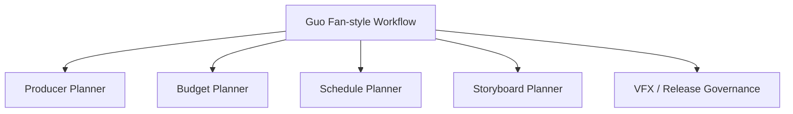
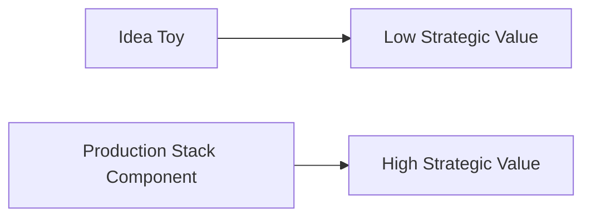
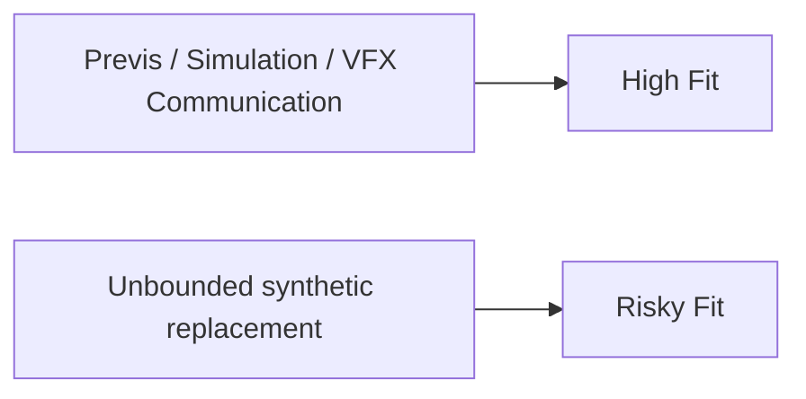
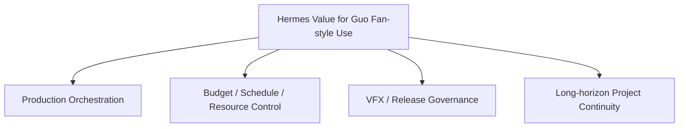

# 98. 导演案例：郭帆

## 这篇文档回答什么问题

在中国导演案例里，郭帆是另一个极具代表性的样本。

与张艺谋型导演不同，郭帆所代表的更像是：

- 高技术密度
- 强科幻世界构建
- 强工业化协同
- 对 AI 保持积极探索但又高度警惕风险

本篇重点回答：

1. 郭帆型导演工作法为什么特别适合导演智能体平台。
2. 哪些 AI 路线与这类导演兼容，哪些会踩边界。
3. Hermes movie mode 如果服务这类导演，应怎样设计重心。

---

## 一、为什么郭帆是一个“电影工业 3.0”案例

公开对谈和行业活动中，郭帆反复把 AI 放到电影工业升级语境里讨论。他在 2023 年 WAIC 与清华 AIR 的对谈中明确提出，电影工业正逐步进入“3.0 时代”，希望尽快理解 AI 在构思、拍摄、宣传乃至放映形态中的应用，以建立新的工业基础。 citeturn5view1

这类导演天生更容易把 AI 平台理解成 production OS，而不是单点工具。

---

## 二、这类导演为什么天然适合强 orchestration 平台

郭帆型项目的核心难题，往往不是单个镜头怎么想，而是：

- 大规模跨部门协同
- 科幻世界与技术设定的一致性
- 长周期 production planning
- VFX、拍摄、声音、release 的长期联动

这和 Hermes movie mode 的优势高度吻合。

---

## 三、郭帆型导演对 AI 的典型边界意识

公开发言里，郭帆并不是无条件乐观。他一方面积极试验 AI，另一方面也明确表达过对快速技术变革的焦虑和风险意识。China Daily 2023 年的报道显示，他的团队已在《流浪地球 2》制作中尝试过 AI，并研究了数字角色、声音和外貌再现等技术，但他也坦言看到相关结果时会感到震动与焦虑。 citeturn5view2turn5view1

这说明他适合的不是“无边界 AI”，而是“高能力 + 高治理”的 AI 平台。

---

## 四、这类导演最适合哪类 AI 支持

对郭帆型 workflow，最适合的 AI 通常集中在：

- preproduction simulation
- complex scheduling and resource planning
- world-building continuity
- VFX / post-production coordination

这类项目真正痛的地方，恰恰是平台擅长解决的地方。

---

## 五、为什么这类导演特别需要强 production object system

郭帆型电影项目通常会非常依赖：

- `BreakdownSheet`
- `BudgetDraft`
- `ScheduleDraft`
- `ResourcePlan`
- `VFXDelivery`
- `ReleasePackage`

也就是说，这类导演案例会把平台的 production layer 价值放到非常高的位置。

---

## 六、郭帆型导演需要的 Director Agent 画像

如果要服务这类导演，Director Lead Agent 更像：

- 高复杂度制作总控台
- simulation-aware planner
- 风险与 trade-off 的裁决中枢

---

## 七、优先级更高的角色

这类 workflow 中，优先级尤其高的角色通常是：

- `producer_planner`
- `budget_planner`
- `schedule_planner`
- `storyboard_planner`
- 后续的 `vfx / release governance`

---

## 八、郭帆型导演对 AI 平台最大的需求，不是灵感，而是规模化协同

China Daily 2023 年的行业报道中，郭帆谈到大模型脚本与创意辅助可帮助处理大量低价值任务，并认为摄影和灯光的未来可能会更偏向实时渲染和生成。这类表述非常关键，因为它说明他并不只是把 AI 看作灵感玩具，而是看作未来 production stack 的组成部分。 citeturn5view2

这正是导演智能体平台的机会窗口。

---

## 九、影像模型在这类导演工作法中的最佳位置

对郭帆型导演来说，影像模型最适合放在：

- previs / simulation
- concept-to-production package
- VFX communication
- complex shot option exploration

这意味着，模型必须被对象系统和治理层包住，才能进入正式生产。

---

## 十、对 Hermes movie mode 的直接启发

如果要服务郭帆型导演，Hermes 最值得强调的是：

- production orchestration
- schedule / budget / resource integration
- VFX-aware workflow governance
- long-horizon project control

这使郭帆型项目成为导演智能体平台非常典型、也非常有证明力的目标场景。

---

## 十一、结论

郭帆这个案例最重要的意义，在于它代表了一种非常适合导演智能体平台的中国导演工作法：

- 技术导向强
- 复杂协同密度高
- 对工业升级和 AI 融合有明确兴趣
- 同时又不愿意失去风险控制

因此，对这类导演，Hermes movie mode 最好的定位不是：

- AI 创意玩具

而是：

- 高复杂度 production OS
- 多角色工业协作中枢
- 风险与治理可见的电影项目控制层

这类案例几乎天然就是导演智能体平台最适合发力的主战场之一。

---

## 相关文档

- [93-china-film-ai-production-trends-2026.md](./93-china-film-ai-production-trends-2026.md)
- [97-director-case-zhang-yimou.md](./97-director-case-zhang-yimou.md)
- [99-hermes-agent-ai-film-operating-system-overview.md](./99-hermes-agent-ai-film-operating-system-overview.md)
- [101-hermes-agent-benefit-map-for-china-film.md](./101-hermes-agent-benefit-map-for-china-film.md)
