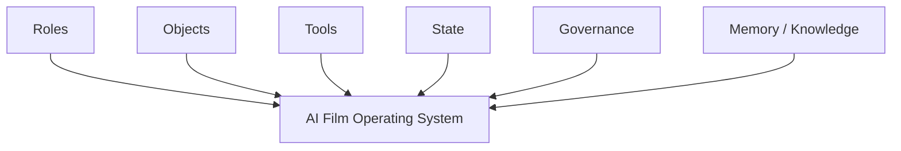
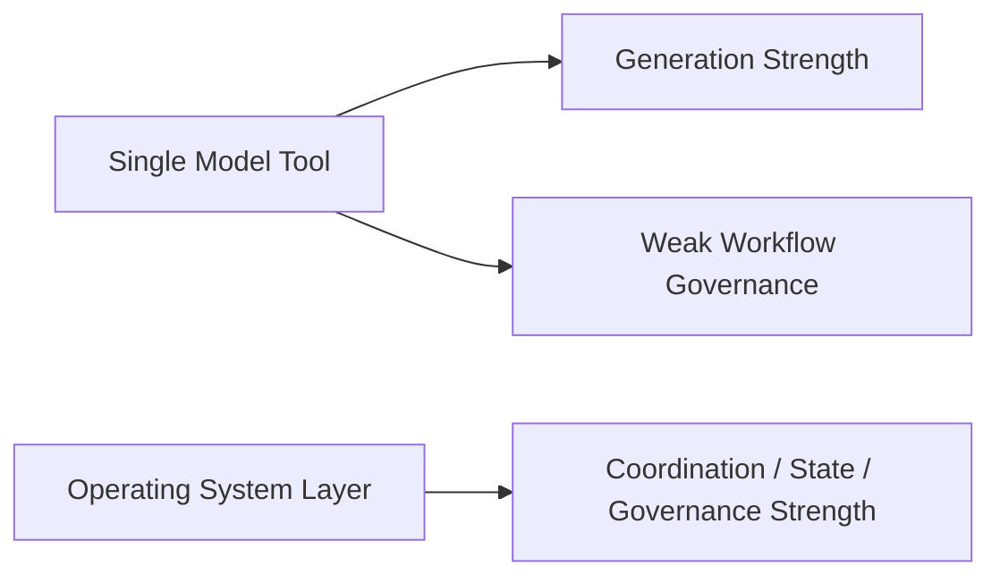
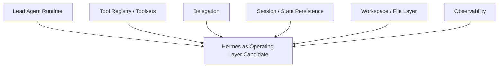
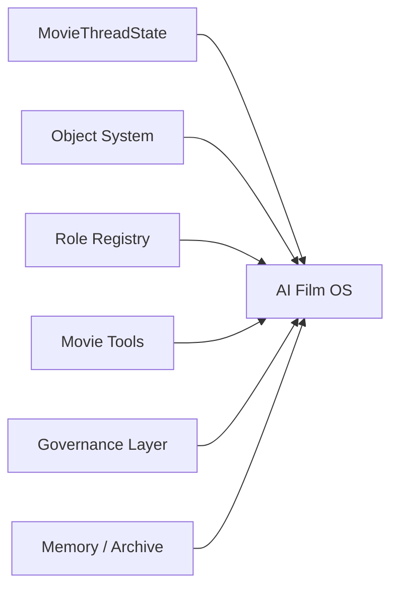
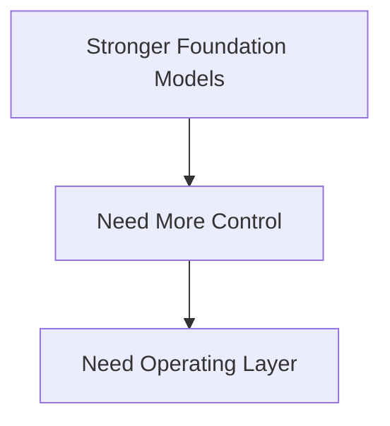
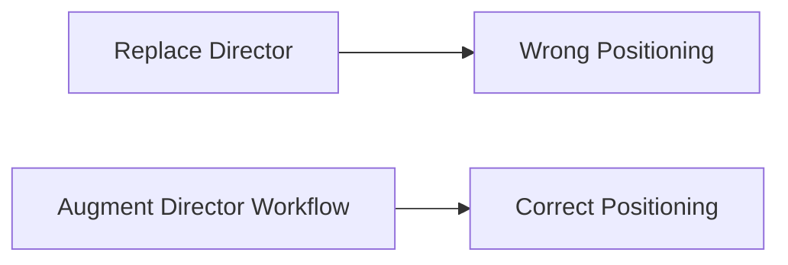
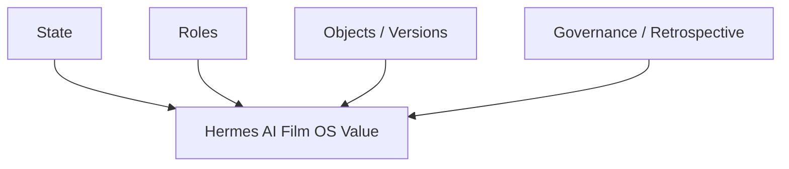
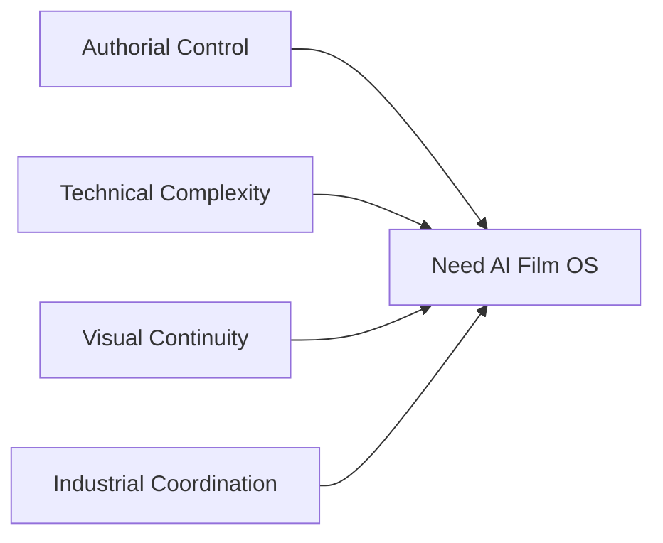
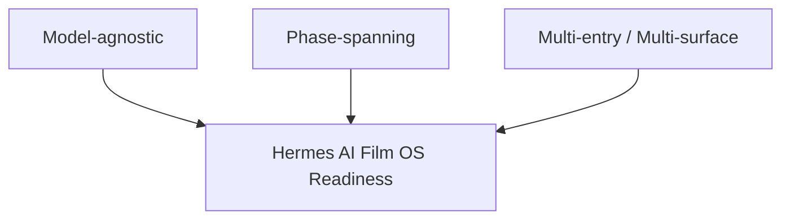

# 99. Hermes Agent 作为 AI 电影操作系统总览

## 这篇文档回答什么问题

经过前面 1 到 98 篇，我们已经分别讨论了：

- 电影流程
- 角色系统
- 对象系统
- 源码扩展
- 试点与企业化
- 2026 模型趋势与导演案例

现在需要把这些内容收束成一个总判断：

**为什么 Hermes Agent 有机会成为 AI 电影操作系统，而不只是一个更复杂的创作助手。**

本篇重点回答：

1. AI 电影操作系统到底指什么。
2. Hermes 为什么比单模型工具更接近这个位置。
3. 电影操作系统的核心组成应是什么。

---

## 一、什么叫“AI 电影操作系统”

这里说的“操作系统”，不是传统意义上的底层软件内核，而是指一个能统一承接：

- 角色
- 对象
- 工具
- 状态
- 治理
- 记忆

的电影生产控制层。

它的重点不是“会不会生成”，而是“能不能长期组织生产”。

---

## 二、为什么单模型工具很难成为电影操作系统

单模型工具往往擅长：

- 生成文本
- 生成图像
- 生成视频

但很难天然解决：

- 多角色协作
- 多对象版本控制
- review / approval
- archive / retrospective

这也是为什么“最强模型”不等于“最适合电影生产的平台”。

---

## 三、Hermes 为什么更接近操作系统而不是工具壳

Hermes 当前已经具备几个关键底座：

- lead agent runtime
- tool registry / toolsets
- delegation
- session continuity
- file / workspace 操作
- trajectory / logging / persistence

这说明 Hermes 原生就更适合做 orchestration 层，而不是只做生成层。

---

## 四、AI 电影操作系统的最小组成

前面的文档已经反复证明，最小可用的操作系统至少要有六块：

- `MovieThreadState`
- movie objects
- role registry
- movie tools
- governance
- memory / archive

其中任何一块缺席，平台都更像“高级助手”而不是“操作系统”。

---

## 五、为什么 2026 的模型趋势反而强化了 Hermes 的位置

截至 2026 年 4 月，视频与媒体模型正在快速进步，但它们也越来越需要：

- 更强控制
- 更强包装
- 更强多角色协作
- 更强治理边界

模型越强，操作系统层反而越重要，因为能力表面越复杂、协同成本越高。

---

## 六、Hermes 的位置不在“替代导演”，而在“增强导演工作流”

一个正确的定位应该是：

- Director Lead Agent 不替代人类导演
- 而是把导演工作流对象化、角色化、治理化

这个定位更符合：

- 好莱坞的 creator-in-the-loop 路线
- 中国的产业化与流程组织化路线

---

## 七、AI 电影操作系统的核心价值主张

建议把 Hermes movie mode 的核心价值压缩成四句话：

1. 把项目状态做实。
2. 把角色协作做清。
3. 把对象与版本做稳。
4. 把治理和复盘做完整。

---

## 八、为什么这套系统特别适合复杂导演工作法

不论是：

- Nolan 型的高控制结构
- Cameron 型的高技术复杂度
- Villeneuve 型的风格连续性
- 张艺谋型的视觉总控
- 郭帆型的工业化科幻生产

它们都需要一个比“单个模型生成器”更高一层的系统。

---

## 九、Hermes 成为 AI 电影操作系统的关键前提

要真正占住这个位置，Hermes 必须做到：

- 不被单模型绑死
- 不被单一阶段绑死
- 不被单一入口绑死

这也是为什么：

- movie tools
- movie skills
- movie factory
- movie config

这些层都必须建立起来。

---

## 十、结论

Hermes Agent 之所以有机会成为 AI 电影操作系统，并不是因为它某个单点能力最强，而是因为它天然拥有：

- orchestration
- delegation
- state continuity
- workspace / artifact
- governance 扩展空间

在 2026 的模型环境下，这种“组织能力”比单点生成能力更稀缺，也更接近真实电影生产的核心需求。

---

## 相关文档

- [91-2026-model-landscape-and-film-ai-stack.md](./91-2026-model-landscape-and-film-ai-stack.md)
- [100-hermes-agent-benefit-map-for-hollywood.md](./100-hermes-agent-benefit-map-for-hollywood.md)
- [101-hermes-agent-benefit-map-for-china-film.md](./101-hermes-agent-benefit-map-for-china-film.md)
- [102-hermes-agent-roi-governance-and-adoption-roadmap-2026.md](./102-hermes-agent-roi-governance-and-adoption-roadmap-2026.md)
- [103-hermes-agent-movie-integration-strategy-summary.md](./103-hermes-agent-movie-integration-strategy-summary.md)
- [105-hermes-agent-future-reference-architecture.md](./105-hermes-agent-future-reference-architecture.md)
