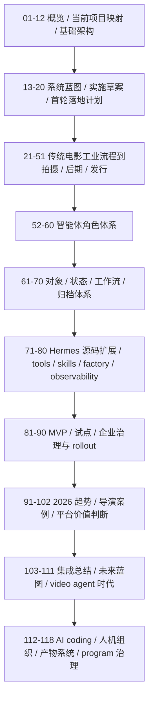
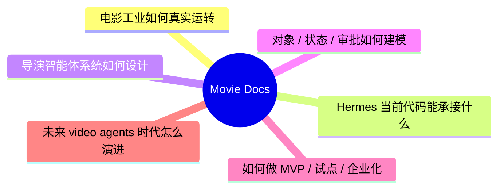
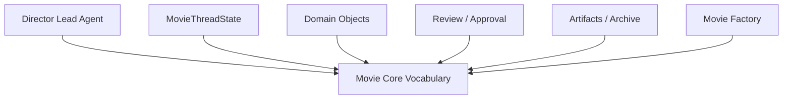
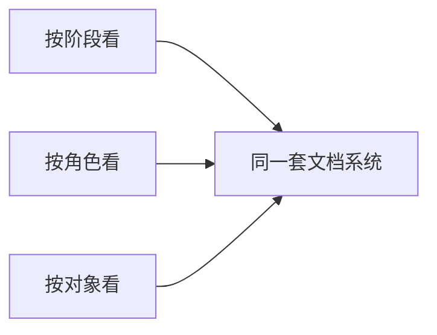
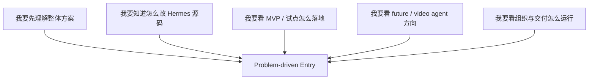
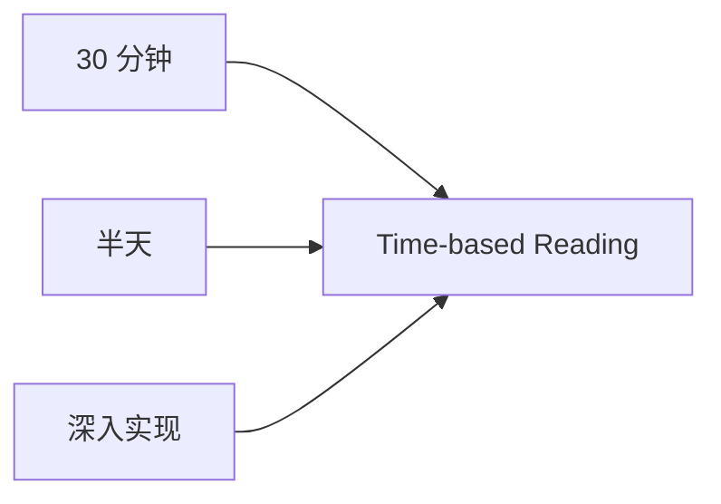

# Movie 导演智能体方案导览

本目录用于系统化说明：如何基于当前 Hermes Agent 项目，逐步改造成面向大规模电影制作的导演智能体系统。

这套文档现在已经形成一整套完整档案：

- `118` 篇主题文档
- `1` 个总导航 README
- 覆盖概念、流程、角色、对象、源码扩展、试点治理、未来路线与项目群运营

它不是一篇长文，而是一套按阶段、按主题、按实现深度组织的文档系统。

---

## 总览地图

---

## 这套文档在回答什么

更具体地说，它在回答五个大问题：

1. 电影制作流程、角色、文档、审批链到底是什么。
2. Hermes Agent 当前的 runtime、tooling、state、delegate 机制能承接哪些部分。
3. 如何把它扩展成一个面向电影项目的多智能体操作系统。
4. 如何把这套系统从试点推向企业级治理和长期运行。
5. 当视频大模型与 agents 融合时，Hermes 应该如何继续演进。

---

## 快速入口

如果你不想一上来就读完整套文档，可以先按下面四种入口进入。

### 入口一：先建立全局认知

先看：

- [01-overview.md](./01-overview.md)
- [02-current-project-mapping.md](./02-current-project-mapping.md)
- [03-target-architecture.md](./03-target-architecture.md)
- [08-roadmap.md](./08-roadmap.md)
- [24-hermes-agent-transformation-roadmap.md](./24-hermes-agent-transformation-roadmap.md)
- [99-hermes-agent-ai-film-operating-system-overview.md](./99-hermes-agent-ai-film-operating-system-overview.md)
- [103-hermes-agent-movie-integration-strategy-summary.md](./103-hermes-agent-movie-integration-strategy-summary.md)

适合想先快速判断“这整件事值不值得做、应该怎么理解”的读者。

### 入口二：先理解电影工业现实

先看：

- [21-traditional-filmmaking-overview.md](./21-traditional-filmmaking-overview.md)
- [22-non-ai-filmmaking-organization.md](./22-non-ai-filmmaking-organization.md)
- [23-mapping-traditional-process-to-agent-platform.md](./23-mapping-traditional-process-to-agent-platform.md)
- [25-script-development-and-lock.md](./25-script-development-and-lock.md)
- [27-budgeting-and-line-producer-view.md](./27-budgeting-and-line-producer-view.md)
- [28-scheduling-and-first-ad-view.md](./28-scheduling-and-first-ad-view.md)
- [37-principal-photography-operations.md](./37-principal-photography-operations.md)
- [45-editing-workflow-and-versioning.md](./45-editing-workflow-and-versioning.md)
- [49-review-flow-versioning-and-release-package.md](./49-review-flow-versioning-and-release-package.md)

适合想先确认“平台设计有没有踩在真实电影流程上”的读者。

### 入口三：先看系统设计与源码落点

先看：

- [13-system-blueprint.md](./13-system-blueprint.md)
- [15-a-code-design-draft.md](./15-a-code-design-draft.md)
- [52-director-lead-agent-design.md](./52-director-lead-agent-design.md)
- [61-project-object-system-overview.md](./61-project-object-system-overview.md)
- [67-workflow-state-machine-design.md](./67-workflow-state-machine-design.md)
- [71-lead-agent-transformation-plan.md](./71-lead-agent-transformation-plan.md)
- [72-task-tool-and-delegation-extension.md](./72-task-tool-and-delegation-extension.md)
- [74-thread-state-extension-plan.md](./74-thread-state-extension-plan.md)
- [75-movie-tools-design.md](./75-movie-tools-design.md)
- [77-movie-factory-design.md](./77-movie-factory-design.md)

适合想直接进入“怎么改 Hermes 代码”的读者。

### 入口四：先看未来与 video agent 时代

先看：

- [91-2026-model-landscape-and-film-ai-stack.md](./91-2026-model-landscape-and-film-ai-stack.md)
- [99-hermes-agent-ai-film-operating-system-overview.md](./99-hermes-agent-ai-film-operating-system-overview.md)
- [104-hermes-agent-future-capability-blueprint.md](./104-hermes-agent-future-capability-blueprint.md)
- [105-hermes-agent-future-reference-architecture.md](./105-hermes-agent-future-reference-architecture.md)
- [106-video-foundation-models-future-evolution.md](./106-video-foundation-models-future-evolution.md)
- [108-video-models-and-agents-convergence.md](./108-video-models-and-agents-convergence.md)
- [110-hermes-agent-roadmap-for-video-agent-era.md](./110-hermes-agent-roadmap-for-video-agent-era.md)
- [111-video-agents-risk-evals-and-governance.md](./111-video-agents-risk-evals-and-governance.md)

适合想先看远景、判断方向和战略空间的读者。

---

## 阅读路径图

如果按最顺的方式读，推荐就是这五步。

---

## 术语速查

下面这些术语在整套文档里出现频率最高，先统一一下口径。

- `Director Lead Agent`
  - 电影项目的主控智能体，负责目标、阶段、优先级、升级与最终协调。
- `MovieThreadState`
  - 线程级电影控制面，承接当前阶段、风险、活跃对象、待办与 next actions。
- `ScriptVersion / Scene / Character`
  - 创作对象主链，负责承接故事、场景和角色语义。
- `BreakdownSheet / BudgetDraft / ScheduleDraft / ResourcePlan`
  - 生产对象主链，负责把创作语义翻译成预算、排期和资源约束。
- `ShotPlan / StoryboardDraft / PromptPack`
  - 视觉执行对象主链，负责把导演意图翻译成镜头计划、分镜与生成输入包。
- `ReviewRound / ApprovalRequest / ReleasePackage`
  - 治理对象主链，负责把评审、审批与发布边界显式化。
- `Artifact / Archive Snapshot`
  - `Artifact` 是任何正式产物，`Archive Snapshot` 是一个可追溯的历史冻结点。
- `Movie Tools / Movie Skills / Movie Factory`
  - `Movie Tools` 是领域工具，`Movie Skills` 是领域工作法，`Movie Factory` 是角色、state、tools、skills 的组装层。

如果你准备直接读实现或对象设计，建议把这一节和下面几篇一起看：

- [52-director-lead-agent-design.md](./52-director-lead-agent-design.md)
- [61-project-object-system-overview.md](./61-project-object-system-overview.md)
- [66-review-approval-release-package-object-system.md](./66-review-approval-release-package-object-system.md)
- [77-movie-factory-design.md](./77-movie-factory-design.md)

---

## 三视图索引

如果你已经知道自己想看“哪一类问题”，下面这组三视图会比从头顺读更快。

### 视图一：按阶段看

- 开发与前期准备：
  - [21-traditional-filmmaking-overview.md](./21-traditional-filmmaking-overview.md)
  - [25-script-development-and-lock.md](./25-script-development-and-lock.md)
  - [26-script-breakdown-and-breakdown-sheet.md](./26-script-breakdown-and-breakdown-sheet.md)
  - [27-budgeting-and-line-producer-view.md](./27-budgeting-and-line-producer-view.md)
  - [28-scheduling-and-first-ad-view.md](./28-scheduling-and-first-ad-view.md)
- 前期视觉与技术预演：
  - [31-art-costume-props-collaboration.md](./31-art-costume-props-collaboration.md)
  - [32-cinematography-lighting-vfx-preproduction.md](./32-cinematography-lighting-vfx-preproduction.md)
  - [33-text-storyboard-and-shot-list.md](./33-text-storyboard-and-shot-list.md)
  - [34-static-storyboards-and-moodboards.md](./34-static-storyboards-and-moodboards.md)
  - [35-style-reference-analysis-and-unification.md](./35-style-reference-analysis-and-unification.md)
- 拍摄执行：
  - [37-principal-photography-operations.md](./37-principal-photography-operations.md)
  - [38-call-sheet-and-daily-plan.md](./38-call-sheet-and-daily-plan.md)
  - [39-assistant-director-dispatch-system.md](./39-assistant-director-dispatch-system.md)
  - [40-progress-and-cost-control.md](./40-progress-and-cost-control.md)
  - [44-dailies-output-and-review.md](./44-dailies-output-and-review.md)
- 后期、审核与出厂：
  - [45-editing-workflow-and-versioning.md](./45-editing-workflow-and-versioning.md)
  - [46-adr-music-sound-collaboration.md](./46-adr-music-sound-collaboration.md)
  - [47-color-grading-and-visual-consistency.md](./47-color-grading-and-visual-consistency.md)
  - [48-vfx-post-collaboration-and-delivery.md](./48-vfx-post-collaboration-and-delivery.md)
  - [49-review-flow-versioning-and-release-package.md](./49-review-flow-versioning-and-release-package.md)
- 发行、复盘与长期运营：
  - [50-marketing-assets-and-distribution-collaboration.md](./50-marketing-assets-and-distribution-collaboration.md)
  - [51-project-retrospective-and-knowledge-capture.md](./51-project-retrospective-and-knowledge-capture.md)
  - [85-pilot-project-implementation-manual.md](./85-pilot-project-implementation-manual.md)
  - [90-enterprise-rollout-roadmap.md](./90-enterprise-rollout-roadmap.md)
  - [118-program-governance-roadmap-and-operating-metrics.md](./118-program-governance-roadmap-and-operating-metrics.md)

### 视图二：按角色看

- 导演主控：
  - [05-agent-system.md](./05-agent-system.md)
  - [52-director-lead-agent-design.md](./52-director-lead-agent-design.md)
  - [71-lead-agent-transformation-plan.md](./71-lead-agent-transformation-plan.md)
- 制片 / 预算 / 排期：
  - [53-producer-subagent-design.md](./53-producer-subagent-design.md)
  - [56-budget-subagent-design.md](./56-budget-subagent-design.md)
  - [57-scheduling-subagent-design.md](./57-scheduling-subagent-design.md)
- 编剧分析 / 分镜 / 视觉语言：
  - [54-script-analyst-subagent-design.md](./54-script-analyst-subagent-design.md)
  - [55-storyboard-subagent-design.md](./55-storyboard-subagent-design.md)
  - [60-cinematography-language-subagent-design.md](./60-cinematography-language-subagent-design.md)
- 选角 / 勘景：
  - [58-casting-subagent-design.md](./58-casting-subagent-design.md)
  - [59-location-subagent-design.md](./59-location-subagent-design.md)
- 现场控制与升级：
  - [39-assistant-director-dispatch-system.md](./39-assistant-director-dispatch-system.md)
  - [41-on-set-escalation-and-decision-making.md](./41-on-set-escalation-and-decision-making.md)
  - [42-performance-direction-and-feedback.md](./42-performance-direction-and-feedback.md)
- 人类团队与数字员工：
  - [86-team-organization-and-role-allocation.md](./86-team-organization-and-role-allocation.md)
  - [113-human-team-and-ai-team-organization-design.md](./113-human-team-and-ai-team-organization-design.md)
  - [117-digital-employees-expansion-framework.md](./117-digital-employees-expansion-framework.md)

### 视图三：按对象看

- 项目控制对象：
  - [61-project-object-system-overview.md](./61-project-object-system-overview.md)
  - [62-movie-thread-state-design.md](./62-movie-thread-state-design.md)
  - [67-workflow-state-machine-design.md](./67-workflow-state-machine-design.md)
- 创作对象：
  - [63-script-scene-character-object-system.md](./63-script-scene-character-object-system.md)
  - [25-script-development-and-lock.md](./25-script-development-and-lock.md)
  - [36-dialogue-design-and-polish.md](./36-dialogue-design-and-polish.md)
- 生产对象：
  - [64-budget-schedule-resource-object-system.md](./64-budget-schedule-resource-object-system.md)
  - [26-script-breakdown-and-breakdown-sheet.md](./26-script-breakdown-and-breakdown-sheet.md)
  - [40-progress-and-cost-control.md](./40-progress-and-cost-control.md)
- 视觉执行对象：
  - [65-shotplan-storyboard-promptpack-object-system.md](./65-shotplan-storyboard-promptpack-object-system.md)
  - [33-text-storyboard-and-shot-list.md](./33-text-storyboard-and-shot-list.md)
  - [34-static-storyboards-and-moodboards.md](./34-static-storyboards-and-moodboards.md)
- 治理与交付对象：
  - [66-review-approval-release-package-object-system.md](./66-review-approval-release-package-object-system.md)
  - [68-approval-and-escalation-flow-design.md](./68-approval-and-escalation-flow-design.md)
  - [70-artifact-version-and-archive-system.md](./70-artifact-version-and-archive-system.md)
- 记忆、产物与知识对象：
  - [69-memory-and-knowledge-capture-design.md](./69-memory-and-knowledge-capture-design.md)
  - [79-workspace-artifacts-and-file-flow.md](./79-workspace-artifacts-and-file-flow.md)
  - [116-output-management-and-agent-artifacts-system.md](./116-output-management-and-agent-artifacts-system.md)

---

## 问题导向索引

如果你不是按“阶段 / 角色 / 对象”来思考，而是按“我现在要解决什么问题”来找文档，可以直接从这里进入。

- 我想先理解“这整套东西到底是什么”
  - [01-overview.md](./01-overview.md)
  - [03-target-architecture.md](./03-target-architecture.md)
  - [99-hermes-agent-ai-film-operating-system-overview.md](./99-hermes-agent-ai-film-operating-system-overview.md)
  - [103-hermes-agent-movie-integration-strategy-summary.md](./103-hermes-agent-movie-integration-strategy-summary.md)

- 我想确认“电影工业现实”和“平台设计”是不是对得上
  - [21-traditional-filmmaking-overview.md](./21-traditional-filmmaking-overview.md)
  - [22-non-ai-filmmaking-organization.md](./22-non-ai-filmmaking-organization.md)
  - [23-mapping-traditional-process-to-agent-platform.md](./23-mapping-traditional-process-to-agent-platform.md)
  - [24-hermes-agent-transformation-roadmap.md](./24-hermes-agent-transformation-roadmap.md)

- 我想直接看“怎么改 Hermes 源码”
  - [10-source-mapping-agent-runtime.md](./10-source-mapping-agent-runtime.md)
  - [12-source-mapping-state-and-config.md](./12-source-mapping-state-and-config.md)
  - [71-lead-agent-transformation-plan.md](./71-lead-agent-transformation-plan.md)
  - [72-task-tool-and-delegation-extension.md](./72-task-tool-and-delegation-extension.md)
  - [77-movie-factory-design.md](./77-movie-factory-design.md)

- 我想看“对象、状态、审批”这套核心骨架
  - [61-project-object-system-overview.md](./61-project-object-system-overview.md)
  - [62-movie-thread-state-design.md](./62-movie-thread-state-design.md)
  - [66-review-approval-release-package-object-system.md](./66-review-approval-release-package-object-system.md)
  - [67-workflow-state-machine-design.md](./67-workflow-state-machine-design.md)
  - [70-artifact-version-and-archive-system.md](./70-artifact-version-and-archive-system.md)

- 我想看“怎么做 MVP 和试点”
  - [81-mvp-scope-definition.md](./81-mvp-scope-definition.md)
  - [82-phase-1-development-plan.md](./82-phase-1-development-plan.md)
  - [85-pilot-project-implementation-manual.md](./85-pilot-project-implementation-manual.md)
  - [89-metrics-and-roi.md](./89-metrics-and-roi.md)
  - [90-enterprise-rollout-roadmap.md](./90-enterprise-rollout-roadmap.md)

- 我想看“2026 趋势、导演案例和平台价值判断”
  - [91-2026-model-landscape-and-film-ai-stack.md](./91-2026-model-landscape-and-film-ai-stack.md)
  - [92-hollywood-ai-film-production-trends-2026.md](./92-hollywood-ai-film-production-trends-2026.md)
  - [93-china-film-ai-production-trends-2026.md](./93-china-film-ai-production-trends-2026.md)
  - [99-hermes-agent-ai-film-operating-system-overview.md](./99-hermes-agent-ai-film-operating-system-overview.md)
  - [102-hermes-agent-roi-governance-and-adoption-roadmap-2026.md](./102-hermes-agent-roi-governance-and-adoption-roadmap-2026.md)

- 我想看“video agent 时代 Hermes 该怎么走”
  - [104-hermes-agent-future-capability-blueprint.md](./104-hermes-agent-future-capability-blueprint.md)
  - [105-hermes-agent-future-reference-architecture.md](./105-hermes-agent-future-reference-architecture.md)
  - [108-video-models-and-agents-convergence.md](./108-video-models-and-agents-convergence.md)
  - [110-hermes-agent-roadmap-for-video-agent-era.md](./110-hermes-agent-roadmap-for-video-agent-era.md)
  - [111-video-agents-risk-evals-and-governance.md](./111-video-agents-risk-evals-and-governance.md)

- 我想看“AI coding、人机协作和数字员工组织”
  - [112-ai-coding-and-multi-agent-delivery-plan.md](./112-ai-coding-and-multi-agent-delivery-plan.md)
  - [113-human-team-and-ai-team-organization-design.md](./113-human-team-and-ai-team-organization-design.md)
  - [114-ai-engineering-factory-and-collaboration-mode.md](./114-ai-engineering-factory-and-collaboration-mode.md)
  - [115-human-ai-collaboration-playbook.md](./115-human-ai-collaboration-playbook.md)
  - [117-digital-employees-expansion-framework.md](./117-digital-employees-expansion-framework.md)

---

## 时间预算入口

如果你不是按主题找，而是按“我今天能看多久”来安排阅读，可以直接用这组时间预算入口。

### 30 分钟读完

适合先判断这件事值不值得继续看。

- [01-overview.md](./01-overview.md)
- [03-target-architecture.md](./03-target-architecture.md)
- [24-hermes-agent-transformation-roadmap.md](./24-hermes-agent-transformation-roadmap.md)
- [99-hermes-agent-ai-film-operating-system-overview.md](./99-hermes-agent-ai-film-operating-system-overview.md)
- [103-hermes-agent-movie-integration-strategy-summary.md](./103-hermes-agent-movie-integration-strategy-summary.md)

看完这 5 篇，基本就能回答：

- 这件事是什么
- 为什么值得做
- 为什么 Hermes 能做
- 最合理的推进顺序是什么

### 半天读完

适合想把“业务现实 + 系统设计 + MVP 路线”连起来的人。

- [01-overview.md](./01-overview.md)
- [21-traditional-filmmaking-overview.md](./21-traditional-filmmaking-overview.md)
- [23-mapping-traditional-process-to-agent-platform.md](./23-mapping-traditional-process-to-agent-platform.md)
- [52-director-lead-agent-design.md](./52-director-lead-agent-design.md)
- [61-project-object-system-overview.md](./61-project-object-system-overview.md)
- [67-workflow-state-machine-design.md](./67-workflow-state-machine-design.md)
- [71-lead-agent-transformation-plan.md](./71-lead-agent-transformation-plan.md)
- [81-mvp-scope-definition.md](./81-mvp-scope-definition.md)
- [85-pilot-project-implementation-manual.md](./85-pilot-project-implementation-manual.md)
- [103-hermes-agent-movie-integration-strategy-summary.md](./103-hermes-agent-movie-integration-strategy-summary.md)

看完这组，基本可以把：

- 电影工业现实
- 角色、对象、状态机设计
- Hermes 改造主路径
- MVP / 试点方案

放到同一张地图上。

### 深入实现读完

适合准备真的开始设计代码、拆任务、做 PR。

- [02-current-project-mapping.md](./02-current-project-mapping.md)
- [10-source-mapping-agent-runtime.md](./10-source-mapping-agent-runtime.md)
- [11-source-mapping-subagents.md](./11-source-mapping-subagents.md)
- [12-source-mapping-state-and-config.md](./12-source-mapping-state-and-config.md)
- [15-a-code-design-draft.md](./15-a-code-design-draft.md)
- [16-b-interfaces-and-data-contracts.md](./16-b-interfaces-and-data-contracts.md)
- [17-c-first-code-drop-plan.md](./17-c-first-code-drop-plan.md)
- [19-solution-2-mvp-implementation-path.md](./19-solution-2-mvp-implementation-path.md)
- [62-movie-thread-state-design.md](./62-movie-thread-state-design.md)
- [72-task-tool-and-delegation-extension.md](./72-task-tool-and-delegation-extension.md)
- [75-movie-tools-design.md](./75-movie-tools-design.md)
- [77-movie-factory-design.md](./77-movie-factory-design.md)
- [79-workspace-artifacts-and-file-flow.md](./79-workspace-artifacts-and-file-flow.md)
- [80-observability-logging-and-evaluation.md](./80-observability-logging-and-evaluation.md)
- [112-ai-coding-and-multi-agent-delivery-plan.md](./112-ai-coding-and-multi-agent-delivery-plan.md)

这组更像“实现准备包”，适合直接拿来做技术设计、任务切片和代码落地。

---

## 全量目录

### A. 概览、当前项目映射与基础架构

- [01-overview.md](./01-overview.md)
- [02-current-project-mapping.md](./02-current-project-mapping.md)
- [03-target-architecture.md](./03-target-architecture.md)
- [04-production-phases.md](./04-production-phases.md)
- [05-agent-system.md](./05-agent-system.md)
- [06-data-models.md](./06-data-models.md)
- [07-tools-memory-skills.md](./07-tools-memory-skills.md)
- [08-roadmap.md](./08-roadmap.md)
- [09-source-mapping-overview.md](./09-source-mapping-overview.md)
- [10-source-mapping-agent-runtime.md](./10-source-mapping-agent-runtime.md)
- [11-source-mapping-subagents.md](./11-source-mapping-subagents.md)
- [12-source-mapping-state-and-config.md](./12-source-mapping-state-and-config.md)

### B. 系统蓝图、实施草案与首轮开发计划

- [13-system-blueprint.md](./13-system-blueprint.md)
- [14-implementation-draft.md](./14-implementation-draft.md)
- [15-a-code-design-draft.md](./15-a-code-design-draft.md)
- [16-b-interfaces-and-data-contracts.md](./16-b-interfaces-and-data-contracts.md)
- [17-c-first-code-drop-plan.md](./17-c-first-code-drop-plan.md)
- [18-solution-1-detailed-md-drafts.md](./18-solution-1-detailed-md-drafts.md)
- [19-solution-2-mvp-implementation-path.md](./19-solution-2-mvp-implementation-path.md)
- [20-master-plan-50-docs.md](./20-master-plan-50-docs.md)

### C. 传统电影工业与平台映射

- [21-traditional-filmmaking-overview.md](./21-traditional-filmmaking-overview.md)
- [22-non-ai-filmmaking-organization.md](./22-non-ai-filmmaking-organization.md)
- [23-mapping-traditional-process-to-agent-platform.md](./23-mapping-traditional-process-to-agent-platform.md)
- [24-hermes-agent-transformation-roadmap.md](./24-hermes-agent-transformation-roadmap.md)

### D. 前期制作

- [25-script-development-and-lock.md](./25-script-development-and-lock.md)
- [26-script-breakdown-and-breakdown-sheet.md](./26-script-breakdown-and-breakdown-sheet.md)
- [27-budgeting-and-line-producer-view.md](./27-budgeting-and-line-producer-view.md)
- [28-scheduling-and-first-ad-view.md](./28-scheduling-and-first-ad-view.md)
- [29-casting-and-actor-management.md](./29-casting-and-actor-management.md)
- [30-location-scouting-and-lock.md](./30-location-scouting-and-lock.md)
- [31-art-costume-props-collaboration.md](./31-art-costume-props-collaboration.md)
- [32-cinematography-lighting-vfx-preproduction.md](./32-cinematography-lighting-vfx-preproduction.md)
- [33-text-storyboard-and-shot-list.md](./33-text-storyboard-and-shot-list.md)
- [34-static-storyboards-and-moodboards.md](./34-static-storyboards-and-moodboards.md)
- [35-style-reference-analysis-and-unification.md](./35-style-reference-analysis-and-unification.md)
- [36-dialogue-design-and-polish.md](./36-dialogue-design-and-polish.md)

### E. 拍摄执行

- [37-principal-photography-operations.md](./37-principal-photography-operations.md)
- [38-call-sheet-and-daily-plan.md](./38-call-sheet-and-daily-plan.md)
- [39-assistant-director-dispatch-system.md](./39-assistant-director-dispatch-system.md)
- [40-progress-and-cost-control.md](./40-progress-and-cost-control.md)
- [41-on-set-escalation-and-decision-making.md](./41-on-set-escalation-and-decision-making.md)
- [42-performance-direction-and-feedback.md](./42-performance-direction-and-feedback.md)
- [43-on-set-collaboration-camera-light-sound-vfx.md](./43-on-set-collaboration-camera-light-sound-vfx.md)
- [44-dailies-output-and-review.md](./44-dailies-output-and-review.md)

### F. 后期、审核与发行

- [45-editing-workflow-and-versioning.md](./45-editing-workflow-and-versioning.md)
- [46-adr-music-sound-collaboration.md](./46-adr-music-sound-collaboration.md)
- [47-color-grading-and-visual-consistency.md](./47-color-grading-and-visual-consistency.md)
- [48-vfx-post-collaboration-and-delivery.md](./48-vfx-post-collaboration-and-delivery.md)
- [49-review-flow-versioning-and-release-package.md](./49-review-flow-versioning-and-release-package.md)
- [50-marketing-assets-and-distribution-collaboration.md](./50-marketing-assets-and-distribution-collaboration.md)
- [51-project-retrospective-and-knowledge-capture.md](./51-project-retrospective-and-knowledge-capture.md)

### G. 智能体角色体系

- [52-director-lead-agent-design.md](./52-director-lead-agent-design.md)
- [53-producer-subagent-design.md](./53-producer-subagent-design.md)
- [54-script-analyst-subagent-design.md](./54-script-analyst-subagent-design.md)
- [55-storyboard-subagent-design.md](./55-storyboard-subagent-design.md)
- [56-budget-subagent-design.md](./56-budget-subagent-design.md)
- [57-scheduling-subagent-design.md](./57-scheduling-subagent-design.md)
- [58-casting-subagent-design.md](./58-casting-subagent-design.md)
- [59-location-subagent-design.md](./59-location-subagent-design.md)
- [60-cinematography-language-subagent-design.md](./60-cinematography-language-subagent-design.md)

### H. 对象、状态、审批与归档体系

- [61-project-object-system-overview.md](./61-project-object-system-overview.md)
- [62-movie-thread-state-design.md](./62-movie-thread-state-design.md)
- [63-script-scene-character-object-system.md](./63-script-scene-character-object-system.md)
- [64-budget-schedule-resource-object-system.md](./64-budget-schedule-resource-object-system.md)
- [65-shotplan-storyboard-promptpack-object-system.md](./65-shotplan-storyboard-promptpack-object-system.md)
- [66-review-approval-release-package-object-system.md](./66-review-approval-release-package-object-system.md)
- [67-workflow-state-machine-design.md](./67-workflow-state-machine-design.md)
- [68-approval-and-escalation-flow-design.md](./68-approval-and-escalation-flow-design.md)
- [69-memory-and-knowledge-capture-design.md](./69-memory-and-knowledge-capture-design.md)
- [70-artifact-version-and-archive-system.md](./70-artifact-version-and-archive-system.md)

### I. Hermes 源码扩展、tools、skills 与运行基础设施

- [71-lead-agent-transformation-plan.md](./71-lead-agent-transformation-plan.md)
- [72-task-tool-and-delegation-extension.md](./72-task-tool-and-delegation-extension.md)
- [73-subagent-registry-cinema-extension.md](./73-subagent-registry-cinema-extension.md)
- [74-thread-state-extension-plan.md](./74-thread-state-extension-plan.md)
- [75-movie-tools-design.md](./75-movie-tools-design.md)
- [76-movie-skills-design.md](./76-movie-skills-design.md)
- [77-movie-factory-design.md](./77-movie-factory-design.md)
- [78-custom-agent-configuration-system.md](./78-custom-agent-configuration-system.md)
- [79-workspace-artifacts-and-file-flow.md](./79-workspace-artifacts-and-file-flow.md)
- [80-observability-logging-and-evaluation.md](./80-observability-logging-and-evaluation.md)

### J. MVP、试点、企业治理与 rollout

- [81-mvp-scope-definition.md](./81-mvp-scope-definition.md)
- [82-phase-1-development-plan.md](./82-phase-1-development-plan.md)
- [83-phase-2-development-plan.md](./83-phase-2-development-plan.md)
- [84-phase-3-development-plan.md](./84-phase-3-development-plan.md)
- [85-pilot-project-implementation-manual.md](./85-pilot-project-implementation-manual.md)
- [86-team-organization-and-role-allocation.md](./86-team-organization-and-role-allocation.md)
- [87-data-and-asset-governance.md](./87-data-and-asset-governance.md)
- [88-security-permissions-and-audit.md](./88-security-permissions-and-audit.md)
- [89-metrics-and-roi.md](./89-metrics-and-roi.md)
- [90-enterprise-rollout-roadmap.md](./90-enterprise-rollout-roadmap.md)

### K. 2026 趋势、导演案例与平台价值判断

- [91-2026-model-landscape-and-film-ai-stack.md](./91-2026-model-landscape-and-film-ai-stack.md)
- [92-hollywood-ai-film-production-trends-2026.md](./92-hollywood-ai-film-production-trends-2026.md)
- [93-china-film-ai-production-trends-2026.md](./93-china-film-ai-production-trends-2026.md)
- [94-director-case-christopher-nolan.md](./94-director-case-christopher-nolan.md)
- [95-director-case-james-cameron.md](./95-director-case-james-cameron.md)
- [96-director-case-denis-villeneuve.md](./96-director-case-denis-villeneuve.md)
- [97-director-case-zhang-yimou.md](./97-director-case-zhang-yimou.md)
- [98-director-case-guo-fan.md](./98-director-case-guo-fan.md)
- [99-hermes-agent-ai-film-operating-system-overview.md](./99-hermes-agent-ai-film-operating-system-overview.md)
- [100-hermes-agent-benefit-map-for-hollywood.md](./100-hermes-agent-benefit-map-for-hollywood.md)
- [101-hermes-agent-benefit-map-for-china-film.md](./101-hermes-agent-benefit-map-for-china-film.md)
- [102-hermes-agent-roi-governance-and-adoption-roadmap-2026.md](./102-hermes-agent-roi-governance-and-adoption-roadmap-2026.md)

### L. Hermes 集成总结、未来蓝图与 video agent 时代

- [103-hermes-agent-movie-integration-strategy-summary.md](./103-hermes-agent-movie-integration-strategy-summary.md)
- [104-hermes-agent-future-capability-blueprint.md](./104-hermes-agent-future-capability-blueprint.md)
- [105-hermes-agent-future-reference-architecture.md](./105-hermes-agent-future-reference-architecture.md)
- [106-video-foundation-models-future-evolution.md](./106-video-foundation-models-future-evolution.md)
- [107-agents-future-evolution.md](./107-agents-future-evolution.md)
- [108-video-models-and-agents-convergence.md](./108-video-models-and-agents-convergence.md)
- [109-ai-native-media-production-pipeline-future.md](./109-ai-native-media-production-pipeline-future.md)
- [110-hermes-agent-roadmap-for-video-agent-era.md](./110-hermes-agent-roadmap-for-video-agent-era.md)
- [111-video-agents-risk-evals-and-governance.md](./111-video-agents-risk-evals-and-governance.md)

### M. AI coding、人机组织、产物系统与项目群治理

- [112-ai-coding-and-multi-agent-delivery-plan.md](./112-ai-coding-and-multi-agent-delivery-plan.md)
- [113-human-team-and-ai-team-organization-design.md](./113-human-team-and-ai-team-organization-design.md)
- [114-ai-engineering-factory-and-collaboration-mode.md](./114-ai-engineering-factory-and-collaboration-mode.md)
- [115-human-ai-collaboration-playbook.md](./115-human-ai-collaboration-playbook.md)
- [116-output-management-and-agent-artifacts-system.md](./116-output-management-and-agent-artifacts-system.md)
- [117-digital-employees-expansion-framework.md](./117-digital-employees-expansion-framework.md)
- [118-program-governance-roadmap-and-operating-metrics.md](./118-program-governance-roadmap-and-operating-metrics.md)

---

## 图表导览

如果你主要想看 Mermaid 图而不是先读长文，推荐优先看下面几组：

- 架构总图：
  - [03-target-architecture.md](./03-target-architecture.md)
  - [13-system-blueprint.md](./13-system-blueprint.md)
  - [103-hermes-agent-movie-integration-strategy-summary.md](./103-hermes-agent-movie-integration-strategy-summary.md)
  - [105-hermes-agent-future-reference-architecture.md](./105-hermes-agent-future-reference-architecture.md)

- 电影流程图：
  - [04-production-phases.md](./04-production-phases.md)
  - [21-traditional-filmmaking-overview.md](./21-traditional-filmmaking-overview.md)
  - [37-principal-photography-operations.md](./37-principal-photography-operations.md)
  - [45-editing-workflow-and-versioning.md](./45-editing-workflow-and-versioning.md)

- 角色协作图：
  - [05-agent-system.md](./05-agent-system.md)
  - [52-director-lead-agent-design.md](./52-director-lead-agent-design.md)
  - [53-producer-subagent-design.md](./53-producer-subagent-design.md)
  - [60-cinematography-language-subagent-design.md](./60-cinematography-language-subagent-design.md)

- 对象 / 状态 / 审批图：
  - [61-project-object-system-overview.md](./61-project-object-system-overview.md)
  - [62-movie-thread-state-design.md](./62-movie-thread-state-design.md)
  - [66-review-approval-release-package-object-system.md](./66-review-approval-release-package-object-system.md)
  - [67-workflow-state-machine-design.md](./67-workflow-state-machine-design.md)
  - [68-approval-and-escalation-flow-design.md](./68-approval-and-escalation-flow-design.md)
  - [70-artifact-version-and-archive-system.md](./70-artifact-version-and-archive-system.md)

- 未来路线图：
  - [104-hermes-agent-future-capability-blueprint.md](./104-hermes-agent-future-capability-blueprint.md)
  - [106-video-foundation-models-future-evolution.md](./106-video-foundation-models-future-evolution.md)
  - [108-video-models-and-agents-convergence.md](./108-video-models-and-agents-convergence.md)
  - [110-hermes-agent-roadmap-for-video-agent-era.md](./110-hermes-agent-roadmap-for-video-agent-era.md)
  - [118-program-governance-roadmap-and-operating-metrics.md](./118-program-governance-roadmap-and-operating-metrics.md)

---

## 与当前 Hermes 项目的关系

这套方案的核心不是“做一个会聊电影的 AI”，而是：

- 做一个能管理电影项目的导演主智能体
- 做一组能承担部门职责的专业子智能体
- 做一套能承载剧本、预算、排期、镜头、版本、审核的对象系统
- 做一条贯穿前期、中期、后期的阶段化工作流
- 做一层能承接未来视频大模型与 agents 融合的控制与治理层

当前 Hermes Agent 已经具备几个非常关键的基础：

- `AIAgent` 主循环
- `delegate_tool` 子智能体委派机制
- `toolsets.py` 与 `tools/registry.py` 的工具基础设施
- `SessionStore` / `SessionDB` 这样的会话与状态骨架
- skills、workspace、artifact、trajectory、observability 相关机制

因此，这套方案不是推倒重来，而是在现有多智能体底座上做行业化、对象化、治理化升级。

---

## 一句话总结

**Movie 目录描述的是：如何把 Hermes Agent 从通用多智能体工作流系统，演进成面向大规模电影制作的导演智能体平台，并继续推进到面向 video agent 时代的 AI 媒体操作系统。**
