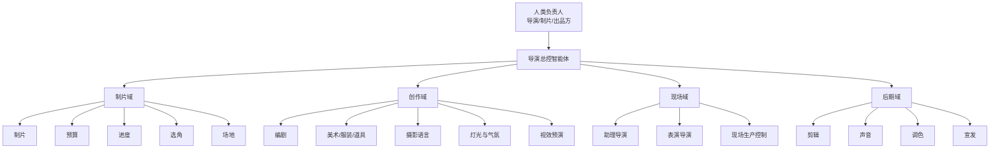
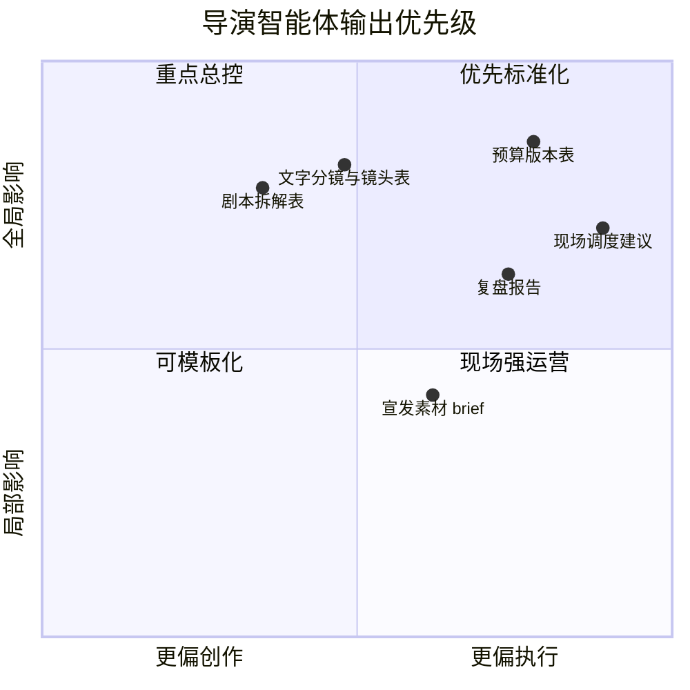

# 01. 总体定位：把 Hermes-Agent 改造成导演总控智能体

## 1. 当前项目为什么适合改造

Hermes-Agent 已经具备电影制作智能体最关键的几个基础能力：

- `run_agent.py` 的 `AIAgent` 已经有稳定的会话循环、工具调用和多轮推理能力
- `tools/registry.py` + `model_tools.py` 已经支持工具注册、工具集编排和动态可用性判断
- `tools/delegate_tool.py` 已经支持把任务分派给子智能体，天然适合映射为制片、编剧、摄影指导、1st AD 等专业角色
- `hermes_state.py` 已经提供会话与搜索能力，可扩展为项目级记忆、资产索引和版本追踪
- `agent/prompt_builder.py`、`agent/skill_commands.py` 已经能挂载角色提示词和行业技能
- `gateway/` 与 `cron/` 已经具备跨渠道沟通和定时运行能力，适合做日报、通告、审片提醒、版本同步

也就是说，Hermes 当前不是“从零做影视系统”，而是“从通用代理平台升级为电影制作操作系统”。

## 2. 目标定位

导演智能体不是单一聊天机器人，而是一个项目总控层：

- 对上承接制片人、导演、出品方的目标
- 对内协调编剧、预算、进度、场景、演员、美术、摄影、灯光、视效、剪辑、声音、宣发
- 对下调度文本、图像、视频、音频、表格、提示词和审批工单

它的核心职责是三件事：

1. 保证创作一致性
2. 保证制作可执行性
3. 保证过程可追踪、可审核、可复盘

## 3. 目标能力模型

### 3.1 创作能力

- 剧本分析、分场、人物弧光与主题诊断
- 对话设计、对白润色、多风格版本生成
- 文字分镜、镜头表、节奏设计
- 概念设计、静态分镜图、氛围图生成与统一
- 风格参考分析与“可用边界”提示
- 针对科幻、广告、武打等类型建立专项知识包

### 3.2 制片能力

- 剧本拆解为预算项、场景项、演员项、服化道项、拍摄需求项
- 自动预算草案、版本对比、超支预警
- 自动排期、日拍计划、任务分配、冲突检测
- 场地锁定、演员档期、通告单和审批流管理

### 3.3 现场执行能力

- 作为导演助理和 1st AD 的协同中枢
- 根据拍摄进度和现场变更即时调整通告、镜头顺序和资源调度
- 输出演员表演建议、摄影机位建议、灯光气氛建议、VFX 现场标记
- 生成“加工后提示词”，让图像/视频/视效模型可直接消费

### 3.4 后期与交付能力

- 日素材审看、剪辑建议、版本比对
- ADR、配音、配乐、音效、调色协同
- 版本管理、审批记录、交付包清单
- 宣发素材生成和渠道适配
- 项目复盘与知识沉淀

## 4. 组织模型

建议采用“导演总控 + 部门子智能体 + 人类负责人”的三层结构。

### 4.1 导演总控智能体

导演智能体负责：

- 项目总目标、主题、情绪、节奏、风格统一
- 跨部门冲突裁决
- 最终镜头意图与版本审批
- 风险升级与关键节点签核

### 4.2 部门子智能体

建议首批角色：

- 制片智能体
- 编剧智能体
- 预算智能体
- 进度智能体
- 选角智能体
- 场地智能体
- 美术/服装/道具智能体
- 摄影语言智能体
- 灯光与气氛智能体
- 视效预演智能体
- 助理导演智能体
- 表演导演智能体
- 剪辑智能体
- 声音智能体
- 调色智能体
- 宣发智能体

### 4.3 人机协作原则

- 创作建议可由 AI 大量产出，但“锁版”必须有人审批
- 排期、预算、合同、演员安排等高风险事项默认需要人工确认
- 现场改拍、超支、删场、补拍等事件必须走升级机制
- 每个子智能体都只能写入自己负责的工件，避免全局相互覆盖

## 5. 导演智能体的核心输入与输出

### 5.1 输入

- 剧本与修订稿
- 导演阐述、制片要求、投资限制
- 类型片知识库
- 参考影片、参考画面、风格说明
- 场地资料、演员资料、服化道资料、设备清单
- 预算约束、进度约束、审批规则

### 5.2 输出

- 剧本拆解表
- 预算版本表
- 分级表与评分表
- 排期与通告单
- 文字分镜、剧情分镜表、镜头表
- 概念图、静态分镜图、氛围图说明
- 对白版本与提示词包
- 现场调度建议
- 审片意见和版本变更说明
- 宣发素材 brief
- 复盘报告

## 6. 大规模制作的关键约束

如果目标是“大规模电影制作”，系统不能只会生成内容，还必须处理以下问题：

- 多部门并行和资源冲突
- 多版本、多审批链、多阶段锁定
- 预算与进度的持续约束
- 现场突发变化后的快速重规划
- 风格一致性不能随着上下文漂移而丢失
- 电影资产必须具备可检索、可追踪、可归档能力

因此系统设计必须从“对话中心”切换到“项目中心 + 工件中心 + 状态机中心”。
