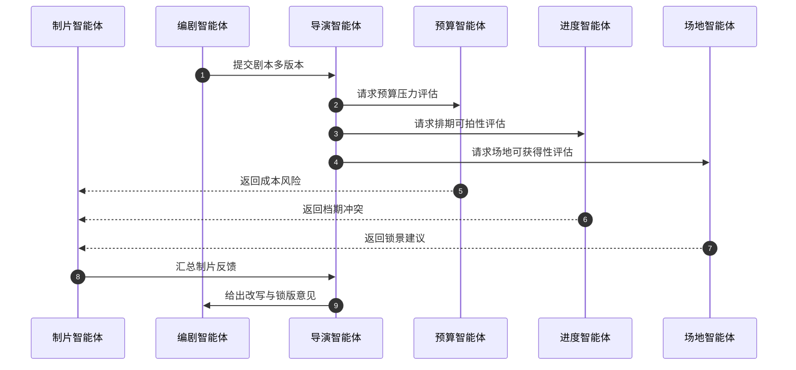
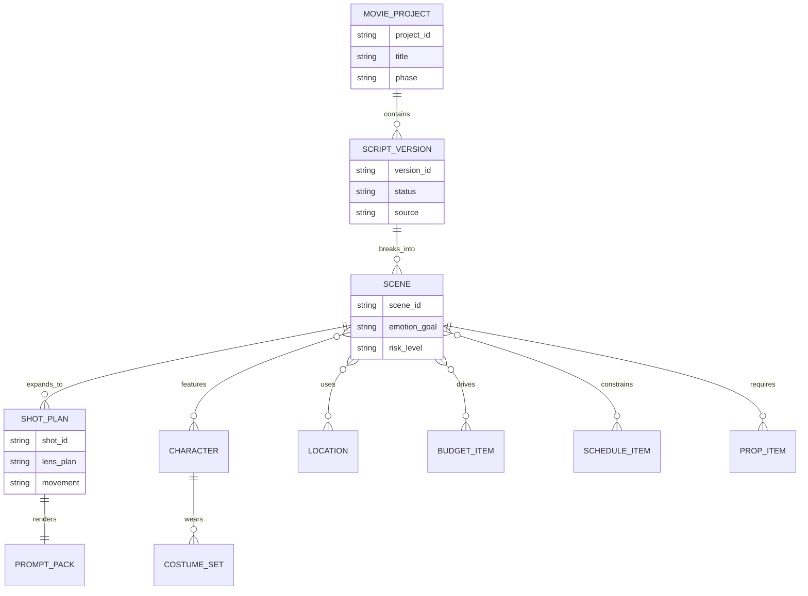
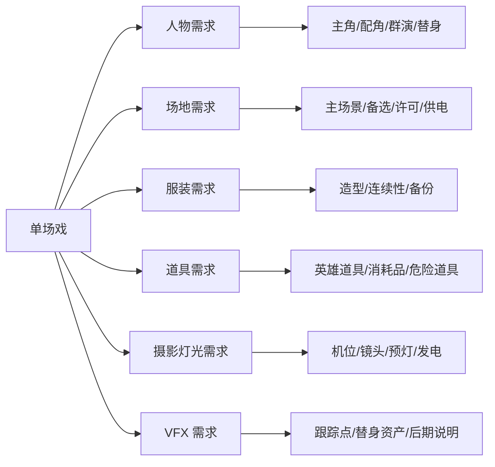
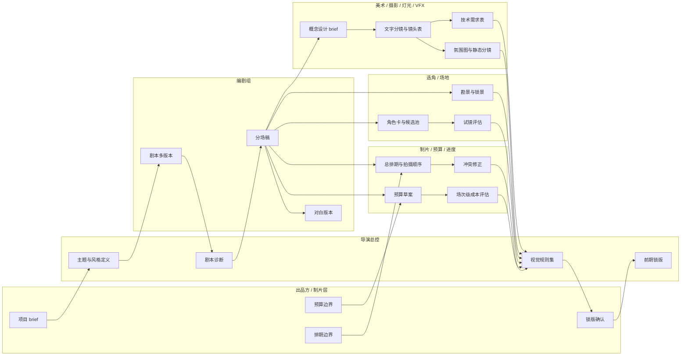
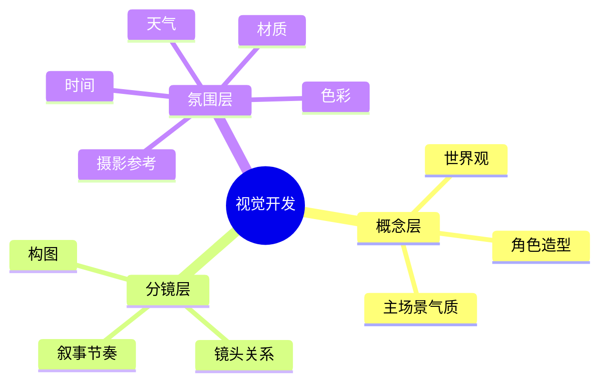
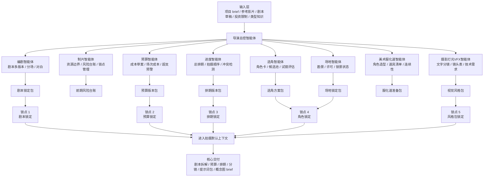
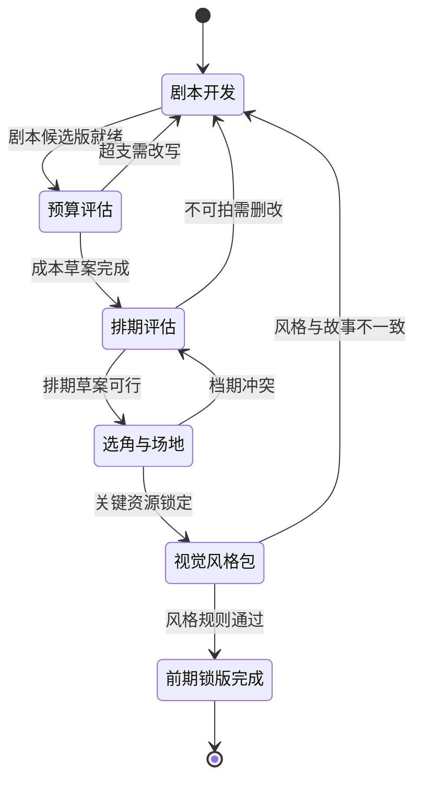

# 02. 前期：剧本、预算、演员、进度、场地的筹备系统

## 1. 前期目标

前期不是简单产出创意，而是把“可拍性”锁定下来。导演智能体在这一阶段要完成两类事情：

- 创作定向：主题、类型、风格、人物、对白、镜头语言
- 制片落地：预算、排期、演员、场地、服化道、摄影、灯光、视效准备

## 2. 前期子智能体编组

建议把前期拆成以下协同单元：

- 制片智能体：预算、资源、合同边界、风险台账
- 编剧智能体：剧本迭代、分场、对白、角色关系
- 预算智能体：按场景、演员、部门、设备、视效拆预算
- 进度智能体：按拍摄日、场地、演员窗口编排
- 选角智能体：角色画像、候选池、试镜评估表
- 场地智能体：场地需求分析、勘景报告、锁景状态
- 美术/服装/道具智能体：按角色、场景、时间线建立清单
- 摄影/灯光/视效预演智能体：将剧本转成镜头和技术需求

## 3. 前期核心工件

所有前期工作都应该沉淀为标准工件，而不是只停留在聊天结果：

- `script/`：剧本版本、分场稿、对白版本
- `breakdown/`：场景拆解、人物拆解、道具拆解、服装拆解、特效拆解
- `budget/`：预算草案、版本对比、超支清单
- `schedule/`：总排期、按阶段排期、按拍摄日排期
- `casting/`：角色卡、候选人名单、试镜评价
- `locations/`：场地 brief、勘景报告、锁定状态
- `art/`：概念设计 brief、静态分镜、氛围图、参考图册
- `shot_design/`：文字分镜、剧情分镜表、镜头清单、摄影语言说明
- `promptpacks/`：图像/视频/对白/VFX 的加工后提示词

## 4. 关键流程

### 4.1 剧本锁定链路

1. 编剧智能体输出剧本多版本
2. 导演智能体做主题、人物、节奏诊断
3. 制片智能体检查预算和拍摄复杂度
4. 预算/进度/场地子智能体给出可拍性反馈
5. 导演与制片共同决定锁定版本

### 4.2 预算与进度联动

预算不能脱离排期单独存在，需要联动：

- 复杂动作场面是否需要拆天拍摄
- 大型场地是否要集中拍完
- 演员档期能否支持重场戏顺序
- 视效镜头比例是否会推高后期预算

因此预算智能体和进度智能体应共享一个“场次级对象模型”：

- 场次编号
- 场景类型
- 主要演员
- 群演规模
- 场地需求
- 服化道需求
- 摄影和灯光复杂度
- VFX 标记
- 预计时长
- 风险等级

### 4.3 角色、场地、服化道联动

系统需要支持从一场戏反推所有准备项：

- 人：主角、配角、群演、替身、特技演员
- 场地：主场景、备选场景、许可状态、交通与供电
- 服装：角色当前阶段造型、连续性要求、备份数
- 道具：英雄道具、消耗品、危险道具、VFX 替身道具

### 4.4 前期泳道图

## 5. 创作增强模块

### 5.1 文字分镜

导演智能体要把分镜从“画面描述”升级为“可执行镜头意图”：

- 景别、机位、镜头运动
- 情绪目标
- 对白节拍
- 表演动作
- 灯光气氛
- 声音提示
- 后期与 VFX 注意事项

### 5.2 概念设计、静态分镜图、氛围图

建议引入三层输出：

- 概念层：世界观、角色造型、主场景气质
- 分镜层：关键镜头构图与叙事关系
- 氛围层：色彩、材质、天气、时间、摄影参考

### 5.3 对话设计与润色

对白不应只是“更自然”，而要符合：

- 人物身份和关系
- 类型片表达习惯
- 情绪推进
- 节奏与剪辑空间
- 演员表演空间

建议对白工件至少保留：

- 原版对白
- 导演版对白
- 表演增强版
- 节奏压缩版
- 审核友好版

### 5.4 参考风格分析和使用

系统应显式区分：

- 可借鉴：摄影语言、节奏、氛围、色彩逻辑
- 需警惕：过度模仿某导演、某镜头、某美术设定
- 可转译：把参考风格转成“原创风格规则集”

最终输出不是“像某片”，而是：

- 允许使用的构图原则
- 允许使用的色调区间
- 允许使用的镜头运动倾向
- 允许使用的声音密度和对白节奏

## 6. 分级表、提示词、概念表

为了让前期成果可复用，建议引入三类结构化模板：

### 6.1 分级表

用于评价剧本、场次、镜头、概念图、演员方案：

- 创作质量
- 可拍性
- 成本压力
- 风格一致性
- 技术复杂度
- 交付风险

### 6.2 概念表

用于统一设定：

- 主题词
- 角色关键词
- 世界观规则
- 美术关键词
- 摄影关键词
- 灯光关键词
- VFX 边界

### 6.3 加工后提示词

导演智能体不直接把随手描述发给生成模型，而是先加工为：

- 主体
- 动作
- 场景
- 构图
- 镜头
- 光线
- 色彩
- 情绪
- 材质
- 禁用项

## 6.4 前期汇报总图

## 7. 前期阶段的审批门

前期至少设置五个锁点：

1. 剧本锁定
2. 预算锁定
3. 总排期锁定
4. 角色与场地锁定
5. 视觉风格包锁定

只有锁定后的工件才能进入拍摄阶段的默认上下文。

