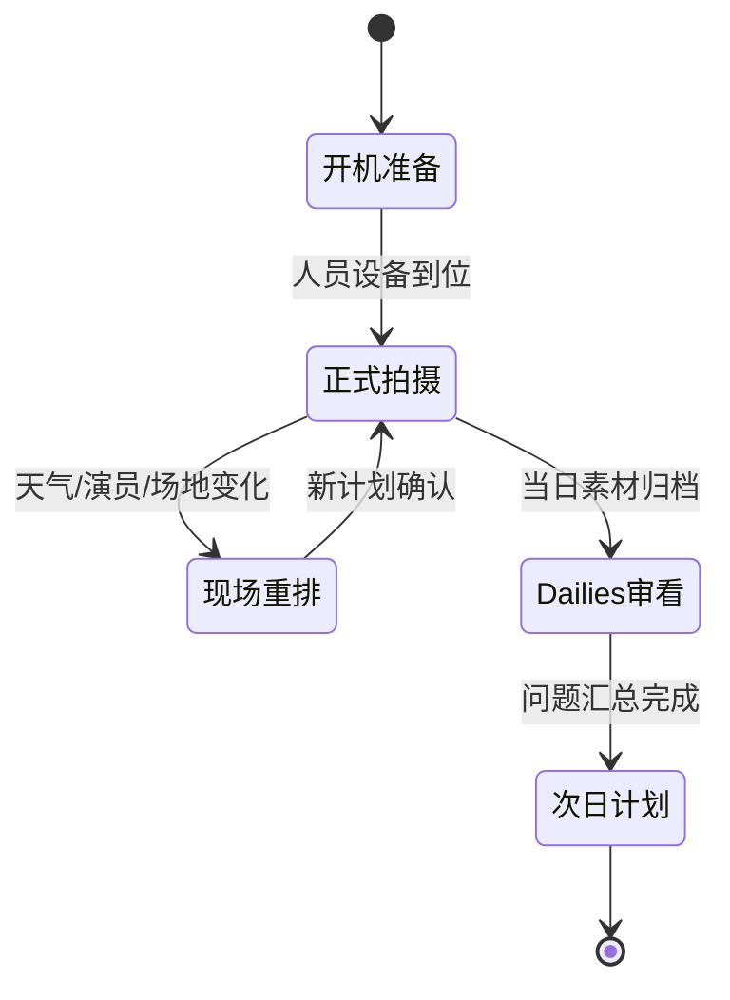
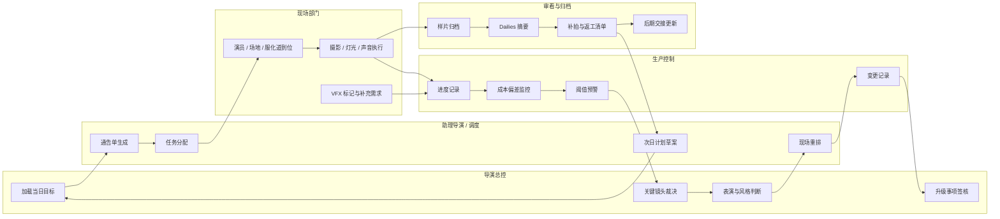
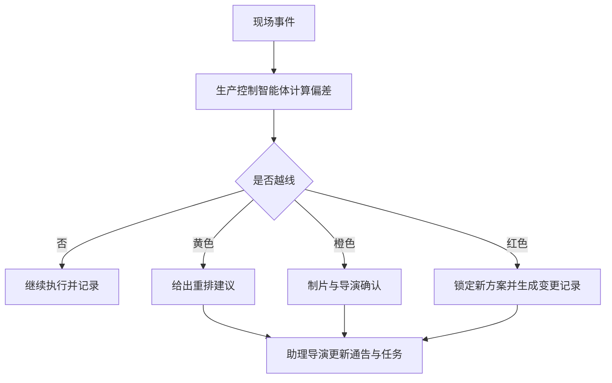
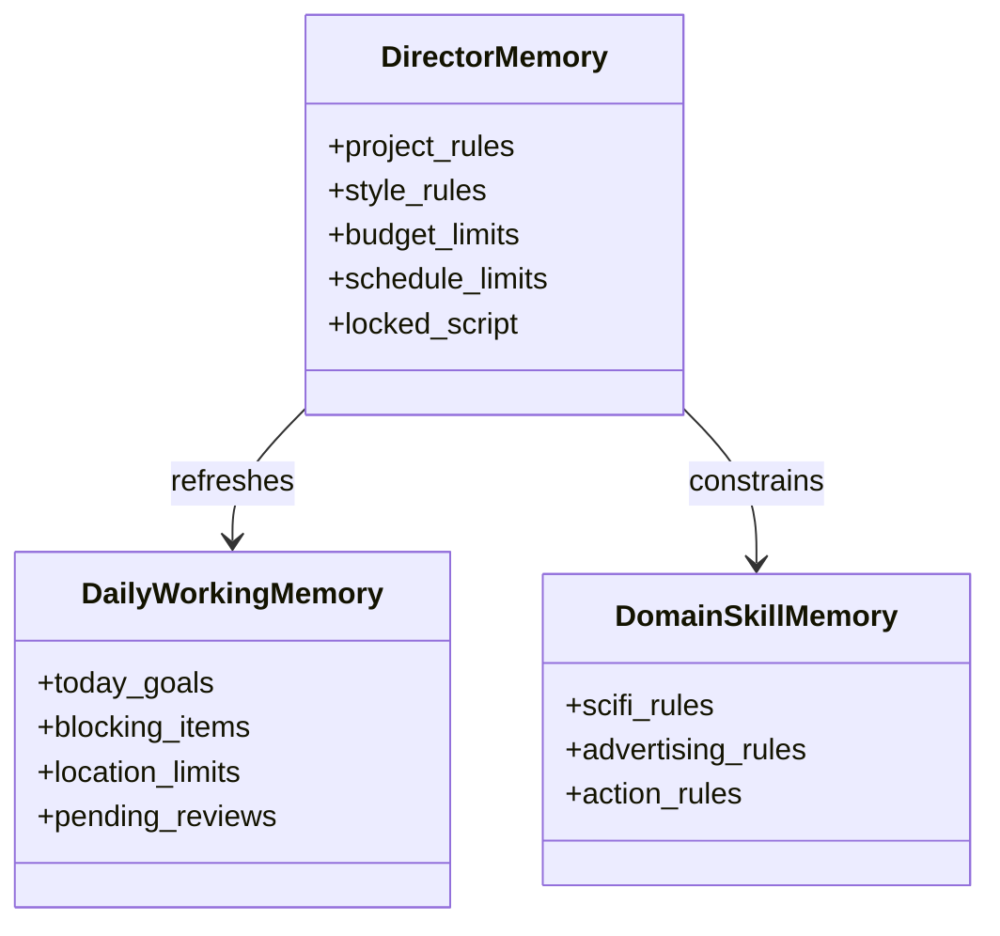
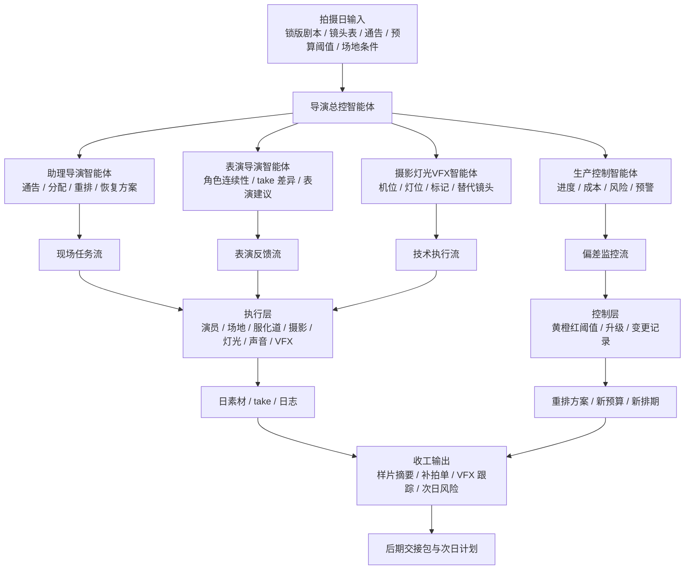
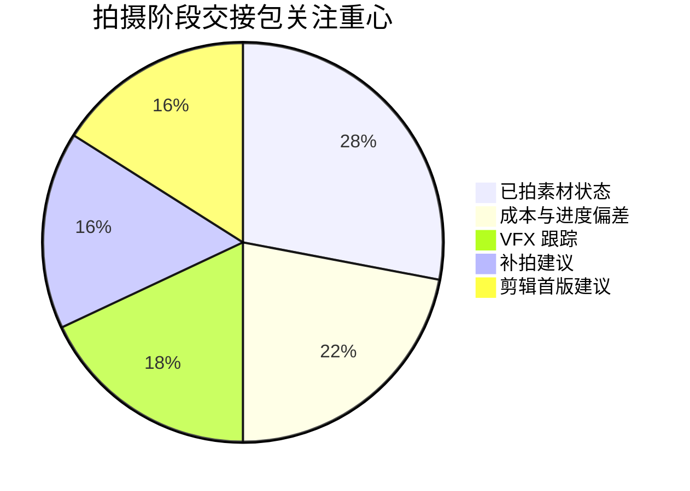

# 03. 中期：进度、成本控制、任务分配与现场调度

## 1. 中期目标

拍摄阶段的核心不再是发散创意，而是高压环境下的动态决策：

- 保证每天拍得出来
- 保证成本不失控
- 保证创作意图不跑偏
- 保证现场多部门协同顺畅

导演智能体在中期应当成为“导演 + 1st AD + 生产控制中枢”的联合大脑。

## 2. 中期角色分工

### 2.1 导演智能体

- 维护每场戏的情绪目标和叙事意图
- 对关键镜头、表演和风格偏差做裁决
- 对删减、替换、补拍给出创意判断

### 2.2 助理导演智能体

- 通告单生成
- 现场任务分配
- 场次重排
- 跨部门调度
- 延误恢复方案

### 2.3 生产控制智能体

- 实时记录完成镜头数、超时、返工、加班
- 追踪当日成本偏差
- 预警未来 3 至 5 天的档期和预算风险

### 2.4 表演导演智能体

- 为演员输出表演意图、节奏和动作建议
- 基于角色弧线提醒人物状态连续性
- 对多条 take 做表演差异总结

### 2.5 摄影/灯光/VFX 协同智能体

- 检查镜头设计是否落地
- 输出机位、镜头运动、灯位和特效标记建议
- 识别现场条件变化导致的方案偏移

## 3. 中期的核心工件

- `daily_plan/`：通告单、日拍计划、部门任务单
- `set_status/`：实际开拍时间、完成场次、阻塞项、事故记录
- `cost_control/`：日成本、周成本、偏差解释、补救方案
- `performance_notes/`：演员反馈、角色连续性、take 评价
- `shot_updates/`：现场镜头调整、删镜头、补镜头、替代镜头
- `review/`：样片审看意见、问题清单、返工单

## 4. 现场工作流

### 4.1 开机前

- 助理导演智能体生成通告单
- 生产控制智能体核对人员、场地、服化道、设备到位情况
- 导演智能体加载当日重点场次、人物情绪、镜头目标

### 4.2 拍摄中

- 现场事件实时写入项目状态
- 如演员迟到、天气变化、场地受限，助理导演智能体立刻重排
- 导演智能体判断哪些镜头不能砍，哪些镜头可合并
- 生产控制智能体评估重排后的时间与成本影响

### 4.3 收工后

- 样片自动归档
- 生成 dailies 审看摘要
- 标注需要补拍、返拍、VFX 跟踪的镜头
- 输出次日风险清单

```mermaid
gantt
    title 单日拍摄控制台节奏
    dateFormat  HH:mm
    axisFormat %H:%M
    section 开机前
    通告确认           :done, a1, 06:00, 00:30
    场地与设备核验     :done, a2, 06:30, 00:45
    section 拍摄中
    重点场次拍摄       :active, a3, 07:30, 04:30
    午间复盘与重排     :a4, 12:00, 00:45
    下午场次拍摄       :a5, 13:00, 05:00
    section 收工后
    素材归档与样片生成 :a6, 18:30, 01:00
    风险复盘与次日计划 :a7, 19:30, 00:45
```

### 4.4 中期泳道图

## 5. 进度和成本控制

中期一定要把“创作判断”和“经营约束”联成一个闭环。

建议建立以下监控指标：

- 当日计划完成率
- 当周累计偏差
- 单场戏实际耗时 vs 预计耗时
- 单场戏实际成本 vs 预算成本
- 关键演员/关键场地风险
- VFX 镜头积压数量
- 补拍概率

当指标越线时，系统自动触发升级：

- 黄色：给出重排建议
- 橙色：要求制片与导演确认
- 红色：锁定新的执行方案并生成变更记录

## 6. 任务分配与调度

任务分配需要面向部门，不是面向聊天回合。

建议每项任务都包含：

- 任务类型
- 所属场次/镜头
- 负责人
- 依赖项
- 截止时间
- 风险等级
- 审核人
- 完成标准

典型任务包括：

- 演员到场确认
- 特殊服装准备
- 危险道具检查
- 镜头预灯
- VFX marker 布置
- 替代镜头方案准备
- 样片回传与审核

## 7. 能力、知识、记忆

中期比前期更依赖“角色化记忆”。

建议为导演智能体维护三层记忆：

### 7.1 项目长期记忆

- 剧本锁定版
- 风格规则
- 预算边界
- 排期边界
- 核心角色设定

### 7.2 拍摄期工作记忆

- 今日目标
- 未解决阻塞项
- 当日现场限制
- 待审核镜头

### 7.3 领域技能记忆

- 科幻：世界观一致性、技术设定、VFX 管线
- 广告：品牌露出、节奏控制、卖点镜头
- 武打：动作连续性、安全、机位节奏

## 8. 分级表、剧情分镜表、摄影与对白协同

中期要把各类创意材料转成现场可操作表：

- 分级表：优先级、拍摄难度、返工风险、可替代性
- 剧情分镜表：场次目标、镜头目标、情绪目标、对白节奏
- 摄影表：机位、焦段、运动方式、备选方案
- 对白表：原句、删减版、节奏版、现场应急版

## 9. 加工后提示词与审核

“加工后提示词”在中期主要用于三类事情：

- 现场快速生成补充概念图或替代镜头参考
- 给 VFX/previz/后期团队输出结构化需求
- 给多模态模型生成稳定、可审查的版本

中期的审核必须至少覆盖：

- 是否偏离锁定风格
- 是否超出预算/排期阈值
- 是否影响角色连续性
- 是否增加后期难度
- 是否需要导演或制片升级审批

## 9.1 中期汇报总图

## 10. 中期的最终输出

拍摄阶段结束时，导演智能体应交出：

- 已拍素材状态总表
- 未完成镜头与补拍建议
- VFX 跟踪清单
- 剪辑首版建议
- 成本与进度偏差总结
- 进入后期的交接包

