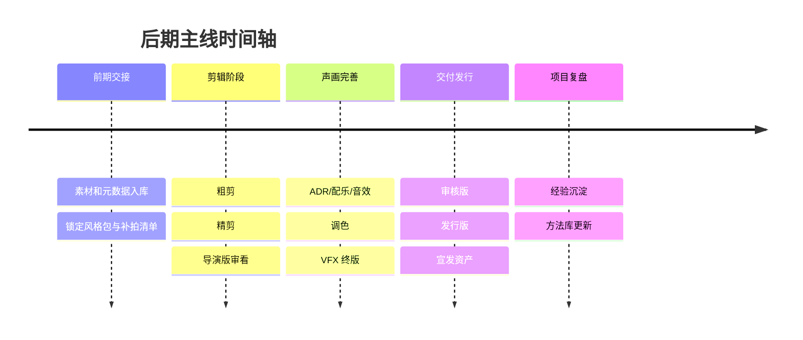
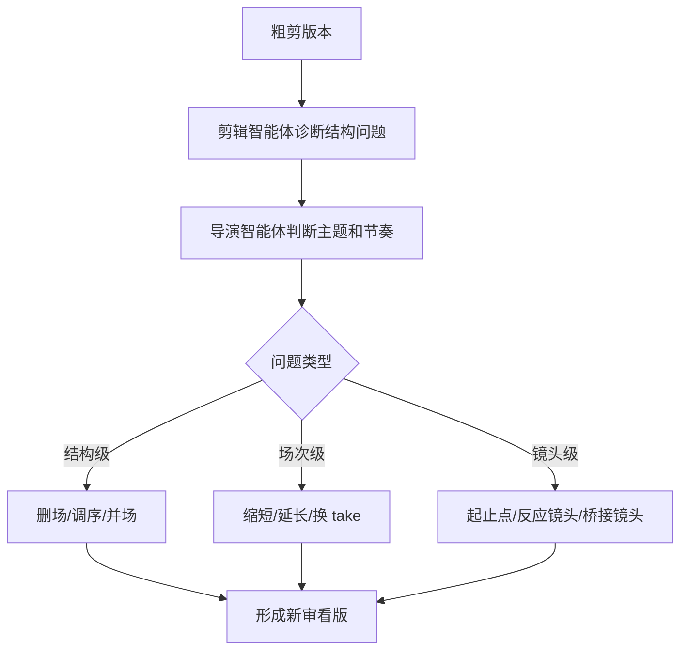
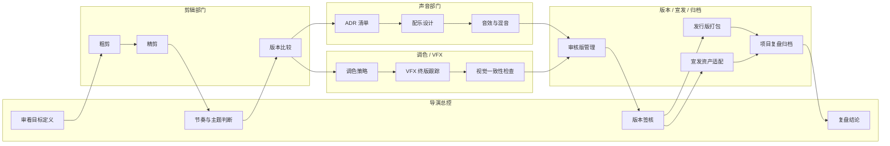
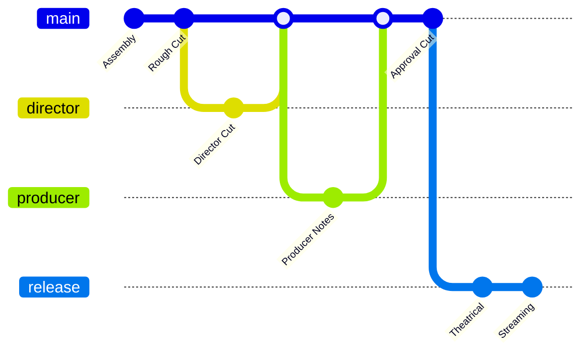
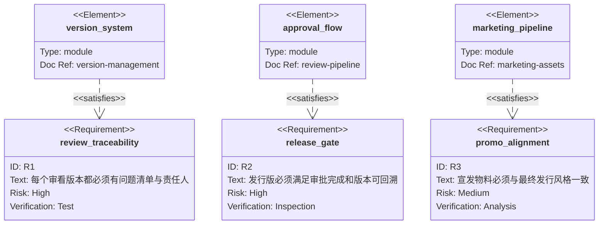
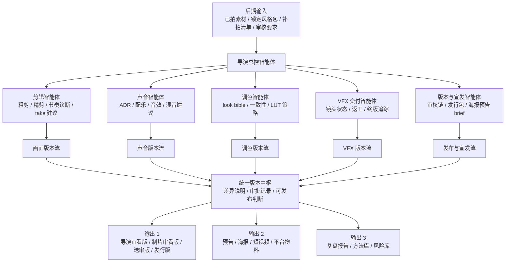

# 04. 后期：剪辑、声音、调色、版本管理、宣发与项目复盘

## 1. 后期目标

后期阶段的导演智能体，要从“现场调度中枢”切换为“版本与品质中枢”。

主要目标：

- 快速形成可审看版本
- 控制剪辑、声音、音乐、调色、视效的协同节奏
- 保证版本管理清晰
- 为宣发和交付提供标准化资产
- 在项目结束后完成复盘与知识回收

## 2. 后期子智能体

- 剪辑智能体：粗剪、精剪建议、结构问题诊断、节奏建议
- ADR/配音智能体：补录台词点位、口型匹配、替换台词建议
- 配乐智能体：音乐情绪设计、段落功能、 temp track 管理
- 音效智能体：环境声、拟音、冲击点、空间层次建议
- 调色智能体：镜头一致性、场景色彩曲线、风格 LUT 策略
- 视效交付智能体：镜头状态追踪、版本审核、返工记录
- 版本管理智能体：版本号、审批链、发布包和归档
- 宣发智能体：预告片、海报 brief、短视频切条、平台适配

## 3. 后期核心工件

- `edit/`：粗剪、精剪、导演剪辑版、发行版说明
- `sound/`：ADR 清单、配乐方案、音效清单、混音意见
- `grade/`：调色参考、look bible、镜头一致性报告
- `vfx_delivery/`：VFX 镜头状态、版本记录、供应商反馈
- `release/`：送审版、发行版、平台版、字幕版、预告版
- `marketing/`：宣传语、预告结构、花絮、角色物料
- `retrospective/`：项目复盘、经验卡片、风险案例、最佳实践

## 4. 剪辑与导演协同

导演智能体在剪辑阶段应重点管理：

- 每场戏是否仍然服务主题
- 结构节奏是否拖沓
- 情绪转场是否足够平滑
- 演员最佳 take 是否被用对
- 是否存在补拍比重高于重剪的段落

建议系统输出三类剪辑建议：

- 结构级：删场、调序、并场
- 场次级：缩短、延长、换 take
- 镜头级：起止点、反应镜头、空镜、桥接镜头

### 4.1 后期泳道图

## 5. 配音、配乐、音效

声音系统不能只看单点，而要保持整体叙事体验：

- ADR 智能体负责识别台词不清、信息不足、表演不一致
- 配乐智能体负责段落情绪弧线与主题动机
- 音效智能体负责空间感、冲击力、环境真实感

导演智能体在这里要维护的是“声音风格规则集”：

- 哪些场景留白
- 哪些场景让音乐主导
- 哪些场景用环境声而不是台词解释

## 6. 调色与视觉统一

调色阶段建议把前期锁定的风格包重新激活为审片基线：

- 色温区间
- 对比度倾向
- 黑位控制
- 饱和度风格
- 日夜戏视觉统一原则
- 特效镜头与实拍镜头的视觉缝合标准

## 7. 版本管理

后期最怕版本混乱，因此需要明确对象模型：

- 项目版本
- 影片版本
- 场次版本
- 镜头版本
- VFX 版本
- 声音版本
- 字幕版本
- 宣发版本

每个版本都应记录：

- 来源
- 修改原因
- 审批人
- 与上一版差异
- 是否可发布

## 8. 审核与出片

“出片、审核”不应是一次性动作，而应形成流水线：

1. 内部工作版
2. 导演审看版
3. 制片审看版
4. 出品/平台/客户审看版
5. 送审版
6. 发行版

每次审核都输出：

- 问题清单
- 必改项
- 可选优化项
- 风险说明
- 截止时间

## 9. 宣发协同

导演智能体在后期还可以把影片语言转为宣传语言：

- 预告片结构建议
- 海报和主视觉 brief
- 角色短视频拆解
- 社交平台文案与素材切条
- 幕后花絮主题设计

## 10. 项目复盘与总结

项目结束后，系统必须自动产出复盘：

- 哪些场次超时、超支
- 哪些创意决策最有效
- 哪些演员/场地/部门协作最稳定
- 哪些提示词和风格规则可复用
- 哪些流程需要在下一项目中前移

最终形成两层知识资产：

- 可跨项目复用的方法库
- 本项目独有的经验库和风险库

## 10.1 后期汇报总图

