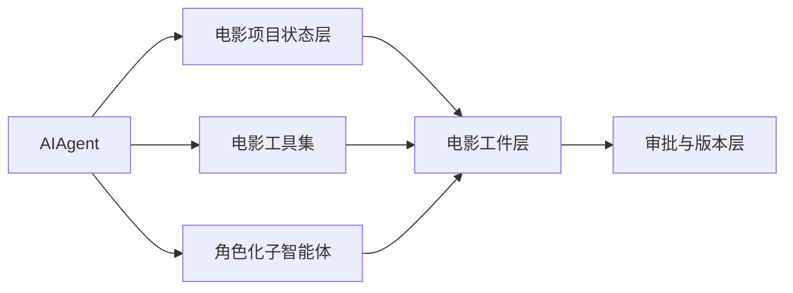
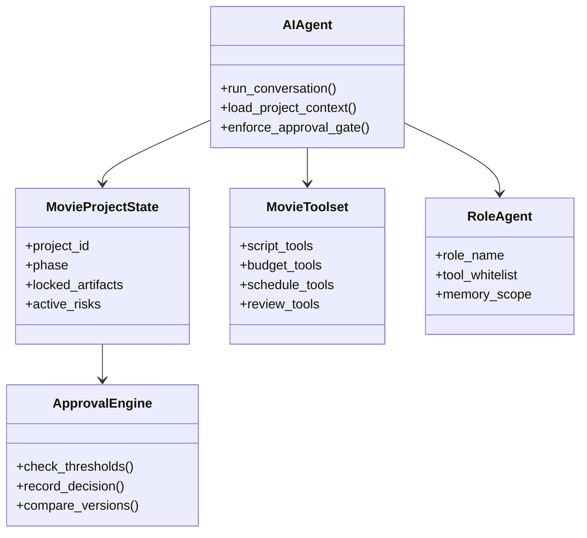
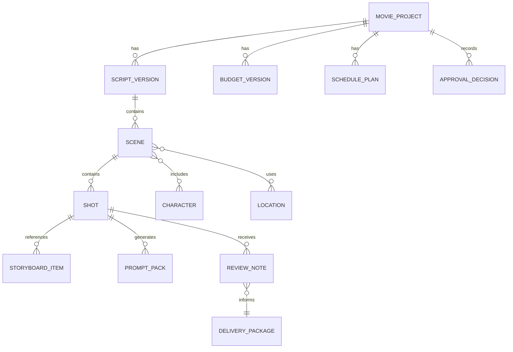
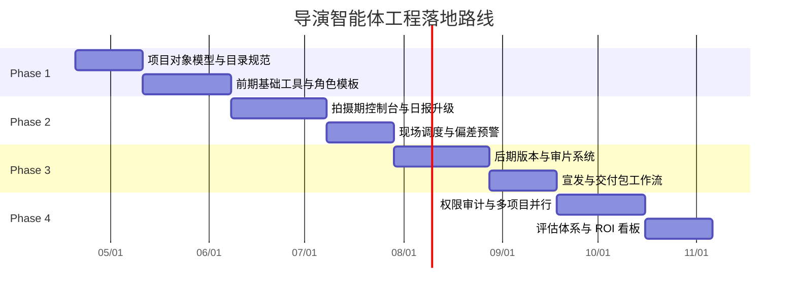
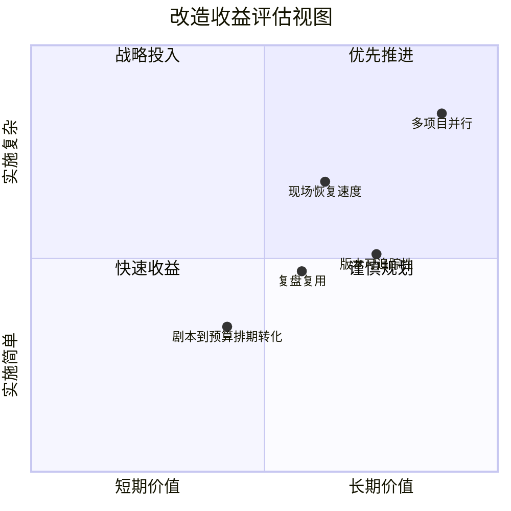

# 05. 工程改造路线：如何基于当前 Hermes-Agent 落地

## 1. 改造总原则

这次改造不建议推翻现有架构，而是沿着 Hermes 的既有骨架扩展：

- 保留 `AIAgent` 作为总控会话循环
- 保留现有工具注册机制
- 保留子智能体委派能力
- 在其上增加“电影项目状态层、电影工件层、电影技能层、电影审批层”

一句话说，就是从“通用代理”升级为“面向电影项目的多智能体工作台”。



## 2. 当前模块与改造方向映射

## 2.0 系统架构总图

```mermaid
flowchart TD
    U["用户与协作端<br/>CLI / Slack / Telegram / Discord / ACP"] --> G["gateway/ + cli.py"]
    G --> R["run_agent.py<br/>导演总控会话循环"]

    subgraph Core["核心编排层"]
        R
        PB["agent/prompt_builder.py<br/>角色模板 / 规则注入"]
        CC["agent/context_compressor.py<br/>工件优先压缩"]
        SC["agent/skill_commands.py<br/>电影技能调用"]
        MT["model_tools.py<br/>工具解析与路由"]
    end

    R --> PB
    R --> CC
    R --> SC
    R --> MT

    subgraph Roles["角色化子智能体层"]
        DG["导演总控"]
        PR["制片"]
        WR["编剧"]
        BD["预算"]
        SH["进度"]
        CA["选角"]
        LO["场地"]
        AR["美术服化道"]
        DP["摄影灯光VFX"]
        AD["助理导演"]
        ED["剪辑声音调色宣发"]
    end

    R --> DG
    R --> PR
    R --> WR
    R --> BD
    R --> SH
    R --> CA
    R --> LO
    R --> AR
    R --> DP
    R --> AD
    R --> ED

    subgraph Tools["电影工具层"]
        T1["movie_project"]
        T2["movie_script"]
        T3["movie_budget"]
        T4["movie_schedule"]
        T5["movie_casting"]
        T6["movie_location"]
        T7["movie_art"]
        T8["movie_storyboard"]
        T9["movie_promptpack"]
        T10["movie_review"]
        T11["movie_delivery"]
        TD["tools/delegate_tool.py"]
    end

    MT --> T1
    MT --> T2
    MT --> T3
    MT --> T4
    MT --> T5
    MT --> T6
    MT --> T7
    MT --> T8
    MT --> T9
    MT --> T10
    MT --> T11
    MT --> TD

    subgraph State["项目状态与工件层"]
        HS["hermes_state.py<br/>项目 / 场次 / 镜头 / 版本 / 审批 / 日志"]
        AF["workspace artifacts<br/>script / budget / schedule / review / release"]
        AP["审批与版本引擎"]
        KM["知识与记忆层"]
    end

    T1 --> HS
    T2 --> AF
    T3 --> AF
    T4 --> AF
    T8 --> AF
    T9 --> AF
    T10 --> AP
    T11 --> AF
    R --> HS
    R --> KM
    HS --> AP
    HS --> AF

    subgraph Ops["协同与自动化"]
        CR["cron/"]
        EV["评估与可观测性"]
        TS["tests/movie/"]
    end

    CR --> G
    CR --> R
    EV --> HS
    TS --> T1
    TS --> HS
    TS --> AP
```



### 2.1 `run_agent.py`

从单轮任务代理扩展为项目总控代理：

- 增加项目上下文装载器，而不只是对话历史装载器
- 增加阶段感知：前期/中期/后期切换
- 增加锁定工件注入：剧本锁版、预算锁版、风格包锁版
- 增加审批门判断：高风险事项先输出建议，再等待确认

### 2.2 `model_tools.py` + `toolsets.py` + `tools/registry.py`

新增电影专用工具集：

- `movie_project`：项目、阶段、角色、审批状态管理
- `movie_script`：剧本拆解、分场、对白版本、人物关系
- `movie_budget`：预算生成、成本预测、偏差分析
- `movie_schedule`：排期、通告、冲突检测、日程重排
- `movie_casting`：角色卡、候选池、试镜记录
- `movie_location`：场地 brief、勘景状态、许可与约束
- `movie_art`：服装、道具、美术需求清单
- `movie_storyboard`：文字分镜、镜头表、剧情分镜表
- `movie_promptpack`：加工后提示词与风格规则包
- `movie_review`：审片意见、版本对比、审批结论
- `movie_delivery`：交付包、宣发包、归档包

### 2.3 `tools/delegate_tool.py`

把当前通用子智能体机制升级为角色化委派：

- 支持导演、制片、编剧、1st AD、摄影、剪辑等固定角色模板
- 每个角色有独立工具白名单、写权限范围、记忆范围
- 支持并行委派，但以工件边界避免冲突
- 保持“不能无限递归委派”的安全边界

### 2.4 `hermes_state.py`

扩展为电影项目状态库：

- 项目表
- 剧本表
- 场次表
- 镜头表
- 角色表
- 演员表
- 场地表
- 预算表
- 版本表
- 审批表
- 事件日志表

并支持：

- 全文检索
- 按项目过滤
- 按版本回溯
- 按角色/场次/镜头聚合

### 2.5 `agent/prompt_builder.py`

增加电影行业的系统提示模板：

- 导演总控模板
- 制片模板
- 编剧模板
- 预算模板
- 1st AD 模板
- 摄影/灯光/VFX 模板
- 剪辑/声音/调色/宣发模板

并把“项目规则、风格规则、审批规则、禁用规则”作为固定块注入。

### 2.6 `agent/context_compressor.py`

上下文压缩改造成“电影工件优先”策略：

- 永远保留锁版剧本摘要
- 永远保留预算/进度边界摘要
- 永远保留风格规则摘要
- 工作聊天可压缩，但工件状态不能被压成不可恢复文本

### 2.7 `agent/skill_commands.py` 和 `skills/`

新增行业技能包：

- `film_script_dev`
- `film_budgeting`
- `film_scheduling`
- `film_casting`
- `film_action_design`
- `film_scifi_worldbuilding`
- `film_advertising_storytelling`
- `film_storyboard`
- `film_dialogue_polish`
- `film_post_supervision`

### 2.8 `gateway/`

把网关作为项目协同层：

- Telegram/Slack/Discord 频道对应不同部门
- 制片群接收预算和进度预警
- 导演群接收创作决策与审片事项
- 现场群接收通告和阻塞项提醒

### 2.9 `cron/`

定时自动化适合做：

- 每日拍摄前通告汇总
- 每日收工后日报
- 每周预算偏差报告
- 每周版本审核清单
- 项目里程碑提醒



## 3. 建议新增的目录

建议以增量方式增加电影域目录：

```text
agent/movie/
  roles/
  workflows/
  evaluators/

tools/movie_*.py

skills/movie/

tests/movie/

docs/movie2/
```

其中：

- `agent/movie/roles/` 存角色系统提示和行为约束
- `agent/movie/workflows/` 存前期、中期、后期流程编排
- `agent/movie/evaluators/` 存分级表、评分器、审片规则
- `tools/movie_*.py` 存电影专用工具
- `tests/movie/` 存对象模型、流程、审批、版本管理测试

## 4. 核心数据对象设计

要支撑大规模项目，至少需要以下对象：

- `MovieProject`
- `ScriptVersion`
- `Scene`
- `Shot`
- `Character`
- `CastMember`
- `Location`
- `BudgetVersion`
- `SchedulePlan`
- `CallSheet`
- `StoryboardItem`
- `PromptPack`
- `ReviewNote`
- `ApprovalDecision`
- `DeliveryPackage`
- `RetrospectiveReport`



## 5. 最小可行产品

建议第一阶段不要一口气做全量，而是先做“前期 MVP”。

### MVP 范围

- 剧本导入与分场
- 场次级预算草案
- 场次级排期草案
- 角色与场地清单
- 文字分镜与镜头表
- 对白润色与风格规则
- 导演总控 + 制片 + 编剧 + 预算 + 排期 5 个子智能体

### MVP 不先做

- 全自动图像/视频生产闭环
- 完整的现场设备联网
- 所有后期供应商对接
- 复杂版权/合同系统

## 6. 分阶段落地路线

### Phase 1：前期筹备 MVP

- 建立项目对象模型
- 建立剧本/预算/排期/选角/场地的基础工具
- 建立导演与制片协同工作流
- 输出标准工件到工作区目录

### Phase 2：拍摄期控制台

- 新增通告、现场调度、成本偏差、样片审看
- 加入助理导演、表演导演、摄影协同角色
- 打通日报与升级流程

### Phase 3：后期与版本系统

- 建立剪辑、声音、调色、VFX、发布版本链路
- 建立审片与变更追踪
- 建立宣发资产工作流

### Phase 4：企业级规模化

- 多项目并行
- 供应商协同
- 权限、审计、合规
- 评估体系与 ROI 看板



## 7. 成功标准

如果改造成功，这个系统应当能明显提升以下指标：

- 剧本到预算/排期的转化速度
- 前期方案收敛速度
- 现场变更后的恢复速度
- 超支和延期的预警提前量
- 镜头和版本的可追踪性
- 项目复盘的可复用程度



## 8. 推荐的第一步

最实用的起点不是先写复杂 UI，而是先做三件小而硬的事：

1. 建立电影项目对象模型和目录规范
2. 建立导演总控提示模板与 5 个前期子智能体
3. 建立前期工件输出链：剧本拆解、预算、排期、文字分镜、提示词包

这样最快能把 Hermes-Agent 从“能聊电影”推进到“能真正辅助做电影项目”。
