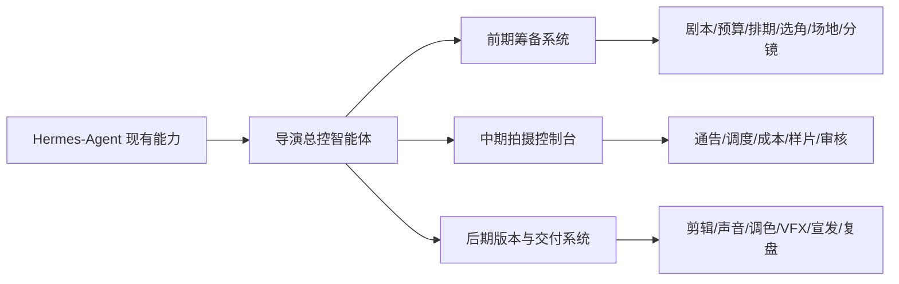
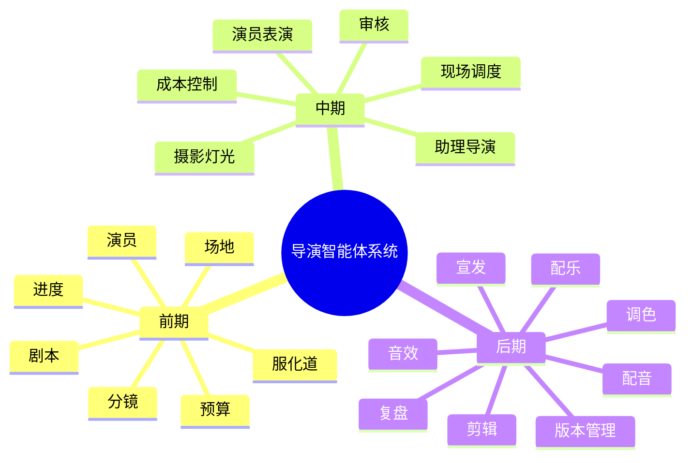

# 面向大规模电影制作的导演智能体改造方案

`docs/movie2` 是一套全新的方案文档，独立于 `docs/movie`，从零定义如何把当前 Hermes-Agent 改造成服务大型电影项目的导演智能体系统。

## 目标

把当前偏通用的多工具、多智能体助手，升级为一个以项目为中心、以导演为总控、覆盖前期/中期/后期全流程的电影制作操作系统：

- 导演智能体负责创作目标、风格统一、关键决策和最终审批
- 制片、编剧、预算、进度、演员、场地、美术、服装、道具、摄影、灯光、视效、剪辑、声音、宣发由专业子智能体协同承担
- 所有工作围绕剧本、镜头、预算、进度、版本、审批流、交付件进行组织
- 让系统既能做创意生成，也能做制片管理、现场调度、版本控制和项目复盘

## 目录

- [01-overview.md](./01-overview.md): 总体定位、能力模型、角色编排
- [02-preproduction.md](./02-preproduction.md): 前期开发与筹备系统
- [03-production.md](./03-production.md): 中期拍摄、调度、审核与成本控制
- [04-postproduction.md](./04-postproduction.md): 后期制作、版本管理、宣发与复盘
- [05-engineering-roadmap.md](./05-engineering-roadmap.md): 基于当前 Hermes-Agent 的工程改造路径

## 一句话架构

把 `AIAgent + tools + delegate + memory + session + gateway + cron`，升级为：

`导演总控智能体 + 电影项目状态层 + 专业部门子智能体 + 电影专用工具集 + 审批/版本/复盘机制`

## 视觉总览

## 适用范围

这套方案特别适合：

- 长片电影
- 剧集项目
- 广告片与品牌大片
- 科幻、动作、武打等复杂调度项目
- 需要多部门协同、长周期跟踪和大量版本管理的内容制作团队
